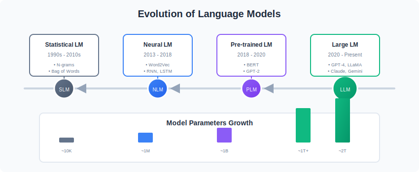
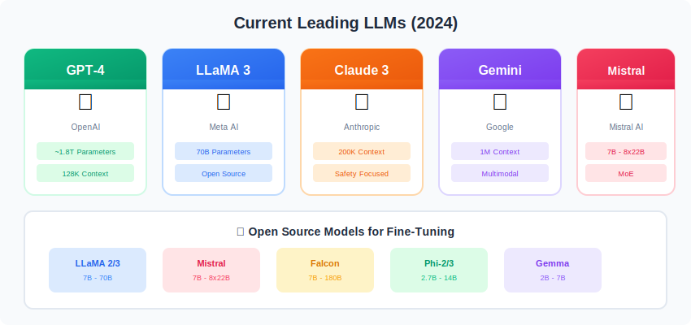
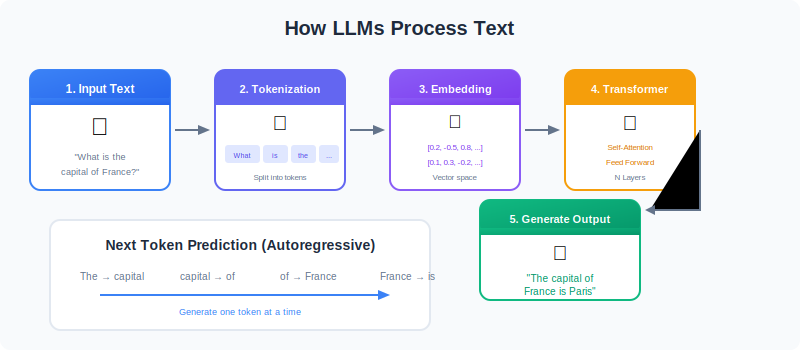
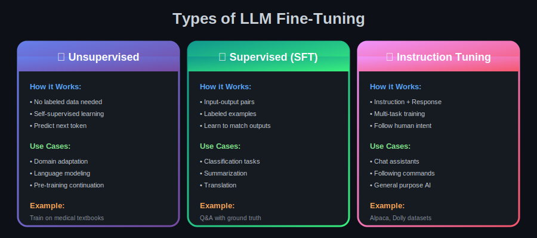
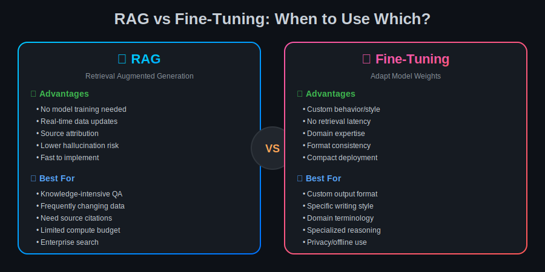

# 🎯 Introduction to Large Language Models

  

---

## 📊 Evolution of Language Models

  

---

## 🏗️ LLM Architecture

  

---

## 🌟 Current Leading LLMs

  

---

## 🔄 How LLMs Work

  

---

## 📈 Model Size Comparison

| Model | Parameters | Training Data | Context Length |
|-------|------------|---------------|----------------|
| GPT-4 | ~1.8T | - | 128K |
| LLaMA 3 | 70B | 15T tokens | 8K |
| Mistral | 7B | - | 32K |
| Claude 3 | - | - | 200K |
| Gemini | - | - | 1M |

---

## 🔀 Types of Fine-Tuning

  

---

## 🔍 RAG - Retrieval Augmented Generation

  

---

## 🆚 RAG vs Fine-Tuning

  

---

## 🔗 Next Steps

| Topic | Link |
|-------|------|
| Seven Stage Pipeline | [02-Seven-Stage-Pipeline](../02-Seven-Stage-Pipeline/) |
| Data Preparation | [03-Data-Preparation](../03-Data-Preparation/) |

---

## 📚 Reference

> [A Comprehensive Guide to Fine-Tuning Large Language Models](https://arxiv.org/html/2408.13296v1)

