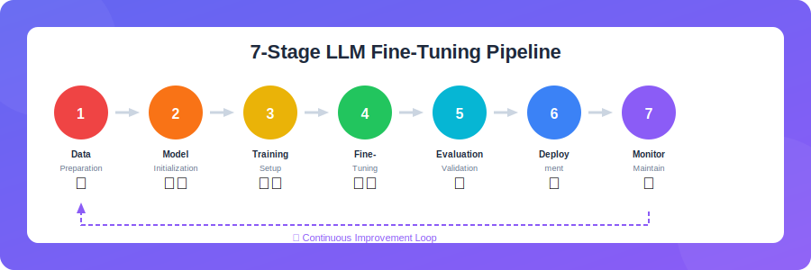
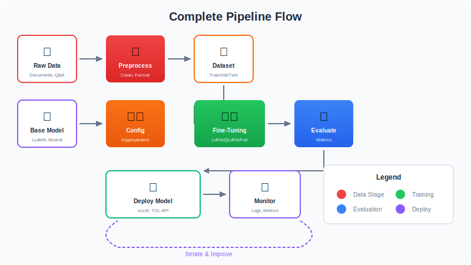
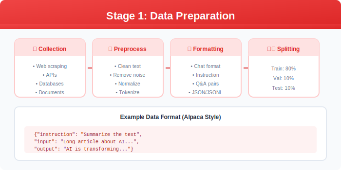
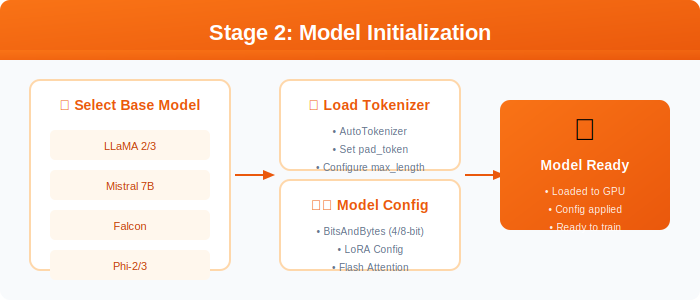
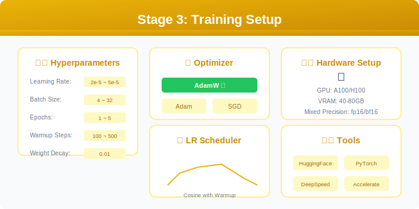
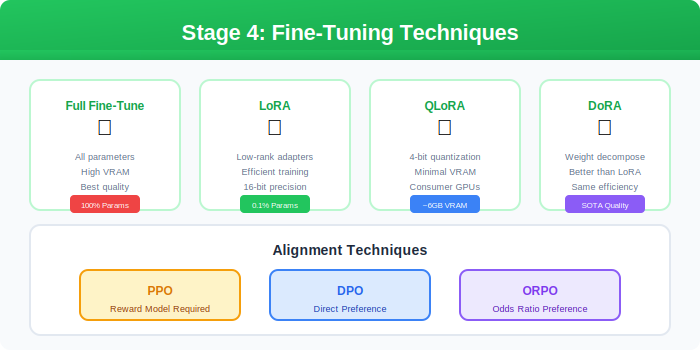
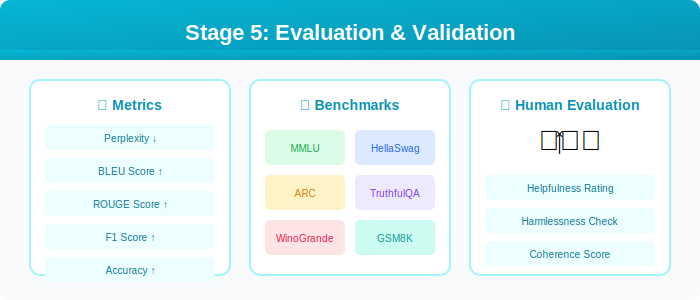
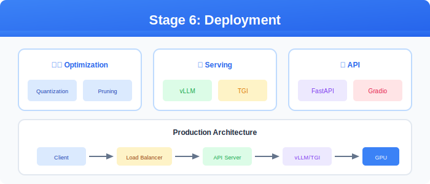
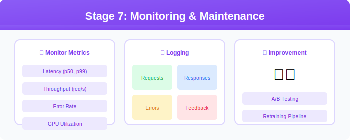

# 🔄 Seven Stage Fine-Tuning Pipeline

  

---

## 📋 Pipeline Overview

  

---

## 📊 Stage 1: Data Preparation

  

| Step | Description |
|------|-------------|
| Collection | Gather domain-specific data |
| Preprocessing | Clean and normalize text |
| Formatting | Convert to required format |
| Splitting | Train/Val/Test splits |

---

## 🏗️ Stage 2: Model Initialization

  

---

## ⚙️ Stage 3: Training Setup

  

---

## 🎛️ Stage 4: Fine-Tuning

  

---

## 📈 Stage 5: Evaluation

  

---

## 🚀 Stage 6: Deployment

  

---

## 📡 Stage 7: Monitoring

  

---

## 🔗 Deep Dive

| Stage | Details |
|-------|---------|
| Data | [03-Data-Preparation](../03-Data-Preparation/) |
| Model | [04-Model-Initialization](../04-Model-Initialization/) |
| Training | [05-Training-Setup](../05-Training-Setup/) |
| Techniques | [06-Fine-Tuning-Techniques](../06-Fine-Tuning-Techniques/) |
| Evaluation | [07-Evaluation-Validation](../07-Evaluation-Validation/) |

---

## 📚 Reference

> [A Comprehensive Guide to Fine-Tuning Large Language Models](https://arxiv.org/html/2408.13296v1)

