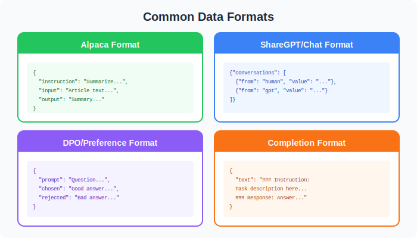
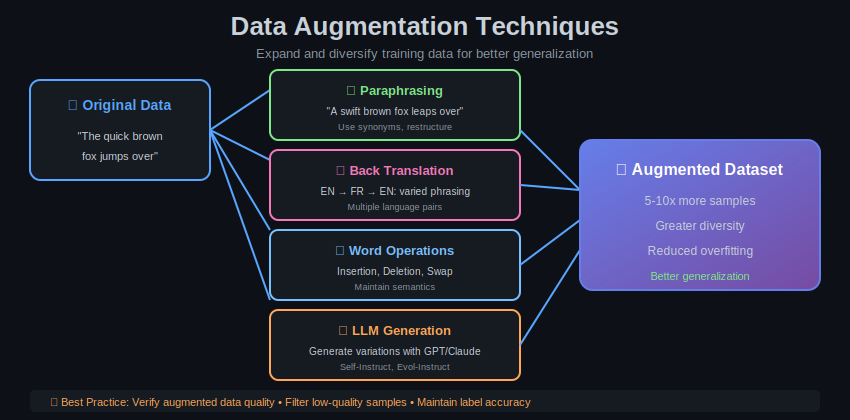
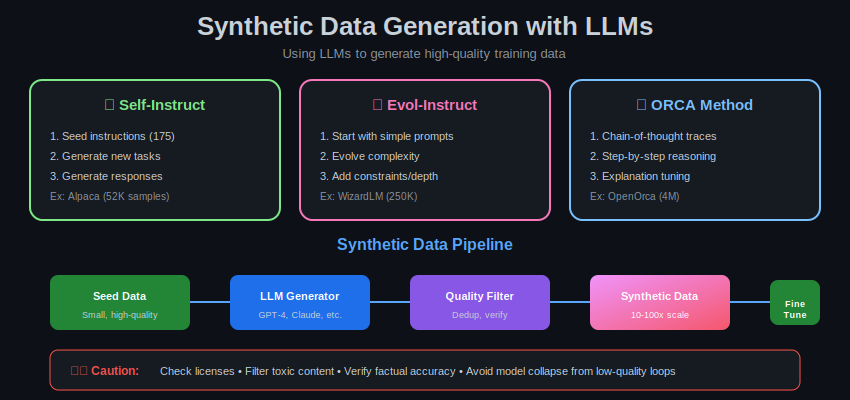

# 📊 Data Preparation for LLM Fine-Tuning

  

---

## 🔄 Data Pipeline

  

---

## 📝 Data Formats

  

---

## 📊 Popular Datasets

| Dataset | Type | Size | Use Case |
|---------|------|------|----------|
| Alpaca | Instruction | 52K | General |
| ShareGPT | Conversation | 90K | Chat |
| LIMA | High-quality | 1K | SFT |
| OpenOrca | Instruction | 4M | Reasoning |
| Dolly | Instruction | 15K | General |

---

## 🛠️ Data Quality Tips

  

---

## 🔄 Data Augmentation

  

---

## 🤖 Synthetic Data Generation

  

---

## 📓 Colab Example

---

## 🔗 Next Steps

| Topic | Link |
|-------|------|
| Model Init | [04-Model-Initialization](../04-Model-Initialization/) |
| Training | [05-Training-Setup](../05-Training-Setup/) |

---

## 📚 Reference

> [A Comprehensive Guide to Fine-Tuning Large Language Models](https://arxiv.org/html/2408.13296v1)

