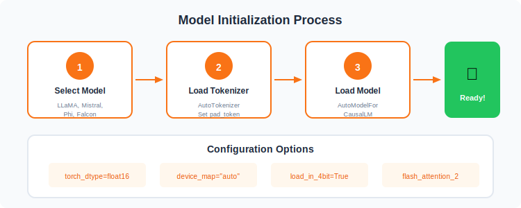
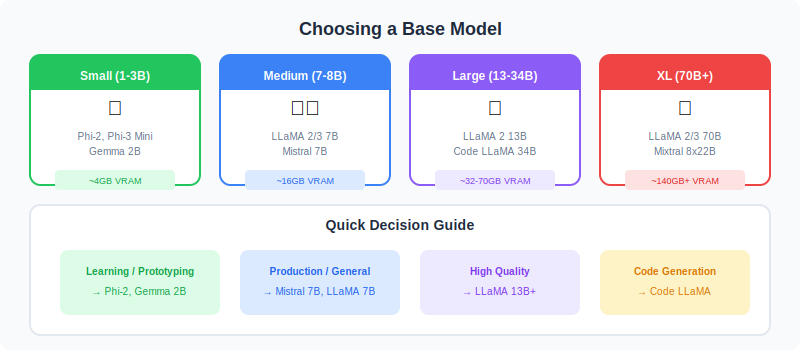

# 🏗️ Model Initialization

<p align="center">
  
</p>

---

## 🔄 Initialization Process

<p align="center">
  
</p>

---

## 🤖 Choosing a Base Model

<p align="center">
  
</p>

---

## 📊 Model Size Comparison

| Model | Parameters | VRAM (FP16) | VRAM (4-bit) | Best For |
|-------|------------|-------------|--------------|----------|
| Phi-2 | 2.7B | ~6GB | ~2GB | Learning, Small tasks |
| Mistral 7B | 7B | ~14GB | ~4GB | General purpose |
| LLaMA 2 7B | 7B | ~14GB | ~4GB | Research, Chat |
| LLaMA 2 13B | 13B | ~26GB | ~8GB | Better quality |
| LLaMA 2 70B | 70B | ~140GB | ~35GB | Best quality |

---

## 🔧 Loading Methods

<p align="center">
  
</p>

---

## 📝 Code Example

```python
from transformers import AutoModelForCausalLM, AutoTokenizer

# Load tokenizer
tokenizer = AutoTokenizer.from_pretrained("meta-llama/Llama-2-7b-hf")
tokenizer.pad_token = tokenizer.eos_token

# Load model
model = AutoModelForCausalLM.from_pretrained(
    "meta-llama/Llama-2-7b-hf",
    torch_dtype=torch.float16,
    device_map="auto",
)
```

---

## 🔗 Next Steps

| Topic | Link |
|-------|------|
| Training Setup | [05-Training-Setup](../05-Training-Setup/) |
| Fine-Tuning Techniques | [06-Fine-Tuning-Techniques](../06-Fine-Tuning-Techniques/) |

---

## 📚 Reference

> [A Comprehensive Guide to Fine-Tuning Large Language Models](https://arxiv.org/html/2408.13296v1)

