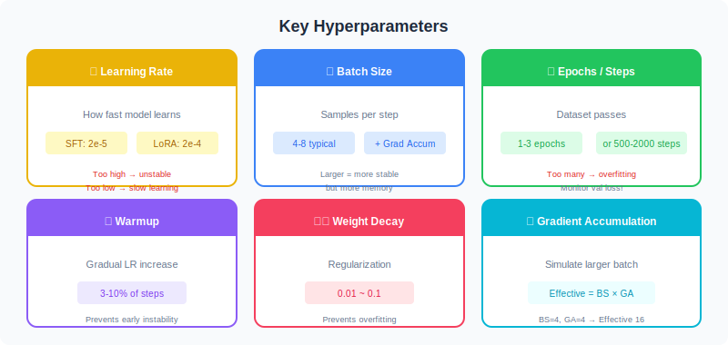
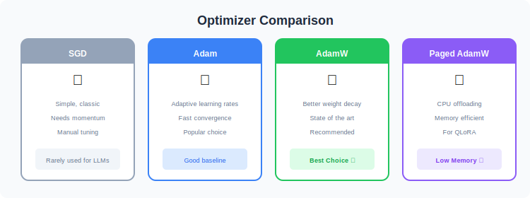
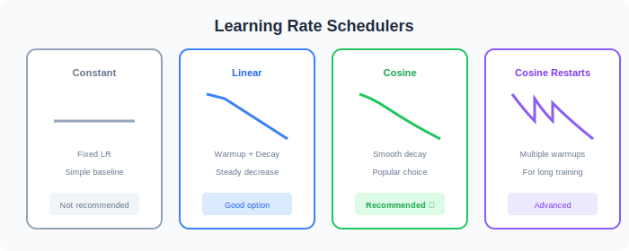
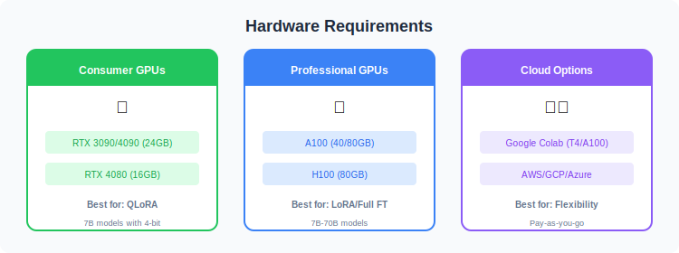
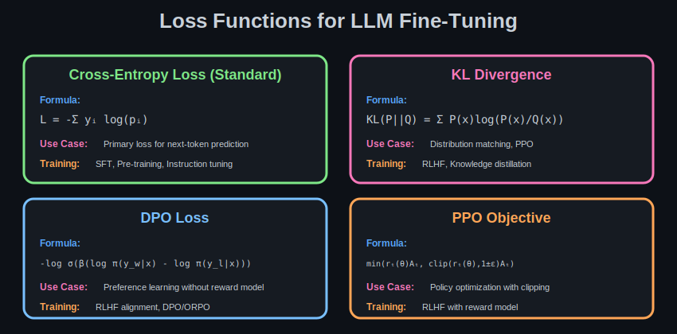

# ⚙️ Training Setup

<p align="center">
  
</p>

---

## 🎚️ Hyperparameters

<p align="center">
  
</p>

---

## 📊 Recommended Settings

| Parameter | SFT | LoRA | QLoRA |
|-----------|-----|------|-------|
| Learning Rate | 2e-5 | 1e-4 ~ 2e-4 | 2e-4 |
| Batch Size | 4-8 | 4-16 | 4-8 |
| Epochs | 1-3 | 1-3 | 1-3 |
| Warmup Ratio | 0.03 | 0.03 | 0.03 |
| Weight Decay | 0.01 | 0.01 | 0.01 |

---

## ⚡ Optimizers Comparison

<p align="center">
  
</p>

---

## 📈 Learning Rate Schedulers

<p align="center">
  
</p>

---

## 🖥️ Hardware Requirements

<p align="center">
  
</p>

---

## 📉 Loss Functions

<p align="center">
  
</p>

---

## 📝 Code Example

```python
from transformers import TrainingArguments

training_args = TrainingArguments(
    output_dir="./output",
    num_train_epochs=3,
    per_device_train_batch_size=4,
    gradient_accumulation_steps=4,
    learning_rate=2e-4,
    warmup_ratio=0.03,
    weight_decay=0.01,
    fp16=True,
    optim="paged_adamw_32bit",
    lr_scheduler_type="cosine",
    logging_steps=10,
    save_steps=100,
)
```

---

## 🔗 Next Steps

| Topic | Link |
|-------|------|
| Fine-Tuning Techniques | [06-Fine-Tuning-Techniques](../06-Fine-Tuning-Techniques/) |
| Evaluation | [07-Evaluation-Validation](../07-Evaluation-Validation/) |

---

## 📚 Reference

> [A Comprehensive Guide to Fine-Tuning Large Language Models](https://arxiv.org/html/2408.13296v1)

