# 🎛️ Fine-Tuning Techniques

  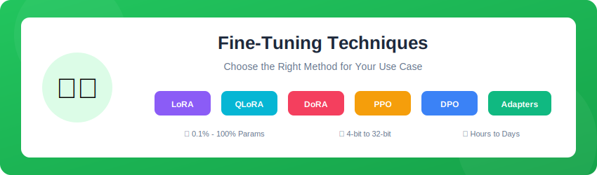

---

## 📚 Techniques Overview

  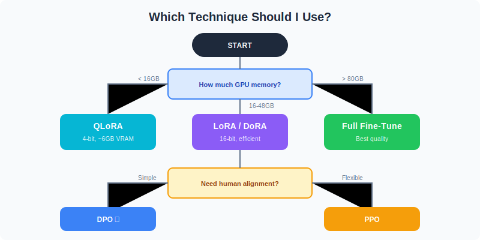

---

## 🔍 Detailed Guides

| Technique | Memory | Speed | Quality | Guide |
|-----------|--------|-------|---------|-------|
| Full Fine-Tune | 🔴 High | 🟡 Medium | 🟢 Best | [Full-FT](./Full-Fine-Tuning/) |
| LoRA | 🟢 Low | 🟢 Fast | 🟢 High | [LoRA](./LoRA/) |
| QLoRA | 🟢 Very Low | 🟡 Medium | 🟢 High | [QLoRA](./QLoRA/) |
| DoRA | 🟡 Medium | 🟢 Fast | 🟢 Best | [DoRA](./DoRA/) |
| PPO | 🔴 High | 🔴 Slow | 🟢 RLHF | [PPO](./PPO/) |
| DPO | 🟡 Medium | 🟢 Fast | 🟢 RLHF | [DPO](./DPO/) |

---

## 🆚 PEFT Comparison

  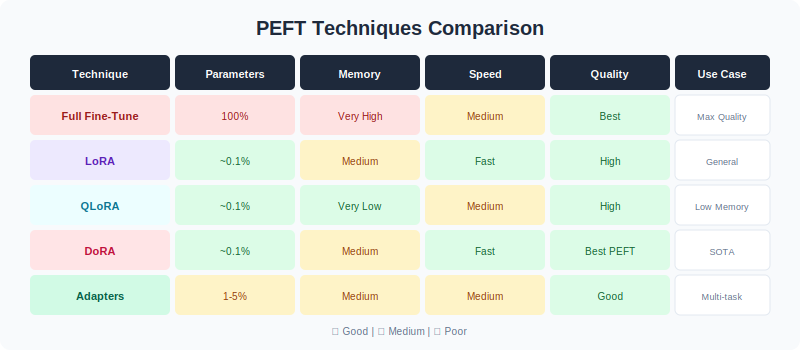

---

## 🔧 LoRA Architecture

  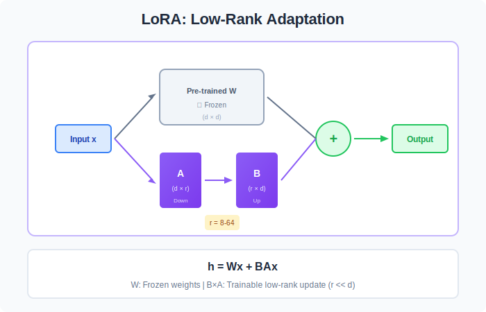

---

## ⚡ QLoRA Architecture

  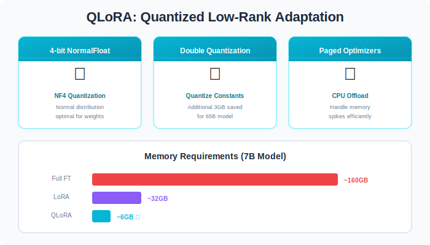

---

## 🎭 DoRA Architecture

  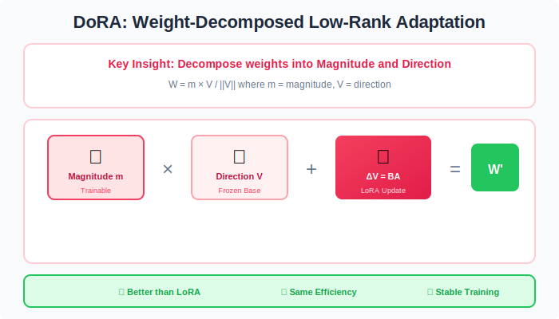

---

## 🎯 Alignment: PPO vs DPO

  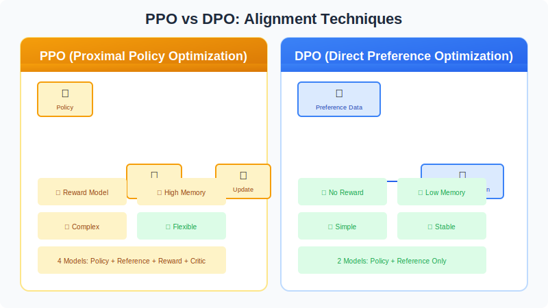

---

## 🔌 Adapter Layers

  

---

## 🧬 Mixture of Experts (MoE)

  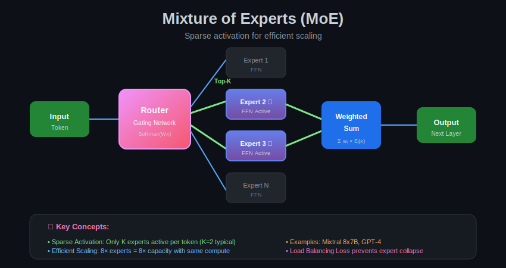

---

## ⚡ ORPO - Odds Ratio Preference Optimization

  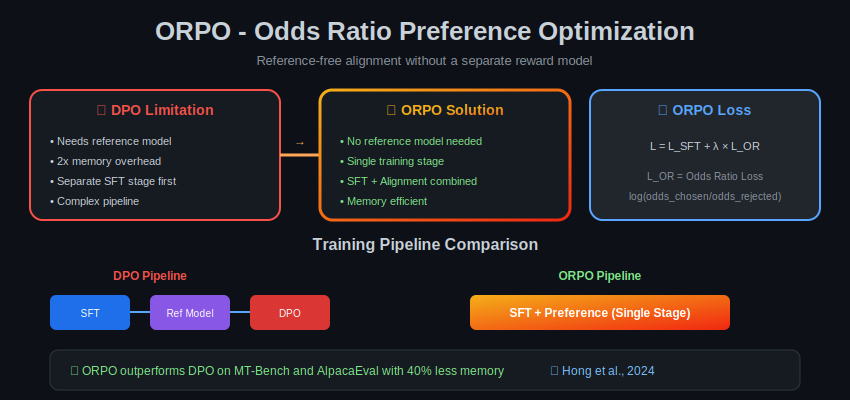

---

## ✂️ Half Fine-Tuning

  

---

## 🧠 Lamini Memory Tuning

  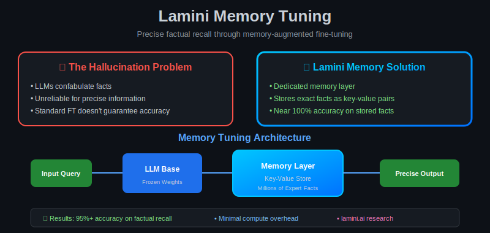

---

## 🏥 Domain-Specific Fine-Tuning

  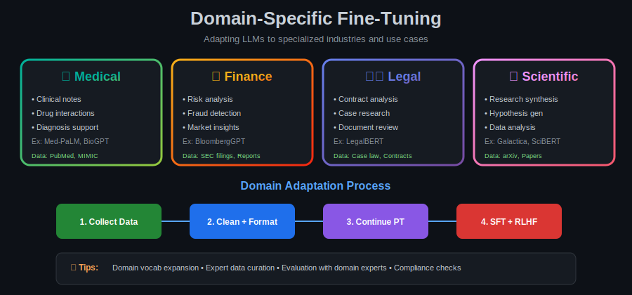

---

## 📓 Colab Notebooks

| Notebook | Description | Link |
|----------|-------------|------|
| LoRA | Parameter-efficient tuning |  |
| QLoRA | 4-bit quantized LoRA |  |
| DPO | Direct Preference |  |

---

## 📚 Reference

> [A Comprehensive Guide to Fine-Tuning Large Language Models](https://arxiv.org/html/2408.13296v1)

