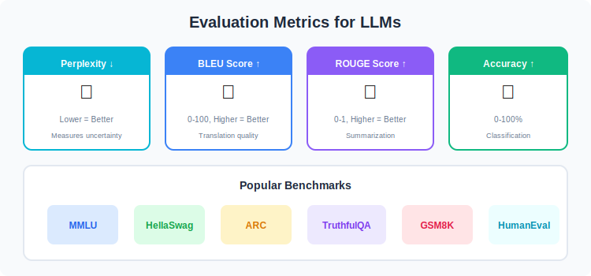
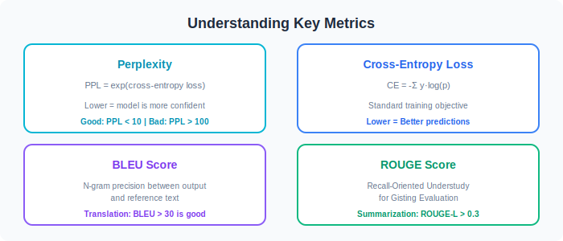

# 📈 Evaluation & Validation

  

---

## 📊 Evaluation Metrics

  

---

## 🏆 Common Benchmarks

| Benchmark | Type | Description |
|-----------|------|-------------|
| MMLU | Knowledge | 57 subjects, multiple choice |
| HellaSwag | Reasoning | Commonsense reasoning |
| ARC | Science | Science questions |
| TruthfulQA | Truthfulness | Factual accuracy |
| GSM8K | Math | Grade school math |
| HumanEval | Code | Python code generation |

---

## 📐 Key Metrics Explained

  

---

## 🔗 Links

| Topic | Link |
|-------|------|
| Deployment | [08-Deployment](../08-Deployment/) |
| Techniques | [06-Fine-Tuning-Techniques](../06-Fine-Tuning-Techniques/) |

---

## 📚 Reference

> [A Comprehensive Guide to Fine-Tuning Large Language Models](https://arxiv.org/html/2408.13296v1)

