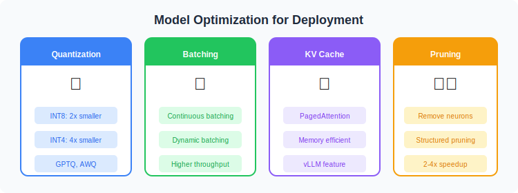
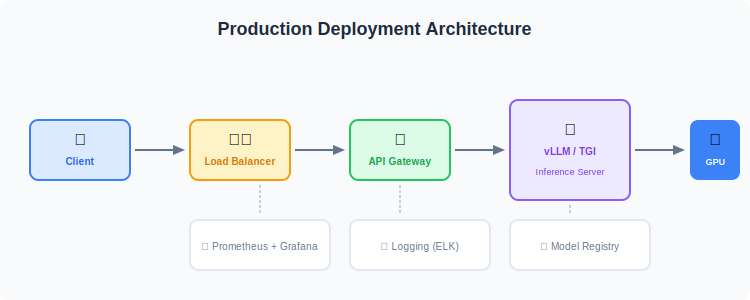

# 🚀 Model Deployment

  

---

## 🔧 Optimization Techniques

  

---

## 🖥️ Serving Frameworks

| Framework | Best For | Features |
|-----------|----------|----------|
| vLLM | High throughput | PagedAttention, fast |
| TGI | Production | HuggingFace native |
| Ollama | Local deployment | Easy to use |
| llama.cpp | CPU/Edge | Quantization |

---

## 📊 Deployment Architecture

  

---

## 📚 Reference

> [A Comprehensive Guide to Fine-Tuning Large Language Models](https://arxiv.org/html/2408.13296v1)

