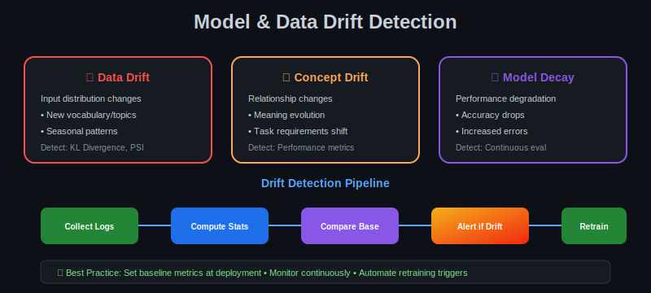

# 📡 Stage 7: Monitoring & Maintenance

<p align="center">
  
</p>

---

## 🔍 Why Monitoring Matters

After deploying a fine-tuned LLM, continuous monitoring ensures:
- **Performance stability** over time
- **Quality assurance** of model outputs
- **Early detection** of degradation
- **Cost optimization** in production

---

## 📉 Drift Detection

<p align="center">
  
</p>

---

## 📊 Key Metrics to Track

| Category | Metrics | Tools |
|----------|---------|-------|
| **Performance** | Latency (P50, P95, P99), Throughput, Error rate | Prometheus, Grafana |
| **Quality** | Accuracy, Relevance scores, Hallucination rate | LangSmith, W&B |
| **Safety** | Toxicity, Bias, PII exposure | Guardrails, NeMo |
| **Cost** | GPU utilization, Token usage, Cost/query | Cloud monitoring |

---

## 🔄 Maintenance Cycle

```
┌─────────┐    ┌─────────────┐    ┌───────────┐    ┌─────────┐
│ Monitor │───▶│ Detect Drift│───▶│Collect New│───▶│ Retrain │
│         │    │             │    │   Data    │    │         │
└─────────┘    └─────────────┘    └───────────┘    └─────────┘
     ▲                                                   │
     └───────────────────────────────────────────────────┘
```

---

## ⚠️ When to Retrain

| Signal | Action |
|--------|--------|
| Accuracy drops >5% | Investigate + retrain |
| New domain/topics emerge | Collect data + fine-tune |
| User complaints increase | Review samples + improve |
| Drift alerts trigger | Analyze + decide |

---

## 🛠️ Tools for Monitoring

| Tool | Purpose |
|------|---------|
| **LangSmith** | LLM observability, tracing |
| **Weights & Biases** | Experiment tracking |
| **Prometheus + Grafana** | System metrics |
| **OpenTelemetry** | Distributed tracing |
| **Guardrails AI** | Output validation |

---

## 📚 Reference

> Based on [A Comprehensive Guide to Fine-Tuning Large Language Models](https://arxiv.org/html/2408.13296v1)

