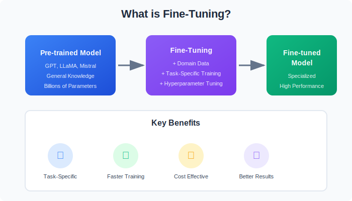
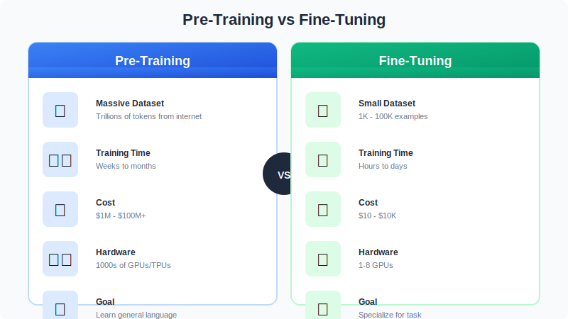
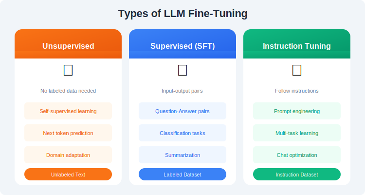
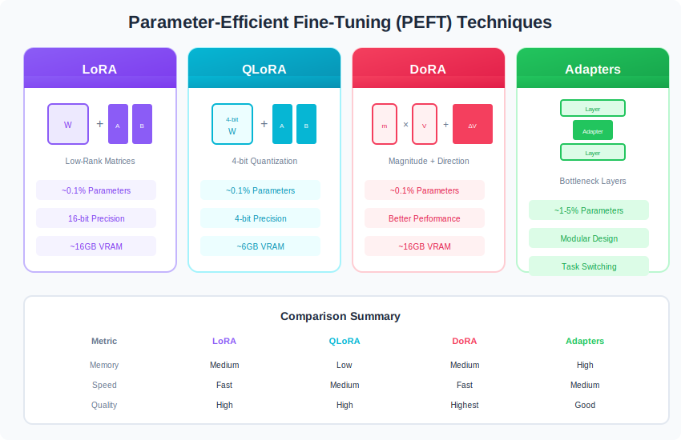
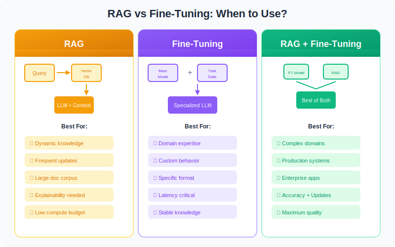

# 🚀 Fine-Tuning Large Language Models (LLMs) - Complete Guide

<p align="center">
  
</p>

<p align="center">
  <a href="#-quick-start"></a>
  <a href="#-seven-stage-pipeline"></a>
  <a href="#-techniques"></a>
  <a href="https://colab.research.google.com/"></a>
</p>

---

## 📚 Table of Contents

| Section | Description | Link |
|---------|-------------|------|
| 🎯 | Introduction to LLMs | [01-Introduction](./01-Introduction/) |
| 🔄 | Seven Stage Pipeline | [02-Seven-Stage-Pipeline](./02-Seven-Stage-Pipeline/) |
| 📊 | Data Preparation | [03-Data-Preparation](./03-Data-Preparation/) |
| 🏗️ | Model Initialization | [04-Model-Initialization](./04-Model-Initialization/) |
| ⚙️ | Training Setup | [05-Training-Setup](./05-Training-Setup/) |
| 🎛️ | Fine-Tuning Techniques | [06-Fine-Tuning-Techniques](./06-Fine-Tuning-Techniques/) |
| 📈 | Evaluation & Validation | [07-Evaluation-Validation](./07-Evaluation-Validation/) |
| 🚀 | Deployment | [08-Deployment](./08-Deployment/) |
| 📡 | Monitoring & Maintenance | [09-Monitoring-Maintenance](./09-Monitoring-Maintenance/) |
| 📓 | Google Colab Notebooks | [notebooks](./notebooks/) |

---

## 🎯 What is Fine-Tuning?

<p align="center">
  
</p>

---

## 🔄 Seven Stage Pipeline

<p align="center">
  
</p>

---

## 🆚 Pre-Training vs Fine-Tuning

<p align="center">
  
</p>

---

## 📊 Fine-Tuning Types

<p align="center">
  
</p>

---

## 🎛️ PEFT Techniques Comparison

<p align="center">
  
</p>

---

## 🔧 When to Use What?

<p align="center">
  
</p>

---

## 📓 Quick Start with Colab

| Notebook | Description | Link |
|----------|-------------|------|
| Basic Fine-Tuning | Simple SFT example | [](https://colab.research.google.com/github/Gaurav14cs17/LLMs_Model/blob/main/Fine-Tuning-LLMs-Guide/notebooks/01_basic_fine_tuning.ipynb) |
| LoRA Fine-Tuning | Parameter-efficient tuning | [](https://colab.research.google.com/github/Gaurav14cs17/LLMs_Model/blob/main/Fine-Tuning-LLMs-Guide/notebooks/02_lora_fine_tuning.ipynb) |
| QLoRA Fine-Tuning | 4-bit quantized LoRA | [](https://colab.research.google.com/github/Gaurav14cs17/LLMs_Model/blob/main/Fine-Tuning-LLMs-Guide/notebooks/03_qlora_fine_tuning.ipynb) |
| DPO Training | Direct Preference Optimization | [](https://colab.research.google.com/github/Gaurav14cs17/LLMs_Model/blob/main/Fine-Tuning-LLMs-Guide/notebooks/04_dpo_training.ipynb) |

---

## 🏗️ Repository Structure

```
Fine-Tuning-LLMs-Guide/
├── 📁 01-Introduction/
├── 📁 02-Seven-Stage-Pipeline/
├── 📁 03-Data-Preparation/
├── 📁 04-Model-Initialization/
├── 📁 05-Training-Setup/
├── 📁 06-Fine-Tuning-Techniques/
│   ├── 📁 LoRA/
│   ├── 📁 QLoRA/
│   ├── 📁 DoRA/
│   ├── 📁 PPO/
│   └── 📁 DPO/
├── 📁 07-Evaluation-Validation/
├── 📁 08-Deployment/
├── 📁 09-Monitoring-Maintenance/
├── 📁 assets/svg/
└── 📁 notebooks/
```

---

## ⭐ Star History

[](https://star-history.com/#Gaurav14cs17/LLMs_Model&Date)

---

## 📖 References

### 📚 Primary Source

> This guide is based on: **[A Comprehensive Guide to Fine-Tuning Large Language Models](https://arxiv.org/html/2408.13296v1)** (arXiv:2408.13296)

### 🔬 Fine-Tuning Techniques

| Paper | Authors | Year | Link |
|:------|:--------|:----:|:-----|
| LoRA: Low-Rank Adaptation of LLMs | Hu et al. | 2021 | [arxiv.org/abs/2106.09685](https://arxiv.org/abs/2106.09685) |
| QLoRA: Efficient Finetuning of Quantized LLMs | Dettmers et al. | 2023 | [arxiv.org/abs/2305.14314](https://arxiv.org/abs/2305.14314) |
| DoRA: Weight-Decomposed Low-Rank Adaptation | Liu et al. | 2024 | [arxiv.org/abs/2402.09353](https://arxiv.org/abs/2402.09353) |
| Adapter Modules for NLP | Houlsby et al. | 2019 | [arxiv.org/abs/1902.00751](https://arxiv.org/abs/1902.00751) |
| Prefix-Tuning | Li & Liang | 2021 | [arxiv.org/abs/2101.00190](https://arxiv.org/abs/2101.00190) |

### 🎯 Alignment & RLHF

| Paper | Authors | Year | Link |
|:------|:--------|:----:|:-----|
| Training Language Models with Human Feedback | Ouyang et al. | 2022 | [arxiv.org/abs/2203.02155](https://arxiv.org/abs/2203.02155) |
| DPO: Direct Preference Optimization | Rafailov et al. | 2023 | [arxiv.org/abs/2305.18290](https://arxiv.org/abs/2305.18290) |
| ORPO: Monolithic Preference Optimization | Hong et al. | 2024 | [arxiv.org/abs/2403.07691](https://arxiv.org/abs/2403.07691) |
| PPO: Proximal Policy Optimization | Schulman et al. | 2017 | [arxiv.org/abs/1707.06347](https://arxiv.org/abs/1707.06347) |

### 🏗️ Foundation Models

| Model | Organization | Year | Link |
|:------|:-------------|:----:|:-----|
| LLaMA / LLaMA 2 / LLaMA 3 | Meta | 2023-24 | [arxiv.org/abs/2302.13971](https://arxiv.org/abs/2302.13971) |
| Mistral 7B / Mixtral | Mistral AI | 2023-24 | [arxiv.org/abs/2310.06825](https://arxiv.org/abs/2310.06825) |
| Phi-2 / Phi-3 | Microsoft | 2023-24 | [arxiv.org/abs/2404.14219](https://arxiv.org/abs/2404.14219) |
| Gemma / Gemma 2 | Google | 2024 | [arxiv.org/abs/2403.08295](https://arxiv.org/abs/2403.08295) |
| Command R | Cohere | 2024 | [cohere.com/command](https://cohere.com/command) |
| Qwen / Qwen2 | Alibaba | 2023-24 | [arxiv.org/abs/2309.16609](https://arxiv.org/abs/2309.16609) |
| ChatGLM / GLM-4 | Tsinghua & Zhipu | 2023-24 | [arxiv.org/abs/2406.12793](https://arxiv.org/abs/2406.12793) |
| Baichuan / Baichuan2 | Baichuan AI | 2023 | [arxiv.org/abs/2309.10305](https://arxiv.org/abs/2309.10305) |
| Yi | 01.AI | 2023 | [arxiv.org/abs/2403.04652](https://arxiv.org/abs/2403.04652) |
| DeepSeek / DeepSeek-V2 | DeepSeek | 2024 | [arxiv.org/abs/2401.02954](https://arxiv.org/abs/2401.02954) |
| InternLM / InternLM2 | Shanghai AI Lab | 2023-24 | [arxiv.org/abs/2403.17297](https://arxiv.org/abs/2403.17297) |
| ERNIE | Baidu | 2023 | [arxiv.org/abs/2107.02137](https://arxiv.org/abs/2107.02137) |
| HyperCLOVA | NAVER | 2021 | [arxiv.org/abs/2109.04650](https://arxiv.org/abs/2109.04650) |
| Japanese StableLM | Stability AI Japan | 2024 | [huggingface.co/stabilityai](https://huggingface.co/stabilityai/japanese-stablelm-base-alpha-7b) |

### 📊 Evaluation & Benchmarks

| Benchmark | Description | Link |
|:----------|:------------|:-----|
| MMLU | Massive Multitask Language Understanding | [arxiv.org/abs/2009.03300](https://arxiv.org/abs/2009.03300) |
| HellaSwag | Commonsense NLI | [arxiv.org/abs/1905.07830](https://arxiv.org/abs/1905.07830) |
| TruthfulQA | Truthfulness evaluation | [arxiv.org/abs/2109.07958](https://arxiv.org/abs/2109.07958) |
| HumanEval | Code generation | [arxiv.org/abs/2107.03374](https://arxiv.org/abs/2107.03374) |
| MT-Bench | Multi-turn conversation | [arxiv.org/abs/2306.05685](https://arxiv.org/abs/2306.05685) |

### 🔧 Tools & Libraries

| Tool | Description | Link |
|:-----|:------------|:-----|
| 🤗 Transformers | Model hub & training | [huggingface.co/transformers](https://huggingface.co/docs/transformers) |
| 🤗 PEFT | Parameter-efficient fine-tuning | [huggingface.co/peft](https://huggingface.co/docs/peft) |
| 🤗 TRL | Transformer Reinforcement Learning | [huggingface.co/trl](https://huggingface.co/docs/trl) |
| 🤗 Datasets | Dataset loading & processing | [huggingface.co/datasets](https://huggingface.co/docs/datasets) |
| DeepSpeed | Distributed training | [github.com/microsoft/DeepSpeed](https://github.com/microsoft/DeepSpeed) |
| vLLM | High-throughput inference | [github.com/vllm-project/vllm](https://github.com/vllm-project/vllm) |
| Ollama | Local LLM deployment | [github.com/ollama/ollama](https://github.com/ollama/ollama) |

### 📺 Learning Resources

| Resource | Type | Link |
|:---------|:-----|:-----|
| Hugging Face Course | Tutorial | [huggingface.co/learn](https://huggingface.co/learn) |
| Stanford CS224N | Course | [web.stanford.edu/class/cs224n](https://web.stanford.edu/class/cs224n/) |
| LLM University (Cohere) | Course | [cohere.com/llmu](https://cohere.com/llmu) |
| Weights & Biases | MLOps Guide | [wandb.ai/site/llm](https://wandb.ai/site/llm) |

---

## 📜 License

MIT License - feel free to use for learning and projects!

---

<p align="center">
  <b>Made with ❤️ for the ML Community</b>
</p>

