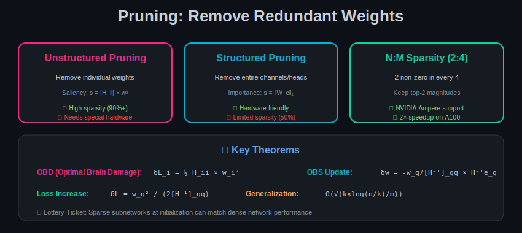

# Module 03: Pruning

  

## 🎯 Overview

Pruning removes redundant weights from neural networks. This module provides rigorous mathematical foundations, proofs, and theoretical analysis of pruning techniques.

---

## 📐 Mathematical Foundations

### 1. Problem Formulation

**Objective:** Find a sparse weight matrix $\hat{W}$ that minimizes:

$$\min_{\hat{W}} \mathcal{L}(f(x; \hat{W})) \quad \text{s.t.} \quad \|\hat{W}\|_0 \leq k$$

Where:
- $\mathcal{L}$ = loss function
- $\|\cdot\|_0$ = number of non-zero elements
- $k$ = sparsity budget

**Equivalent Lagrangian form:**
$$\min_{\hat{W}} \mathcal{L}(f(x; \hat{W})) + \lambda \|\hat{W}\|_0$$

---

### 2. Optimal Brain Damage (OBD)

**Theorem 1 (LeCun et al., 1990):** The increase in loss from removing weight $w_i$ is approximately:

$$\delta\mathcal{L}_i = \frac{1}{2} H_{ii} w_i^2$$

Where $H = \nabla^2 \mathcal{L}$ is the Hessian matrix.

**Proof:**

Taylor expansion of loss around optimal weights $w^*$:

$$\mathcal{L}(w^* + \delta w) = \mathcal{L}(w^*) + \underbrace{\nabla\mathcal{L}^T \delta w}_{=0 \text{ at optimum}} + \frac{1}{2} \delta w^T H \delta w + O(\|\delta w\|^3)$$

For pruning weight $i$ (setting $w_i = 0$), we have $\delta w_i = -w_i$:

$$\delta\mathcal{L} \approx \frac{1}{2} \delta w^T H \delta w$$

**Diagonal Approximation:** If we assume $H$ is diagonal:
$$\delta\mathcal{L}_i \approx \frac{1}{2} H_{ii} w_i^2$$

**Saliency Score:**
$$s_i = |H_{ii}| \cdot w_i^2$$

Prune weights with lowest saliency.

---

### 3. Optimal Brain Surgeon (OBS)

**Theorem 2 (Hassibi & Stork, 1993):** When pruning weight $w_q$, the optimal adjustment to remaining weights is:

$$\delta w = -\frac{w_q}{[H^{-1}]_{qq}} H^{-1} e_q$$

And the resulting loss increase is:

$$\delta\mathcal{L}_q = \frac{w_q^2}{2[H^{-1}]_{qq}}$$

**Proof:**

We want to minimize:
$$\min_{\delta w} \frac{1}{2} \delta w^T H \delta w \quad \text{s.t.} \quad e_q^T(w + \delta w) = 0$$

Using Lagrange multipliers:
$$\mathcal{L}_{Lagrange} = \frac{1}{2} \delta w^T H \delta w + \lambda(e_q^T w + e_q^T \delta w)$$

Setting $\nabla_{\delta w} \mathcal{L}_{Lagrange} = 0$:
$$H \delta w + \lambda e_q = 0$$
$$\delta w = -\lambda H^{-1} e_q$$

From constraint $e_q^T \delta w = -w_q$:
$$-\lambda e_q^T H^{-1} e_q = -w_q$$
$$\lambda = \frac{w_q}{[H^{-1}]_{qq}}$$

Substituting back:
$$\delta w = -\frac{w_q}{[H^{-1}]_{qq}} H^{-1} e_q$$

**Loss increase:**
$$\delta\mathcal{L} = \frac{1}{2} \delta w^T H \delta w = \frac{1}{2} \frac{w_q^2}{([H^{-1}]_{qq})^2} e_q^T H^{-1} H H^{-1} e_q = \frac{w_q^2}{2[H^{-1}]_{qq}}$$

---

### 4. Magnitude Pruning Analysis

**Assumption:** Weights are drawn from distribution $p(w)$ with variance $\sigma^2$.

**Theorem 3:** For magnitude pruning with threshold $\tau$, the expected fraction of pruned weights is:

$$\mathbb{P}(|w| < \tau) = F_W(\tau) - F_W(-\tau)$$

For Gaussian weights $W \sim \mathcal{N}(0, \sigma^2)$:
$$\mathbb{P}(|w| < \tau) = \text{erf}\left(\frac{\tau}{\sigma\sqrt{2}}\right)$$

**Expected Pruning Error:**

$$\mathbb{E}[\|W - \hat{W}\|_F^2] = n \cdot \mathbb{E}[w^2 \cdot \mathbf{1}_{|w| < \tau}]$$

For Gaussian:
$$= n \cdot \int_{-\tau}^{\tau} w^2 \cdot \frac{1}{\sqrt{2\pi}\sigma} e^{-w^2/2\sigma^2} dw$$

$$= n\sigma^2 \left[\text{erf}\left(\frac{\tau}{\sigma\sqrt{2}}\right) - \frac{2\tau}{\sigma\sqrt{2\pi}} e^{-\tau^2/2\sigma^2}\right]$$

---

## 📊 Structured Pruning

### 1. Channel Pruning

**Objective:** Remove entire filters/channels to reduce dimensions.

For convolutional layer with weight tensor $W \in \mathbb{R}^{C_{out} \times C_{in} \times K \times K}$:

**Channel Importance (L1 norm):**
$$s_c = \sum_{i,j,k} |W_{c,i,j,k}|$$

**Channel Importance (L2 norm):**
$$s_c = \sqrt{\sum_{i,j,k} W_{c,i,j,k}^2}$$

**Theorem 4 (Filter Pruning Error Bound):**

Let $\mathcal{C}$ be the set of pruned channels. The output error is bounded by:

$$\|Y - \hat{Y}\|_F \leq \|X\|_F \cdot \sum_{c \in \mathcal{C}} \|W_c\|_F$$

**Proof:**
$$Y - \hat{Y} = \sum_{c \in \mathcal{C}} W_c * X_c$$

By triangle inequality:
$$\|Y - \hat{Y}\|_F \leq \sum_{c \in \mathcal{C}} \|W_c * X_c\|_F \leq \sum_{c \in \mathcal{C}} \|W_c\|_F \|X_c\|_F$$

### 2. Attention Head Pruning

For multi-head attention with $h$ heads:

$$\text{MHA}(Q, K, V) = \text{Concat}(\text{head}_1, \ldots, \text{head}_h) W^O$$

**Head Importance Score:**

Based on expected attention entropy:
$$s_i = -\mathbb{E}_{x}\left[\sum_j A_{ij} \log A_{ij}\right]$$

Low entropy heads are more "decisive" and important.

**Gradient-based importance:**
$$s_i = \mathbb{E}\left[\left|\frac{\partial \mathcal{L}}{\partial \text{head}_i}\right|\right]$$

---

## 📐 The Lottery Ticket Hypothesis

### Formal Statement

**Theorem 5 (Frankle & Carlin, 2019):**

Let $f(x; \theta_0)$ be a randomly initialized network with $\theta_0 \sim \mathcal{D}_{init}$.

There exists a mask $m \in \{0, 1\}^{|\theta|}$ with $\|m\|_0 = k \ll |\theta|$ such that:

After $t$ training iterations:
$$\mathcal{L}(f(x; m \odot \theta_t)) \leq \mathcal{L}(f(x; \theta_t)) + \epsilon$$

With probability at least $1 - \delta$, where $k = O(|\theta|^{1-\alpha})$ for some $\alpha > 0$.

### Theoretical Justification

**Proposition (Malach et al., 2020):**

For any target network $f_T$ with $n$ parameters, a sufficiently overparameterized random network $f_R$ with $N$ parameters contains a subnetwork that $\epsilon$-approximates $f_T$, where:

$$N = O\left(\frac{n^2}{\epsilon^2}\right)$$

**Proof sketch:**

1. Consider each weight in $f_T$ as a target
2. By random initialization, each neuron in $f_R$ has some probability of being close to target
3. With $N$ neurons, the probability of finding all matches approaches 1
4. Union bound over all $n$ targets gives the result

### Strong Lottery Ticket

**Theorem 6 (Ramanujan et al., 2020):**

For a sufficiently wide random network, there exists a subnetwork (without any training) that achieves good performance.

**Condition:** Network width $w = O(n \cdot \text{poly}(1/\epsilon))$

---

## 📊 N:M Structured Sparsity

### Definition

**N:M sparsity:** In every group of M consecutive weights, exactly N are non-zero.

Common pattern: **2:4 sparsity** (50% sparse)

### Mathematical Formulation

For weight vector $w = [w_1, w_2, w_3, w_4]$, find mask $m \in \{0, 1\}^4$ with $\|m\|_0 = 2$ minimizing:

$$\min_{m: \|m\|_0 = 2} \|w - m \odot w\|_2^2 = \min_{m} \sum_{i: m_i = 0} w_i^2$$

**Solution:** Keep the 2 largest magnitude elements.

### Error Analysis

**Theorem 7:** For weights $w \sim \mathcal{N}(0, \sigma^2)$, the expected error from 2:4 pruning is:

$$\mathbb{E}[\|w - m \odot w\|_2^2] = 2\sigma^2 \cdot \mathbb{E}[w_{(1)}^2 + w_{(2)}^2]$$

Where $w_{(1)} \leq w_{(2)}$ are the order statistics.

For standard Gaussian:
$$\mathbb{E}[w_{(1)}^2] \approx 0.3176\sigma^2, \quad \mathbb{E}[w_{(2)}^2] \approx 0.6824\sigma^2$$

$$\mathbb{E}[\text{error}] \approx 2\sigma^2 \times (0.3176 + 0.6824) = 2\sigma^2$$

**Relative error:** 50% of total weight energy (expected for 50% sparsity).

---

## 📈 Iterative Pruning

### Gradual Magnitude Pruning (GMP)

**Sparsity Schedule:** Cubic schedule from $s_0$ to $s_f$ over $T$ steps:

$$s(t) = s_f + (s_0 - s_f)\left(1 - \frac{t - t_0}{T}\right)^3$$

**Theorem 8:** Gradual pruning achieves lower final loss than one-shot pruning.

**Intuition:** Allows network to adapt to increasing sparsity.

### Convergence Analysis

**Proposition:** Under mild conditions, iterative pruning with fine-tuning converges:

$$\mathcal{L}(\theta^{(k)}) \leq \mathcal{L}(\theta^{(k-1)}) + \epsilon_k$$

Where $\epsilon_k \to 0$ as pruning becomes slower.

---

## 📊 Pruning and Generalization

### Theorem 9 (Compression and Generalization)

For a neural network with $n$ parameters pruned to $k$ non-zero weights:

$$\text{Generalization gap} \leq O\left(\sqrt{\frac{k \log(n/k)}{m}}\right)$$

Where $m$ is the number of training samples.

**Implication:** Sparser networks can generalize better!

### PAC-Bayes Bound

$$\mathcal{L}_{test} \leq \mathcal{L}_{train} + \sqrt{\frac{KL(\hat{p} \| p) + \log(m/\delta)}{2m}}$$

For pruned networks, $KL(\hat{p} \| p)$ is related to sparsity:
$$KL \approx k \cdot \log\frac{n}{k} + (n-k)\log\frac{n}{n-k}$$

---

## 📐 Sensitivity Analysis

### Layer-wise Sensitivity

**Definition:** The sensitivity of layer $l$ is:

$$\text{Sens}_l(s) = \frac{\mathcal{L}(\theta_l^{(s)}) - \mathcal{L}(\theta)}{\mathcal{L}(\theta)}$$

Where $\theta_l^{(s)}$ has layer $l$ pruned to sparsity $s$.

**Empirical Finding:** First and last layers are typically most sensitive.

### Fisher Information

**Theorem 10:** The sensitivity is related to Fisher Information:

$$\text{Sens}_l \propto \text{tr}(F_l)$$

Where $F_l = \mathbb{E}[\nabla_{\theta_l} \log p(y|x; \theta) \nabla_{\theta_l} \log p(y|x; \theta)^T]$

Layers with high Fisher information are more sensitive to pruning.

---

## 📖 Summary of Key Formulas

| Concept | Formula |
|---------|---------|
| OBD saliency | $s_i = \frac{1}{2}H_{ii}w_i^2$ |
| OBS weight update | $\delta w = -\frac{w_q}{[H^{-1}]_{qq}}H^{-1}e_q$ |
| OBS loss increase | $\delta\mathcal{L} = \frac{w_q^2}{2[H^{-1}]_{qq}}$ |
| L1 importance | $s_c = \sum_{i,j,k}\|W_{c,i,j,k}\|$ |
| Sparsity schedule | $s(t) = s_f + (s_0 - s_f)(1 - t/T)^3$ |
| Generalization bound | $O(\sqrt{k\log(n/k)/m})$ |

---

## ➡️ Next Module

Continue to [Module 04: Knowledge Distillation](../04_knowledge_distillation/) for mathematical foundations of model distillation.
