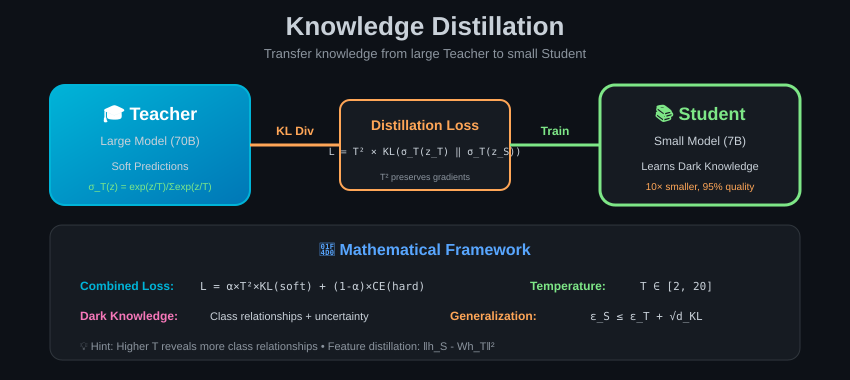

# Module 04: Knowledge Distillation

<p align="center">
  
</p>

## 🎯 Overview

Knowledge Distillation (KD) transfers knowledge from a large "teacher" model to a smaller "student" model. This module provides rigorous mathematical foundations and proofs.

---

## 📐 Mathematical Foundations

### 1. Problem Formulation

**Objective:** Train student $f\_S$ to mimic teacher $f\_T$:

```math
\min_{\theta_S} \mathbb{E}_{x \sim \mathcal{D}}\left[\mathcal{L}_{KD}(f_S(x; \theta_S), f_T(x; \theta_T))\right]

```

Subject to:

- $|\theta\_S| \ll |\theta\_T|$ (student is smaller)

- $\theta\_T$ is fixed (teacher is frozen)

---

### 2. Temperature Scaling

**Definition:** Softmax with temperature $T$:

```math
\sigma_T(z)_i = \frac{\exp(z_i / T)}{\sum_j \exp(z_j / T)}

```

**Properties:**

1. **$T \to 0$:** Approaches one-hot (argmax)

```math
\lim_{T \to 0} \sigma_T(z) = e_{\arg\max_i z_i}

```math

2. **$T \to \infty$:** Approaches uniform

```

\lim_{T \to \infty} \sigma_T(z) = \frac{1}{K}\mathbf{1}

```

3. **$T = 1$:** Standard softmax

**Theorem 1 (Entropy Increase):**

```math
H(\sigma_T(z)) \geq H(\sigma_1(z)) \quad \forall T \geq 1

```

**Proof:**

The entropy is:

```math
H(\sigma_T(z)) = -\sum_i \sigma_T(z)_i \log \sigma_T(z)_i

```

As $T$ increases, $\sigma\_T(z)$ becomes more uniform, and entropy increases toward $\log K$.

**Gradient Property:**

```math
\frac{\partial \sigma_T(z)_i}{\partial z_j} = \frac{1}{T}\sigma_T(z)_i(\delta_{ij} - \sigma_T(z)_j)

```

The factor $1/T$ means gradients are scaled by temperature.

---

### 3. KL Divergence Loss

**Definition:** The distillation loss using KL divergence:

```math
\mathcal{L}_{KD} = T^2 \cdot KL(\sigma_T(z_T) \| \sigma_T(z_S))
= T^2 \sum_i \sigma_T(z_T)_i \log \frac{\sigma_T(z_T)_i}{\sigma_T(z_S)_i}

```

**Why $T^2$ scaling?**

**Theorem 2 (Gradient Magnitude Preservation):**

The $T^2$ factor ensures gradient magnitudes are preserved:

```math
\frac{\partial \mathcal{L}_{KD}}{\partial z_S} \propto \frac{\partial \mathcal{L}_{CE}}{\partial z_S}

```

**Proof:**

Without $T^2$:

```math
\frac{\partial \mathcal{L}_{KD}}{\partial z_{S,i}} = \frac{1}{T}(\sigma_T(z_S)_i - \sigma_T(z_T)_i)

```

With $T^2$:

```math
\frac{\partial (T^2 \mathcal{L}_{KD})}{\partial z_{S,i}} = T(\sigma_T(z_S)_i - \sigma_T(z_T)_i)

```

As $T \to 1$, this matches the cross-entropy gradient:

```math
\frac{\partial \mathcal{L}_{CE}}{\partial z_{S,i}} = \sigma_1(z_S)_i - y_i

```

---

### 4. Combined Loss Function

```math
\mathcal{L}_{total} = \alpha \cdot T^2 \cdot KL(\sigma_T(z_T) \| \sigma_T(z_S)) + (1 - \alpha) \cdot CE(y, \sigma_1(z_S))

```

Where:

- $\alpha \in [0, 1]$ balances soft and hard labels

- $T$ is temperature

- $y$ is ground truth

**Interpretation:**
- First term: Match teacher's soft predictions (dark knowledge)

- Second term: Match ground truth labels (task knowledge)

---

## 📊 Theoretical Analysis

### 1. Why Does Distillation Work?

**Theorem 3 (Dark Knowledge):**

Soft labels contain information about class relationships that hard labels don't.

**Formal Statement:**

Let $p\_T = \sigma\_T(z\_T)$ and $y$ be one-hot. Then:

```math
I(X; p_T | Y) \geq 0

```

The teacher's soft predictions carry additional mutual information about input $X$ beyond the label $Y$.

**Proof sketch:**

$p\_T$ encodes:

1. Which classes are similar (high probability on related classes)

2. Confidence levels (uncertainty about prediction)

3. Input-dependent information

This information is lost in hard labels.

### 2. Generalization Bound

**Theorem 4 (Distillation Generalization):**

Let $\epsilon\_T$ be teacher's generalization error and $d\_{KL}$ the average KL divergence achieved by student:

```math
\epsilon_S \leq \epsilon_T + \sqrt{d_{KL}} + O\left(\sqrt{\frac{\text{complexity}(S)}{n}}\right)

```

**Implication:** If student can match teacher well ($d\_{KL} \approx 0$), it inherits teacher's generalization.

### 3. Model Compression Bound

**Theorem 5 (Ba & Caruana, 2014):**

A shallow network trained with distillation can approximate a deep network:

For teacher $f\_T$ with depth $L$ and width $w$, there exists student $f\_S$ with depth 1 and width $w' = O(w^L)$ such that:

```math
\|f_T(x) - f_S(x)\| \leq \epsilon \quad \forall x \in \mathcal{X}

```

**Note:** Width grows exponentially with depth, so practical distillation uses deeper students.

---

## 📐 Feature-Based Distillation

### 1. Hidden State Matching

**Objective:** Match intermediate representations:

```math
\mathcal{L}_{hidden} = \sum_{l \in \mathcal{M}} \|h_S^{(l)} - \phi(h_T^{(\pi(l))})\|_F^2

```

Where:

- $\mathcal{M}$ = set of matched layers

- $\pi(l)$ = teacher layer corresponding to student layer $l$

- $\phi$ = projection function (if dimensions differ)

### 2. Projection Function

When $d\_S \neq d\_T$, use learned projection:

```math
\phi(h_T) = W_{proj} h_T, \quad W_{proj} \in \mathbb{R}^{d_S \times d_T}

```

**Learning $W\_{proj}$:**

```math
\min_{W_{proj}} \|h_S - W_{proj} h_T\|_F^2

```

**Closed-form solution:**

```math
W_{proj}^* = h_S h_T^T (h_T h_T^T)^{-1}

```

### 3. Attention Transfer

**Definition:** Match attention maps:

```math
\mathcal{L}_{attn} = \sum_{l} \|A_S^{(l)} - A_T^{(\pi(l))}\|_F^2

```

Where $A = \text{softmax}(QK^T / \sqrt{d})$.

**Theorem 6:** Attention transfer preserves the "what to attend to" information:

```math
\text{MI}(A_S; X) \approx \text{MI}(A_T; X)

```

After successful attention distillation.

---

## 📊 Relation-Based Distillation

### 1. Relational Knowledge Distillation (RKD)

**Key Idea:** Transfer relationships between samples, not just individual outputs.

**Distance-wise Loss:**

```math
\mathcal{L}_{RKD-D} = \sum_{(i,j)} l_\delta\left(\psi_D(t_i, t_j), \psi_D(s_i, s_j)\right)

```

Where:

```math
\psi_D(x_i, x_j) = \frac{\|x_i - x_j\|_2}{\mu_D}, \quad \mu_D = \frac{1}{|\mathcal{P}|}\sum_{(i,j) \in \mathcal{P}} \|x_i - x_j\|_2

```

**Angle-wise Loss:**

```math
\mathcal{L}_{RKD-A} = \sum_{(i,j,k)} l_\delta\left(\psi_A(t_i, t_j, t_k), \psi_A(s_i, s_j, s_k)\right)

```

Where:

```math
\psi_A(x_i, x_j, x_k) = \cos \angle x_j x_i x_k = \frac{(x_i - x_j)^T(x_i - x_k)}{\|x_i - x_j\|\|x_i - x_k\|}

```

---

## 📈 Progressive Distillation

### Mathematical Framework

For large teacher-student gap, use intermediate teaching assistants:

```math
T \to TA_1 \to TA_2 \to \ldots \to S

```

**Theorem 7 (Progressive Distillation Bound):**

With $k$ intermediate models of geometrically decreasing size:

```math
\mathcal{L}_S^* \leq \mathcal{L}_T^* + k \cdot \epsilon_{step}

```

Where $\epsilon\_{step}$ is per-step distillation error.

**Optimal number of steps:**

```math
k^* = O\left(\log \frac{|T|}{|S|}\right)

```

**Proof:**

If each step has compression ratio $r$, then after $k$ steps:

```math

|S| = |T| / r^k
k = \log_r(|T|/|S|)

```

---

## 📐 Self-Distillation

### Born-Again Networks

**Process:**

1. Train model $M\_1$ on data

2. Train $M\_2$ (same architecture) with $M\_1$ as teacher

3. Repeat

**Theorem 8:** Self-distillation can improve generalization:

```math
\mathbb{E}[\mathcal{L}_{test}(M_{k+1})] \leq \mathbb{E}[\mathcal{L}_{test}(M_k)]

```

Under mild conditions (ensembling effect).

**Explanation:** Each generation acts as an implicit ensemble:

```math
M_{k+1} \approx \mathbb{E}_{init}[M_k]

```

---

## 📊 Optimal Temperature Selection

**Theorem 9:** The optimal temperature depends on the entropy gap:

```math
T^* \approx \sqrt{\frac{H(p_T)}{H(y)}}

```

Where $H(p\_T)$ is entropy of teacher predictions and $H(y)$ is entropy of labels.

**Intuition:**
- High teacher confidence → lower T

- High label uncertainty → higher T

**Empirical Guidelines:**

| Scenario | Recommended T |
|----------|--------------|
| Simple task, confident teacher | 2-4 |
| Complex task, uncertain teacher | 4-8 |
| Noisy labels | 8-20 |

---

## 📖 Summary of Key Formulas

| Concept | Formula |
|---------|---------|
| Temperature softmax | $\sigma\_T(z)\_i = \frac{\exp(z\_i/T)}{\sum\_j \exp(z\_j/T)}$ |
| KL loss | $\mathcal{L}\_{KD} = T^2 \cdot KL(\sigma\_T(z\_T) \| \sigma\_T(z\_S))$ |
| Combined loss | $\alpha T^2 KL + (1-\alpha)CE$ |
| Hidden loss | $\sum\_l \|h\_S^{(l)} - \phi(h\_T^{(l)})\|\_F^2$ |
| RKD distance | $\psi\_D = \|x\_i - x\_j\|\_2 / \mu\_D$ |
| Optimal steps | $k^* = O(\log(|T|/|S|))$ |

---

## ➡️ Next Module

Continue to [Module 05: Weight Sharing](../05_weight_sharing/) for mathematical analysis of parameter sharing techniques.
