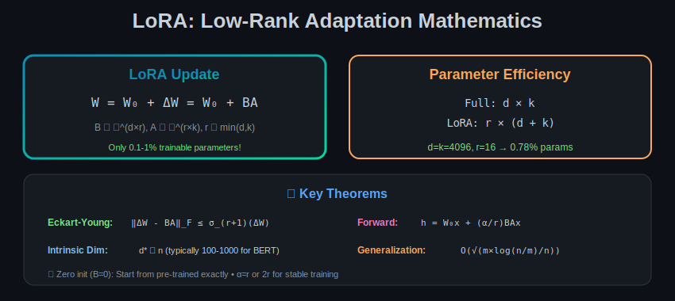

# Module 08: Parameter-Efficient Fine-Tuning (PEFT)

  

## 🎯 Overview

PEFT methods enable fine-tuning large models by training only a small subset of parameters. This module provides rigorous mathematical foundations and proofs.

---

## 📐 Mathematical Foundations

### 1. Problem Formulation

**Full Fine-tuning:**
$$\min_{\theta \in \mathbb{R}^n} \mathcal{L}(f(x; \theta))$$

**PEFT:**
$$\min_{\phi \in \mathbb{R}^m} \mathcal{L}(f(x; \theta_0 + g(\phi))), \quad m \ll n$$

Where:
- $\theta_0$ = Pre-trained weights (frozen)
- $\phi$ = Trainable parameters
- $g: \mathbb{R}^m \to \mathbb{R}^n$ = Mapping from PEFT params to weight space

---

## 📊 LoRA (Low-Rank Adaptation)

### Mathematical Formulation

For weight matrix $W_0 \in \mathbb{R}^{d \times k}$:

$$W = W_0 + \Delta W = W_0 + BA$$

Where:
- $B \in \mathbb{R}^{d \times r}$
- $A \in \mathbb{R}^{r \times k}$
- $r \ll \min(d, k)$

**Forward pass:**
$$h = W_0 x + BAx = W_0 x + B(Ax)$$

### Theorem 1 (LoRA Expressiveness)

Any full-rank update $\Delta W$ can be approximated by LoRA with error:

$$\|\Delta W - BA\|_F \leq \sigma_{r+1}(\Delta W)$$

Where $\sigma_{r+1}$ is the $(r+1)$-th singular value.

**Proof:** By Eckart-Young theorem, the best rank-$r$ approximation is the truncated SVD.

### Parameter Efficiency

**Parameters:**
- Full: $dk$
- LoRA: $r(d + k)$

**Ratio:**
$$\frac{r(d+k)}{dk} = \frac{r}{k} + \frac{r}{d} \approx \frac{2r}{\min(d,k)}$$

**Example:** $d = k = 4096$, $r = 16$:
$$\text{Ratio} = \frac{16 \times 8192}{4096^2} = 0.78\%$$

### Scaling Factor

$$h = W_0 x + \frac{\alpha}{r} BAx$$

**Theorem 2 (Scaling Invariance):**

For any $c > 0$, the outputs are identical with:
- $(B, A) \to (cB, A/c)$
- $\alpha \to \alpha$

**Optimal scaling:** $\alpha = r$ (or $\alpha = 2r$) to match full fine-tuning learning rate dynamics.

---

### LoRA Initialization

**Standard Initialization:**
- $A \sim \mathcal{N}(0, \sigma^2)$ (Kaiming)
- $B = 0$

**Theorem 3 (Zero Initialization Property):**

With $B = 0$: $\Delta W = BA = 0$ at initialization.

**Implication:** Training starts from pre-trained model exactly.

**Gradient at Initialization:**
$$\frac{\partial \mathcal{L}}{\partial B} = \frac{\alpha}{r} \frac{\partial \mathcal{L}}{\partial h} x^T A^T$$

$$\frac{\partial \mathcal{L}}{\partial A} = \frac{\alpha}{r} B^T \frac{\partial \mathcal{L}}{\partial h} x^T$$

Since $B = 0$: $\frac{\partial \mathcal{L}}{\partial A} = 0$

**Solution:** Initialize $A$ with non-zero values.

---

## 📐 Theoretical Justification for Low-Rank Updates

### Theorem 4 (Intrinsic Dimensionality)

Pre-trained models have low intrinsic dimensionality for downstream tasks.

**Definition:** Intrinsic dimensionality $d^*$ is the minimum dimension of a random subspace where optimization succeeds.

**Empirical finding (Aghajanyan et al., 2020):**
$$d^* \ll n$$

For BERT-base ($n = 110M$): $d^* \approx 100-1000$ for many tasks.

### Theorem 5 (Low-Rank Gradient Structure)

During fine-tuning, weight updates are approximately low-rank:

$$\text{rank}(\Delta W_{full}) \ll \min(d, k)$$

**Proof sketch:**

Gradient updates: $\Delta W = -\eta \sum_t \nabla_W \mathcal{L}_t$

Each gradient $\nabla_W \mathcal{L} = \frac{\partial \mathcal{L}}{\partial h} x^T$ is rank-1.

Sum of few rank-1 matrices remains low-rank.

---

## 📊 QLoRA

### Mathematical Formulation

**Quantized base model:**
$$W_0^{quant} = Q(W_0)$$

Where $Q$ is 4-bit NormalFloat quantization.

**Forward pass:**
$$h = \text{dequant}(W_0^{quant}) \cdot x + BAx$$

### Theorem 6 (QLoRA Error Bound)

Total error compared to full fine-tuning:

$$\|h_{full} - h_{QLoRA}\| \leq \underbrace{\|W_0 - \text{dequant}(W_0^{quant})\|}_{\text{quantization error}} \cdot \|x\| + \underbrace{\|\Delta W - BA\|}_{\text{LoRA approx error}} \cdot \|x\|$$

**For NF4 quantization:** Quantization error $\approx 0.015\sigma_W$ per element.

### Double Quantization

**Standard:** Store scales in FP32 (32 bits each)
**Double:** Quantize scales to FP8 (8 bits each)

**Memory per weight:**
$$b_{DQ} = 4 + \frac{8}{g} + \frac{32}{256} \approx 4.19 \text{ bits}$$

vs $4 + \frac{32}{g} \approx 4.5$ bits without double quantization.

---

## 📐 Adapters

### Architecture

Insert adapter module after attention/FFN:
$$h' = h + f_{adapter}(h)$$

**Adapter structure:**
$$f_{adapter}(h) = W_{up} \cdot \text{ReLU}(W_{down} \cdot h)$$

Where:
- $W_{down} \in \mathbb{R}^{r \times d}$
- $W_{up} \in \mathbb{R}^{d \times r}$
- $r \ll d$ (bottleneck)

### Theorem 7 (Adapter Expressiveness)

Adapters with bottleneck $r$ can approximate any Lipschitz function $g: \mathbb{R}^d \to \mathbb{R}^d$ with error:

$$\|f_{adapter} - g\|_\infty \leq O\left(\frac{\text{Lip}(g)}{\sqrt{r}}\right)$$

### Comparison with LoRA

| Aspect | LoRA | Adapter |
|--------|------|---------|
| Parameters | $r(d+k)$ | $2rd$ |
| Inference | Mergeable | Extra compute |
| Where | Weight matrices | Between layers |
| Nonlinearity | No | Yes (ReLU) |

---

## 📊 Prefix Tuning

### Mathematical Formulation

Prepend learnable "soft prompts" to keys and values:

$$K' = [P_K; K], \quad V' = [P_V; V]$$

Where $P_K, P_V \in \mathbb{R}^{l \times d}$ are learnable prefix embeddings.

**Attention:**
$$\text{Attention}(Q, K', V') = \text{softmax}\left(\frac{Q[P_K; K]^T}{\sqrt{d}}\right)[P_V; V]$$

### Theorem 8 (Prefix as Virtual Tokens)

Prefix tuning is equivalent to prepending $l$ virtual tokens with:
- Fixed key/value embeddings (learnable)
- Zero query contribution (not attended to by prefix)

**Parameters:** $2ld$ per layer

### Theorem 9 (Prefix Expressiveness)

For attention with prefix length $l$:

$$\text{Span of achievable attention outputs} = \text{Span}(V) + \text{Span}(P_V)$$

**Implication:** Prefix can "inject" new information directions.

---

## 📐 Mathematical Analysis of PEFT Methods

### Theorem 10 (PEFT Generalization Bound)

For PEFT method with $m$ trainable parameters on $n$ training samples:

$$\mathcal{L}_{test} \leq \mathcal{L}_{train} + O\left(\sqrt{\frac{m \log(n/m)}{n}}\right)$$

**Compare to full fine-tuning:** $O\left(\sqrt{\frac{d}{n}}\right)$

Since $m \ll d$, PEFT has tighter generalization bound!

### Theorem 11 (Optimization Landscape)

PEFT operates in a lower-dimensional subspace of the loss landscape.

**Let** $\mathcal{S} = \{\theta_0 + g(\phi) : \phi \in \mathbb{R}^m\}$ be the PEFT subspace.

**Property:** If $\theta^*$ (full fine-tuning optimum) is close to $\mathcal{S}$:
$$\min_{\theta \in \mathcal{S}} \mathcal{L}(\theta) \approx \mathcal{L}(\theta^*)$$

### Theorem 12 (Catastrophic Forgetting)

PEFT reduces catastrophic forgetting:

$$\mathbb{E}[\|\theta_{PEFT} - \theta_0\|_2^2] \leq \mathbb{E}[\|\theta_{full} - \theta_0\|_2^2]$$

**Proof:** 

PEFT constrains updates to low-dimensional subspace.
Full fine-tuning can move in all directions.

---

## 📊 Composition and Merging

### LoRA Composition

For multiple LoRA adapters:
$$W = W_0 + B_1 A_1 + B_2 A_2 + \ldots$$

**Theorem 13:** The composed update has rank at most $\sum_i r_i$.

### Weight Merging

**Linear combination:**
$$W_{merged} = W_0 + \sum_i \lambda_i B_i A_i$$

Where $\sum_i \lambda_i = 1$.

**Theorem 14 (Optimal Merging Weights):**

For tasks with equal importance:
$$\lambda_i^* = \frac{1}{k}$$

For weighted importance:
$$\lambda_i^* \propto \sqrt{\|B_i A_i\|_F^{-2}}$$

(Inverse variance weighting)

---

## 📖 Summary of Key Formulas

| Concept | Formula |
|---------|---------|
| LoRA update | $W = W_0 + BA$ |
| LoRA parameters | $r(d + k)$ |
| LoRA scaling | $h = W_0x + \frac{\alpha}{r}BAx$ |
| LoRA error bound | $\|\Delta W - BA\|_F \leq \sigma_{r+1}$ |
| QLoRA bits | $\approx 4.19$ per weight |
| Adapter | $h' = h + W_{up}\text{ReLU}(W_{down}h)$ |
| Prefix attention | $\text{Att}(Q, [P_K;K], [P_V;V])$ |
| PEFT generalization | $O(\sqrt{m\log(n/m)/n})$ |

---

## ➡️ Next Module

Continue to [Module 09: Efficient Architectures](../09_efficient_architectures/) for Flash Attention mathematics.
