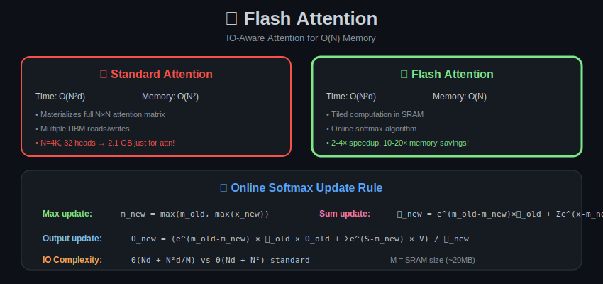

# Module 09: Efficient Architectures

<p align="center">
  
</p>

## 🎯 Overview

Efficient architectures reduce memory and compute through algorithmic innovations. This module provides mathematical foundations for Flash Attention and related techniques.

---

## 📐 Standard Attention Analysis

### Attention Mechanism

$$\text{Attention}(Q, K, V) = \text{softmax}\left(\frac{QK^T}{\sqrt{d_k}}\right)V$$

Where:
- $Q \in \mathbb{R}^{N \times d}$ (queries)
- $K \in \mathbb{R}^{N \times d}$ (keys)
- $V \in \mathbb{R}^{N \times d}$ (values)
- $N$ = sequence length
- $d$ = head dimension

### Complexity Analysis

**Compute:**
1. $QK^T$: $O(N^2 d)$ operations
2. Softmax: $O(N^2)$ operations
3. $(\text{softmax}) \cdot V$: $O(N^2 d)$ operations

**Total:** $O(N^2 d)$

**Memory:**
- $Q, K, V$: $O(Nd)$
- Attention matrix $S = QK^T$: $O(N^2)$ ← **Bottleneck!**
- Softmax output: $O(N^2)$

**For $N = 4096$, $d = 64$:**
- Attention matrix: $4096^2 \times 4 = 67$ MB per head
- 32 heads: **2.1 GB** just for attention!

---

## 📊 Flash Attention

### Key Insight: Memory Hierarchy

**GPU Memory Hierarchy:**
- HBM (High Bandwidth Memory): Large (~40GB), slow (~1.5 TB/s)
- SRAM (on-chip): Small (~20MB), fast (~19 TB/s)

**Standard attention is memory-bound:**
- Writes $O(N^2)$ to HBM
- HBM bandwidth limits speed

### Tiling Strategy

**Idea:** Compute attention in blocks that fit in SRAM.

Partition $Q$ into blocks: $Q_1, Q_2, \ldots, Q_{T_r}$ of size $B_r \times d$
Partition $K, V$ into blocks: $K_1, V_1, \ldots, K_{T_c}, V_{T_c}$ of size $B_c \times d$

**Block attention:**
$$O_i = \sum_j \text{softmax}_{local}(Q_i K_j^T) V_j$$

**Problem:** Softmax requires seeing all values!

---

### Online Softmax Algorithm

**Theorem 1 (Safe Softmax):**

The softmax can be computed incrementally:

$$\text{softmax}(x)_i = \frac{e^{x_i}}{\sum_j e^{x_j}} = \frac{e^{x_i - m}}{\sum_j e^{x_j - m}}$$

Where $m = \max_j x_j$ (for numerical stability).

**Online Algorithm:**

For new block $x_{new}$:

$$m_{new} = \max(m_{old}, \max(x_{new}))$$

$$\ell_{new} = e^{m_{old} - m_{new}} \cdot \ell_{old} + \sum_j e^{x_{new,j} - m_{new}}$$

$$\text{softmax}(x)_i = \frac{e^{x_i - m_{new}}}{\ell_{new}}$$

**Theorem 2 (Output Update):**

For attention output $O$ with blocks:

$$O_{new} = \frac{e^{m_{old} - m_{new}} \cdot \ell_{old} \cdot O_{old} + \sum_j e^{S_{ij} - m_{new}} V_j}{\ell_{new}}$$

This allows computing attention without materializing the full $N \times N$ matrix!

---

### Flash Attention Algorithm

```
Algorithm: FlashAttention
Input: Q, K, V in HBM, block sizes Br, Bc
Output: O in HBM

1. Initialize O = 0, ℓ = 0, m = -∞ in HBM
2. for i = 1 to Tr:
3.     Load Qi from HBM to SRAM
4.     Initialize Oi = 0, ℓi = 0, mi = -∞ in SRAM
5.     for j = 1 to Tc:
6.         Load Kj, Vj from HBM to SRAM
7.         Sij = Qi Kj^T (in SRAM)
8.         mij = max(mi, rowmax(Sij))
9.         Pij = exp(Sij - mij)
10.        ℓij = exp(mi - mij) × ℓi + rowsum(Pij)
11.        Oi = (ℓi/ℓij) × exp(mi - mij) × Oi + Pij × Vj
12.        mi = mij, ℓi = ℓij
13.    Write Oi to HBM
```

### Theorem 3 (Flash Attention Correctness)

Flash Attention computes exact attention:
$$O_{FA} = \text{softmax}(QK^T)V = O_{standard}$$

**Proof:**

The algorithm maintains invariants:
- $\ell_i = \sum_{j \leq \text{current}} \exp(S_{ij} - m_i)$
- $m_i = \max_{j \leq \text{current}} S_{ij}$
- $O_i = \frac{\sum_{j \leq \text{current}} \exp(S_{ij} - m_i) V_j}{\ell_i}$

At termination (all blocks processed), this equals the full softmax.

### Complexity Analysis

**IO Complexity:**

Reads/writes to HBM:
$$\Theta\left(Nd + \frac{N^2d}{M}\right)$$

Where $M$ = SRAM size.

**Compare to standard:** $\Theta(Nd + N^2)$

**Improvement factor:** $O\left(\frac{N^2}{Nd + N^2d/M}\right) = O\left(\frac{NM}{d(M+N)}\right)$

For typical values ($N = 4096$, $d = 64$, $M = 100KB$): **~4× fewer HBM accesses**

---

## 📐 Flash Attention 2 Improvements

### 1. Reduced Non-Matmul FLOPs

**Observation:** Rescaling operations are expensive.

**Solution:** Delay rescaling to end of inner loop.

### 2. Parallelism

**Flash Attention 1:** Parallelize over batch and heads
**Flash Attention 2:** Also parallelize over sequence length

**Work partitioning:**
$$\text{Warps} \leftarrow \text{blocks of } Q$$

Instead of:
$$\text{Warps} \leftarrow \text{blocks of } K, V$$

### Theorem 4 (Flash Attention 2 Speedup)

For sequence length $N$ and $P$ processing units:

$$\text{Speedup}_{FA2/FA1} \approx \min\left(\frac{N}{B_r}, 2\right)$$

**Typical:** 1.5-2× over Flash Attention 1.

---

## 📊 Memory-Efficient Attention

### Gradient Checkpointing for Attention

**Problem:** Backward pass needs attention matrix $S$ and softmax $P$.

**Solution:** Recompute during backward pass.

**Memory:** $O(N)$ instead of $O(N^2)$
**Compute:** 2× forward (recomputation cost)

### Theorem 5 (Checkpointing Trade-off)

For $L$ layers with attention:

| Strategy | Memory | Compute |
|----------|--------|---------|
| No checkpointing | $O(LN^2)$ | $1\times$ |
| Full checkpointing | $O(N^2)$ | $2\times$ |
| Flash Attention | $O(LN)$ | $1\times$ |

---

## 📐 Linear Attention

### Kernel Formulation

**Standard:** $A = \text{softmax}(QK^T)$

**Linear (kernel):** $A = \frac{\phi(Q)\phi(K)^T}{\phi(Q)\phi(K)^T\mathbf{1}}$

For kernel $k(q, k) = \phi(q)^T\phi(k)$.

### Theorem 6 (Associativity Trick)

$$\phi(Q)(\phi(K)^T V) = \phi(Q) \cdot \underbrace{\left(\sum_i \phi(k_i)v_i^T\right)}_{d \times d \text{ matrix}}$$

**Complexity:** $O(Nd^2)$ instead of $O(N^2d)$.

**When $d < N$:** Linear in sequence length!

### Random Feature Approximation

**Theorem 7 (Random Fourier Features):**

For RBF kernel $k(x, y) = e^{-\|x-y\|^2/2}$:

$$k(x, y) \approx \phi(x)^T\phi(y)$$

Where $\phi(x) = \sqrt{\frac{2}{D}}[\cos(\omega_1^T x), \sin(\omega_1^T x), \ldots]$

And $\omega_i \sim \mathcal{N}(0, I)$.

**Error:** $O(1/\sqrt{D})$ with $D$ random features.

---

## 📊 Multi-Query/Grouped-Query Attention

### Mathematical Formulation

**MHA:** Each head has own $K, V$
$$\text{head}_i = \text{Attn}(QW_i^Q, KW_i^K, VW_i^V)$$

**MQA:** All heads share $K, V$
$$\text{head}_i = \text{Attn}(QW_i^Q, KW^K, VW^V)$$

**GQA:** Groups share $K, V$
$$\text{head}_i = \text{Attn}(QW_i^Q, KW_{g(i)}^K, VW_{g(i)}^V)$$

### Theorem 8 (GQA Approximation Error)

For GQA with $g$ groups vs MHA with $h$ heads:

$$\mathbb{E}[\|O_{MHA} - O_{GQA}\|^2] \leq \frac{h - g}{h} \cdot \text{Var}(KV)$$

**Proof sketch:** Averaging KV heads within group introduces error proportional to within-group variance.

### KV-Cache Reduction

| Method | KV-Cache | Reduction |
|--------|----------|-----------|
| MHA | $2BShd$ | 1× |
| GQA | $2BSgd$ | $h/g$ |
| MQA | $2BSd$ | $h$ |

For LLaMA-2 70B ($h = 64$, $g = 8$): 8× reduction.

---

## 📖 Summary of Key Formulas

| Concept | Formula |
|---------|---------|
| Standard attention | $O(N^2d)$ time, $O(N^2)$ space |
| Flash Attention IO | $O(Nd + N^2d/M)$ |
| Online softmax | $\ell_{new} = e^{m_{old} - m_{new}}\ell_{old} + \sum e^{x - m_{new}}$ |
| Linear attention | $O(Nd^2)$ |
| GQA KV-cache | $2BSgd$ |
| FA2 speedup | $\min(N/B_r, 2)\times$ |

---

## ➡️ Next Module

Continue to [Module 10: Compression Pipelines](../10_compression_pipelines/) for end-to-end optimization workflows.
