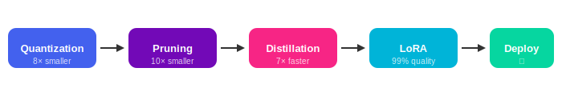

<p align="center">
  
</p>

<p align="center">
  
</p>

<p align="center">
  <b>Transform 70B parameter models into efficient 4GB deployable systems</b>
</p>

---

## 🎯 Pipeline

<p align="center">
  
</p>

---

## 📚 Modules

<table>
<tr>
<td>

### 🔰 Foundations

| | Module | Topics |
|:-:|:-------|:-------|
| [](./01_introduction/) | [**Introduction**](./01_introduction/) | Compression fundamentals, tradeoffs |
| [](./02_quantization/) | [**Quantization**](./02_quantization/) | INT8, INT4, GPTQ, AWQ |
| [](./03_pruning/) | [**Pruning**](./03_pruning/) | Magnitude, structured, lottery ticket |
| [](./04_knowledge_distillation/) | [**Distillation**](./04_knowledge_distillation/) | Soft labels, temperature scaling |

</td>
<td>

### ⚙️ Advanced

| | Module | Topics |
|:-:|:-------|:-------|
| [](./05_weight_sharing/) | [**Weight Sharing**](./05_weight_sharing/) | ALBERT, MQA, GQA |
| [](./06_factorization/) | [**Factorization**](./06_factorization/) | SVD, Tucker decomposition |
| [](./07_sparsity/) | [**Sparsity**](./07_sparsity/) | MoE, 2:4 sparsity |
| [](./08_peft/) | [**PEFT**](./08_peft/) | LoRA, QLoRA, Adapters |

</td>
</tr>
<tr>
<td>

### ⚡ Systems

| | Module | Topics |
|:-:|:-------|:-------|
| [](./09_efficient_architectures/) | [**Efficient Arch**](./09_efficient_architectures/) | Flash Attention |
| [](./10_compression_pipelines/) | [**Pipelines**](./10_compression_pipelines/) | End-to-end workflows |
| [](./11_tools/) | [**Tools**](./11_tools/) | TensorRT, ONNX, llama.cpp |

</td>
<td>

### 🚀 Practice

| | Module | Topics |
|:-:|:-------|:-------|
| [](./12_case_studies/) | [**Case Studies**](./12_case_studies/) | BERT, LLaMA |
| [](./13_future_directions/) | [**Future**](./13_future_directions/) | Speculative decoding, Mamba |

</td>
</tr>
</table>

<details>
<summary><b>📋 Quick Links</b></summary>

<br/>

<p align="center">

[](./01_introduction/)
[](./02_quantization/)
[](./03_pruning/)
[](./04_knowledge_distillation/)

[](./05_weight_sharing/)
[](./06_factorization/)
[](./07_sparsity/)
[](./08_peft/)

[](./09_efficient_architectures/)
[](./10_compression_pipelines/)
[](./11_tools/)
[](./12_case_studies/)
[](./13_future_directions/)

</p>

</details>

---

## 🚀 Quick Start

```bash
pip install -r requirements.txt
python 02_quantization/int8_quantization.py
```

---

## 📐 Mathematics

Each module includes detailed mathematical foundations:

- **Quantization**: Lloyd-Max theorem, GPTQ Hessian analysis
- **Pruning**: OBD/OBS saliency, lottery ticket hypothesis  
- **Distillation**: KL divergence, temperature scaling proof
- **LoRA**: Low-rank adaptation theory, error bounds
- **Flash Attention**: IO complexity analysis

---

## 📖 References

### Core Quantization Papers

| Paper | Authors | Year | Link |
|:------|:--------|:----:|:-----|
| GPTQ: Accurate Post-Training Quantization | Frantar et al. | 2022 | [arxiv.org/abs/2210.17323](https://arxiv.org/abs/2210.17323) |
| AWQ: Activation-aware Weight Quantization | Lin et al. | 2023 | [arxiv.org/abs/2306.00978](https://arxiv.org/abs/2306.00978) |
| LLM.int8(): 8-bit Matrix Multiplication | Dettmers et al. | 2022 | [arxiv.org/abs/2208.07339](https://arxiv.org/abs/2208.07339) |
| SmoothQuant | Xiao et al. | 2022 | [arxiv.org/abs/2211.10438](https://arxiv.org/abs/2211.10438) |

### Pruning & Sparsity Papers

| Paper | Authors | Year | Link |
|:------|:--------|:----:|:-----|
| Optimal Brain Damage | LeCun et al. | 1990 | [papers.nips.cc/paper/1989/250](https://papers.nips.cc/paper/1989/hash/6c9882bbac1c7093bd25041881277658-Abstract.html) |
| Optimal Brain Surgeon | Hassibi & Stork | 1993 | [papers.nips.cc/paper/1992/647](https://papers.nips.cc/paper/1992/hash/303ed4c69846ab36c2904d3ba8573050-Abstract.html) |
| Lottery Ticket Hypothesis | Frankle & Carlin | 2019 | [arxiv.org/abs/1803.03635](https://arxiv.org/abs/1803.03635) |
| What's Hidden in a Random Network | Ramanujan et al. | 2020 | [arxiv.org/abs/1911.13299](https://arxiv.org/abs/1911.13299) |
| Proving Lottery Tickets | Malach et al. | 2020 | [arxiv.org/abs/2002.00585](https://arxiv.org/abs/2002.00585) |
| 2:4 Structured Sparsity | NVIDIA | 2021 | [arxiv.org/abs/2104.08378](https://arxiv.org/abs/2104.08378) |

### Knowledge Distillation Papers

| Paper | Authors | Year | Link |
|:------|:--------|:----:|:-----|
| Distilling Knowledge in Neural Networks | Hinton et al. | 2015 | [arxiv.org/abs/1503.02531](https://arxiv.org/abs/1503.02531) |
| Do Deep Nets Really Need to be Deep? | Ba & Caruana | 2014 | [arxiv.org/abs/1312.6184](https://arxiv.org/abs/1312.6184) |
| DistilBERT | Sanh et al. | 2019 | [arxiv.org/abs/1910.01108](https://arxiv.org/abs/1910.01108) |

### Parameter-Efficient Fine-Tuning

| Paper | Authors | Year | Link |
|:------|:--------|:----:|:-----|
| LoRA: Low-Rank Adaptation | Hu et al. | 2021 | [arxiv.org/abs/2106.09685](https://arxiv.org/abs/2106.09685) |
| QLoRA: Efficient Finetuning | Dettmers et al. | 2023 | [arxiv.org/abs/2305.14314](https://arxiv.org/abs/2305.14314) |
| Intrinsic Dimensionality | Aghajanyan et al. | 2020 | [arxiv.org/abs/2012.13255](https://arxiv.org/abs/2012.13255) |
| Adapter Modules | Houlsby et al. | 2019 | [arxiv.org/abs/1902.00751](https://arxiv.org/abs/1902.00751) |
| Prefix-Tuning | Li & Liang | 2021 | [arxiv.org/abs/2101.00190](https://arxiv.org/abs/2101.00190) |

### Efficient Architectures

| Paper | Authors | Year | Link |
|:------|:--------|:----:|:-----|
| Flash Attention | Dao et al. | 2022 | [arxiv.org/abs/2205.14135](https://arxiv.org/abs/2205.14135) |
| Flash Attention 2 | Dao | 2023 | [arxiv.org/abs/2307.08691](https://arxiv.org/abs/2307.08691) |
| Multi-Query Attention | Shazeer | 2019 | [arxiv.org/abs/1911.02150](https://arxiv.org/abs/1911.02150) |
| GQA: Grouped-Query Attention | Ainslie et al. | 2023 | [arxiv.org/abs/2305.13245](https://arxiv.org/abs/2305.13245) |
| ALBERT | Lan et al. | 2019 | [arxiv.org/abs/1909.11942](https://arxiv.org/abs/1909.11942) |

### Foundation Models & Theory

| Paper | Authors | Year | Link |
|:------|:--------|:----:|:-----|
| Attention Is All You Need | Vaswani et al. | 2017 | [arxiv.org/abs/1706.03762](https://arxiv.org/abs/1706.03762) |
| Scaling Laws for Neural LMs | Kaplan et al. | 2020 | [arxiv.org/abs/2001.08361](https://arxiv.org/abs/2001.08361) |
| LLaMA | Touvron et al. | 2023 | [arxiv.org/abs/2302.13971](https://arxiv.org/abs/2302.13971) |
| Mistral 7B | Jiang et al. | 2023 | [arxiv.org/abs/2310.06825](https://arxiv.org/abs/2310.06825) |
| Phi-3 Technical Report | Microsoft | 2024 | [arxiv.org/abs/2404.14219](https://arxiv.org/abs/2404.14219) |
| Qwen / Qwen2 | Alibaba | 2023-24 | [arxiv.org/abs/2309.16609](https://arxiv.org/abs/2309.16609) |
| ChatGLM / GLM-4 | Tsinghua & Zhipu | 2023-24 | [arxiv.org/abs/2406.12793](https://arxiv.org/abs/2406.12793) |
| DeepSeek-V2 MoE | DeepSeek | 2024 | [arxiv.org/abs/2405.04434](https://arxiv.org/abs/2405.04434) |
| Yi-1.5 | 01.AI | 2024 | [arxiv.org/abs/2403.04652](https://arxiv.org/abs/2403.04652) |
| InternLM2 | Shanghai AI Lab | 2024 | [arxiv.org/abs/2403.17297](https://arxiv.org/abs/2403.17297) |
| Baichuan2 | Baichuan AI | 2023 | [arxiv.org/abs/2309.10305](https://arxiv.org/abs/2309.10305) |

### Tools & Frameworks

| Tool | Description | Link |
|:-----|:------------|:-----|
| llama.cpp | C++ LLM inference | [github.com/ggerganov/llama.cpp](https://github.com/ggerganov/llama.cpp) |
| vLLM | High-throughput serving | [github.com/vllm-project/vllm](https://github.com/vllm-project/vllm) |
| TensorRT-LLM | NVIDIA optimization | [github.com/NVIDIA/TensorRT-LLM](https://github.com/NVIDIA/TensorRT-LLM) |
| PEFT | HuggingFace PEFT library | [github.com/huggingface/peft](https://github.com/huggingface/peft) |
| bitsandbytes | Quantization library | [github.com/TimDettmers/bitsandbytes](https://github.com/TimDettmers/bitsandbytes) |
| GGML/GGUF | Quantization format | [github.com/ggerganov/ggml](https://github.com/ggerganov/ggml) |

---

## ⭐ Star History

[](https://star-history.com/#Gaurav14cs17/LLMs_Model&Date)

---

## 📜 License

MIT License - see [LICENSE](./LICENSE) for details.

---

<p align="center">
  <b>Made with ❤️ for the ML Community</b>
</p>
