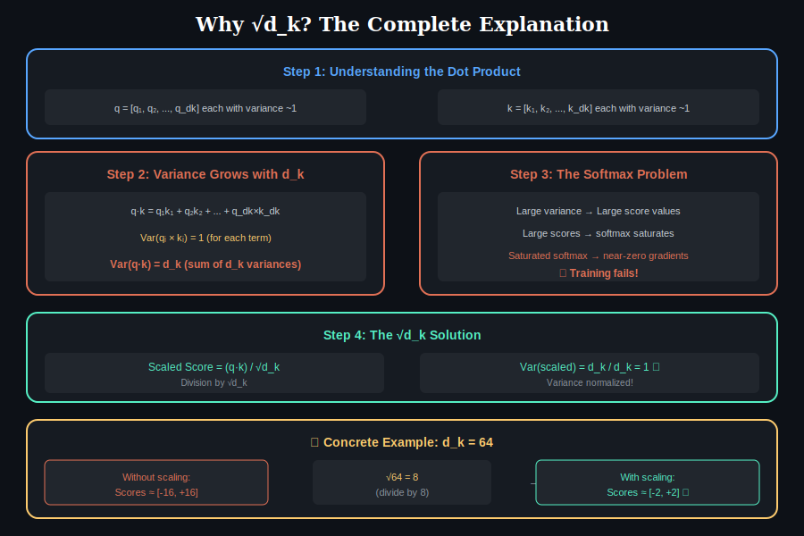
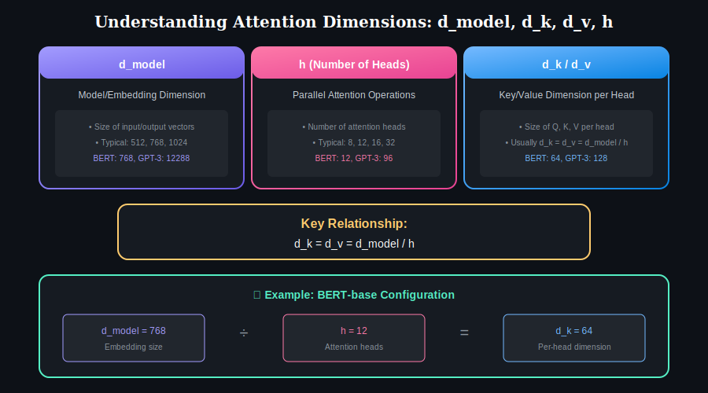
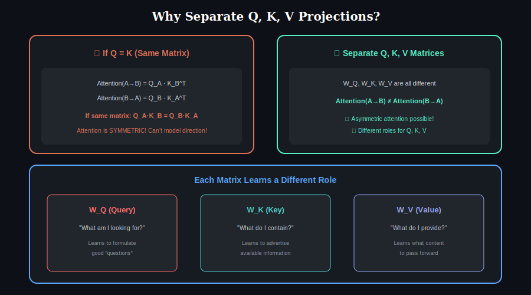
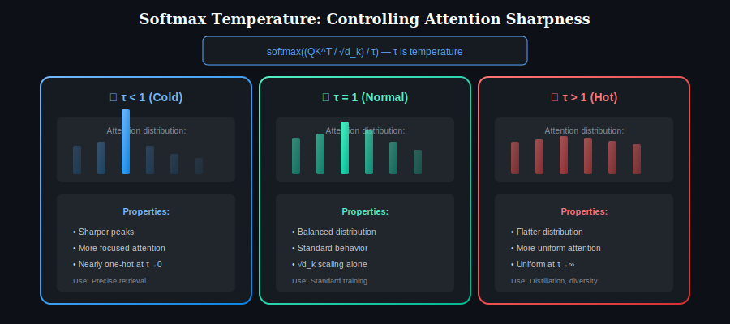
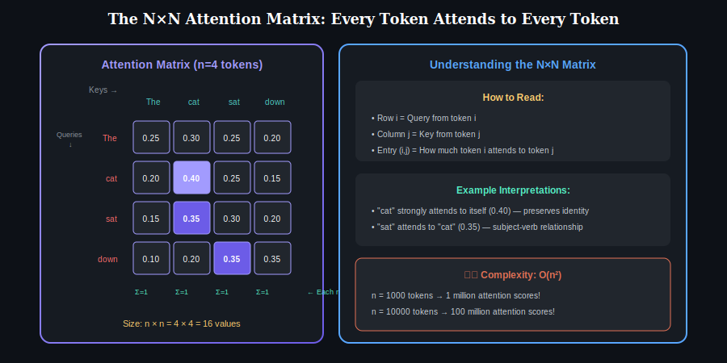

# 🔑 Important Attention Concepts (Don't Skip These!)

> **These small details make or break your understanding of attention!**

This chapter covers the often-overlooked but crucial concepts in attention mechanisms.

---

## Table of Contents

1. [Why Divide by √d_k?](#why-divide-by-√dk)
2. [What is d_k, d_v, d_model?](#what-is-dk-dv-dmodel)
3. [Why Separate Q, K, V Matrices?](#why-separate-q-k-v-matrices)
4. [Softmax Temperature](#softmax-temperature)
5. [Attention Dropout](#attention-dropout)
6. [Positional Encoding vs Attention](#positional-encoding-vs-attention)
7. [Output Projection](#output-projection)
8. [Attention vs Feed-Forward](#attention-vs-feed-forward)
9. [Why N×N Matrix?](#why-n×n-matrix)
10. [Computational Tricks](#computational-tricks)

---

## 1. Why Divide by √d_k? {#why-divide-by-√dk}

<p align="center">
  
</p>

### The Problem Without Scaling

When computing attention scores via dot product, the **variance grows with dimension**:

| Dimension (d_k) | Variance of q·k | Score Range | Softmax Behavior |
|-----------------|-----------------|-------------|------------------|
| 16 | 16 | [-8, +8] | Somewhat smooth |
| 64 | 64 | [-16, +16] | Starting to saturate |
| 256 | 256 | [-32, +32] | Heavily saturated |
| 512 | 512 | [-45, +45] | Nearly one-hot |

### Mathematical Derivation

Assume q and k have zero mean and unit variance per component:

$$q = [q_1, q_2, ..., q_{d_k}]$$
$$k = [k_1, k_2, ..., k_{d_k}]$$

The dot product is:
$$q \cdot k = \sum_{i=1}^{d_k} q_i \times k_i$$

Since Var(q_i × k_i) = 1 (assuming independence):
$$\text{Var}(q \cdot k) = \sum_{i=1}^{d_k} \text{Var}(q_i \times k_i) = d_k$$

### The Solution

After dividing by √d_k:

$$\text{Var}\left(\frac{q \cdot k}{\sqrt{d_k}}\right) = \frac{\text{Var}(q \cdot k)}{d_k} = \frac{d_k}{d_k} = 1$$

**Variance is now ~1 regardless of dimension!**

### Why Not Divide by d_k?

| Scaling Factor | Resulting Variance | Problem |
|----------------|-------------------|---------|
| None | d_k | Too large, saturated softmax |
| d_k | 1/d_k | Too small, too flat attention |
| **√d_k** | **1** | **Just right!** |

---

## 2. What is d_k, d_v, d_model? {#what-is-dk-dv-dmodel}

<p align="center">
  
</p>

### Dimension Glossary

| Symbol | Name | Typical Value | Description |
|--------|------|---------------|-------------|
| **d_model** | Model dimension | 512, 768, 1024 | Size of input/output embeddings |
| **d_k** | Key/Query dimension | d_model / h | Size of each Q, K projection |
| **d_v** | Value dimension | d_model / h | Size of each V projection |
| **h** | Number of heads | 8, 12, 16 | Parallel attention heads |
| **n** | Sequence length | Variable | Number of tokens |

### Relationship

In multi-head attention:

$$d_k = d_v = \frac{d_{model}}{h}$$

**Example:** BERT-base
- d_model = 768
- h = 12 heads
- d_k = d_v = 768 / 12 = 64

### Why This Matters

- **Total computation stays constant:** 12 heads × 64 dimensions = 768 total
- **Same output size:** Output is d_model regardless of head count
- **√d_k changes with head count:** More heads → smaller d_k → smaller √d_k

---

## 3. Why Separate Q, K, V Matrices? {#why-separate-q-k-v-matrices}

<p align="center">
  
</p>

### The Simple Answer

Using **different learned projections** allows the model to:

| Benefit | Explanation |
|---------|-------------|
| **Asymmetric attention** | A can attend to B without B equally attending to A |
| **Role specialization** | Q asks questions, K advertises, V provides content |
| **More parameters** | 3× the learning capacity |
| **Better expressiveness** | Can learn complex attention patterns |

### What If We Used Same Matrix for Q and K?

If Q = K (same projection), attention would be **symmetric**:
- Attention(A→B) = Attention(B→A)
- Cannot model directional relationships
- "The cat sat" — both directions would have same attention!

### Intuition

| Component | Role | Learns To |
|-----------|------|-----------|
| **W_Q** | Query projection | Ask the right questions |
| **W_K** | Key projection | Advertise available information |
| **W_V** | Value projection | Provide useful content |

Different roles need different transformations!

---

## 4. Softmax Temperature {#softmax-temperature}

<p align="center">
  
</p>

### What is Temperature?

Temperature τ modifies how "sharp" the attention distribution is:

$$\text{Attention} = \text{softmax}\left(\frac{QK^T}{\sqrt{d_k} \times \tau}\right)$$

### Temperature Effects

| τ Value | Name | Attention Pattern | Use Case |
|---------|------|-------------------|----------|
| 0.1-0.5 | Very Cold | Almost one-hot | Hard attention approximation |
| 0.5-1.0 | Cold | Sharp, focused | Precise retrieval |
| **1.0** | **Normal** | **Default behavior** | **Standard training** |
| 1.0-2.0 | Warm | Softer, spread out | Regularization |
| 2.0+ | Hot | Very flat, uniform | Exploration |

### When to Use Temperature

| Scenario | Recommended τ |
|----------|---------------|
| Training | 1.0 (standard) |
| Inference (focused) | 0.7-1.0 |
| Sampling (diverse) | 1.0-1.5 |
| Knowledge distillation | 2.0+ |

**Note:** In most implementations, temperature is only applied during inference, not training.

---

## 5. Attention Dropout {#attention-dropout}

### What Gets Dropped?

Dropout is applied to attention weights **after softmax, before multiplying with V**:

$$\text{Output} = \text{Dropout}(\text{softmax}(scores)) \times V$$

### Why Drop Attention Weights?

| Purpose | Explanation |
|---------|-------------|
| **Regularization** | Prevents over-reliance on specific attention patterns |
| **Robustness** | Model learns to use multiple tokens, not just one |
| **Prevents co-adaptation** | Attention heads can't rely on other heads' patterns |

### Typical Values

| Model | Attention Dropout |
|-------|-------------------|
| BERT | 0.1 |
| GPT-2 | 0.1 |
| GPT-3 | 0.0 |

---

## 6. Positional Encoding vs Attention {#positional-encoding-vs-attention}

### The Problem

Self-attention is **permutation equivariant**:
- If you shuffle input tokens, outputs shuffle the same way
- Attention has NO built-in notion of position

### The Solution: Positional Encoding

Add position information **before** attention:

$$\text{Input} = \text{Embedding} + \text{PositionalEncoding}$$

### Types of Positional Encoding

| Type | Description | Used In |
|------|-------------|---------|
| **Sinusoidal** | Fixed sin/cos functions | Original Transformer |
| **Learned** | Trained embeddings | BERT, GPT |
| **Relative** | Encodes distance, not absolute | T5, TransformerXL |
| **Rotary (RoPE)** | Rotates Q, K by position | LLaMA, GPT-NeoX |
| **ALiBi** | Adds bias based on distance | BLOOM |

### Key Insight

Position information flows into attention through Q and K:
- Tokens close together may attend more (if useful)
- Position-dependent patterns can emerge

---

## 7. Output Projection {#output-projection}

### What Happens After Attention?

After computing attention output, there's often an **output projection**:

$$\text{FinalOutput} = \text{Concat}(\text{head}_1, ..., \text{head}_h) \times W_O$$

### Purpose of W_O

| Function | Description |
|----------|-------------|
| **Combine heads** | Mix information from all attention heads |
| **Project back** | Return to d_model dimension |
| **Learn mixing** | Which head combinations are useful |

### Dimensions

- Input: (n × h × d_v) flattened to (n × d_model)
- W_O: (d_model × d_model)
- Output: (n × d_model)

---

## 8. Attention vs Feed-Forward {#attention-vs-feed-forward}

### In Each Transformer Block

```
Input
  ↓
[Self-Attention] → Mixes information across positions
  ↓
[Add & Norm]
  ↓
[Feed-Forward] → Processes each position independently
  ↓
[Add & Norm]
  ↓
Output
```

### Key Difference

| Aspect | Attention | Feed-Forward (FFN) |
|--------|-----------|-------------------|
| **Scope** | All positions interact | Each position independent |
| **Purpose** | Information routing | Non-linear transformation |
| **Parameters** | W_Q, W_K, W_V, W_O | W1, W2, biases |
| **Complexity** | O(n²) | O(n) |

### Why Both?

- **Attention alone:** Good at routing, weak at transformation
- **FFN alone:** Good at transformation, no cross-position info
- **Together:** Route information, then transform it

---

## 9. Why N×N Matrix? {#why-n×n-matrix}

<p align="center">
  
</p>

### Every Token Attends to Every Token

For n tokens, we compute n² attention scores:

| Entry (i, j) | Meaning |
|--------------|---------|
| Score[0,0] | How much token 0 attends to token 0 |
| Score[0,1] | How much token 0 attends to token 1 |
| Score[i,j] | How much token i attends to token j |

### Matrix Structure

| | Token 0 | Token 1 | Token 2 | ... | Token n-1 |
|---|---------|---------|---------|-----|-----------|
| **Token 0** | a₀₀ | a₀₁ | a₀₂ | ... | a₀ₙ |
| **Token 1** | a₁₀ | a₁₁ | a₁₂ | ... | a₁ₙ |
| **...** | ... | ... | ... | ... | ... |
| **Token n-1** | aₙ₀ | aₙ₁ | aₙ₂ | ... | aₙₙ |

### Row vs Column

| Direction | Meaning | After Softmax |
|-----------|---------|---------------|
| **Row i** | Token i's attention TO all tokens | Sums to 1.0 |
| **Column j** | All tokens' attention FROM token j | Doesn't sum to 1 |

---

## 10. Computational Tricks {#computational-tricks}

### Flash Attention

Modern efficient attention implementation:
- Fuses operations in single GPU kernel
- Reduces memory from O(n²) to O(n)
- 2-4× faster than naive implementation

### KV Caching (for Generation)

During autoregressive generation:
- Cache computed K, V for previous tokens
- Only compute Q for new token
- Avoids recomputing everything at each step

### Memory-Efficient Attention

Compute attention in chunks:
- Don't materialize full n×n matrix
- Trade compute for memory
- Enables longer sequences

---

## Quick Reference Table

| Concept | What It Does | Why It Matters |
|---------|--------------|----------------|
| **√d_k scaling** | Normalizes variance | Prevents softmax saturation |
| **d_k = d_model/h** | Keeps computation constant | Multi-head efficiency |
| **Separate Q,K,V** | Different projections | Asymmetric attention |
| **Temperature** | Sharpens/flattens attention | Control attention focus |
| **Dropout** | Regularizes attention | Prevents overfitting |
| **Positional encoding** | Adds position info | Breaks permutation equivariance |
| **Output projection** | Mixes heads | Combines multi-head outputs |
| **N×N matrix** | All-to-all attention | Global receptive field |

---

## Navigation

<p align="center">
  <a href="../">← Back to Main</a> | <a href="../01-self-attention/"><b>Chapter 1: Self-Attention →</b></a>
</p>

