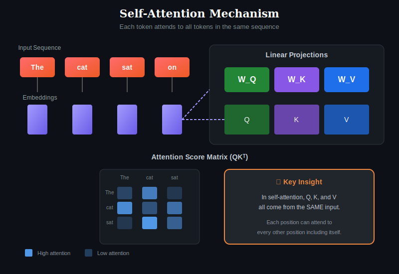
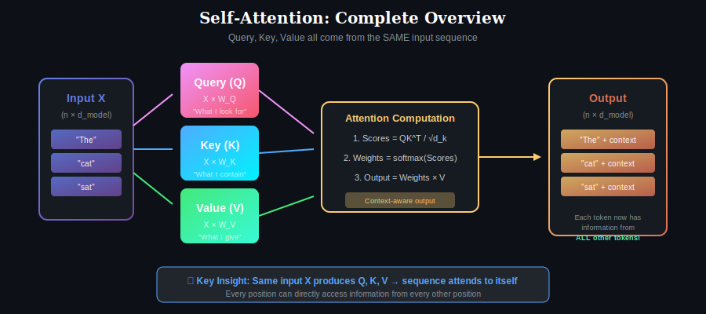
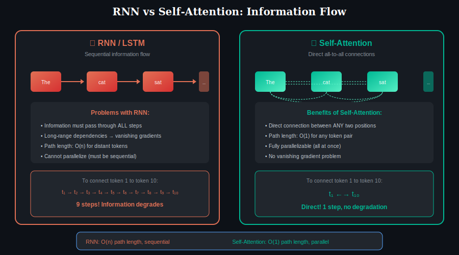
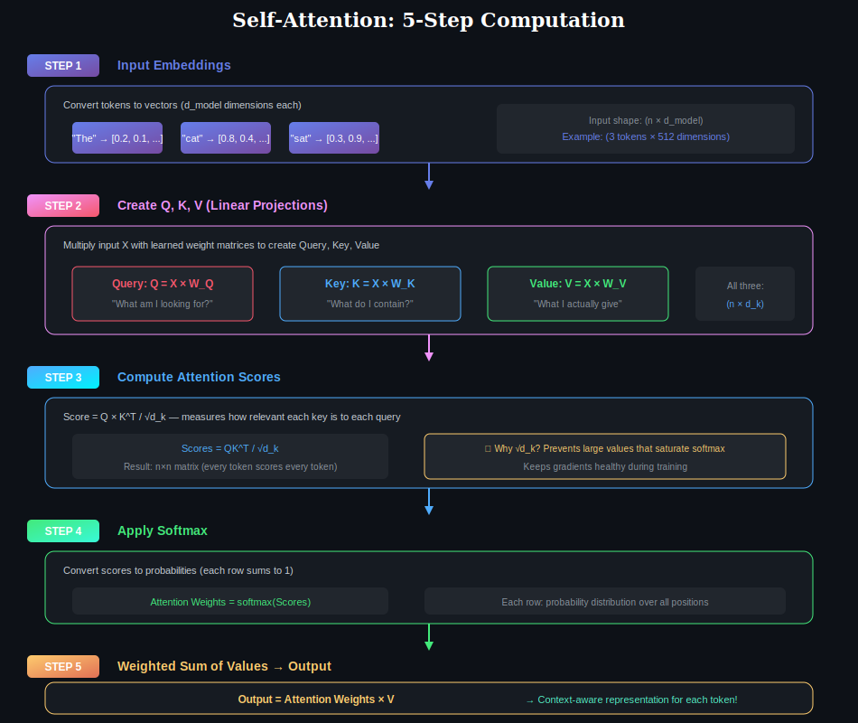
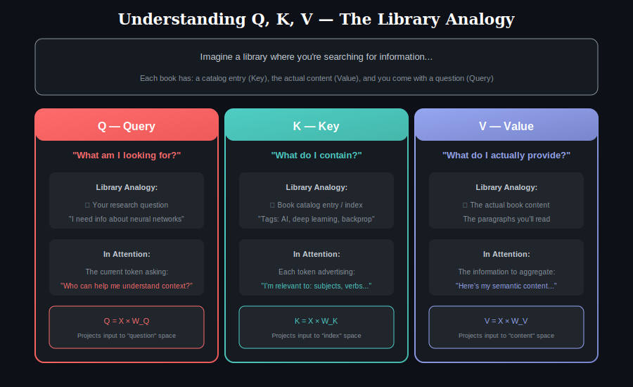
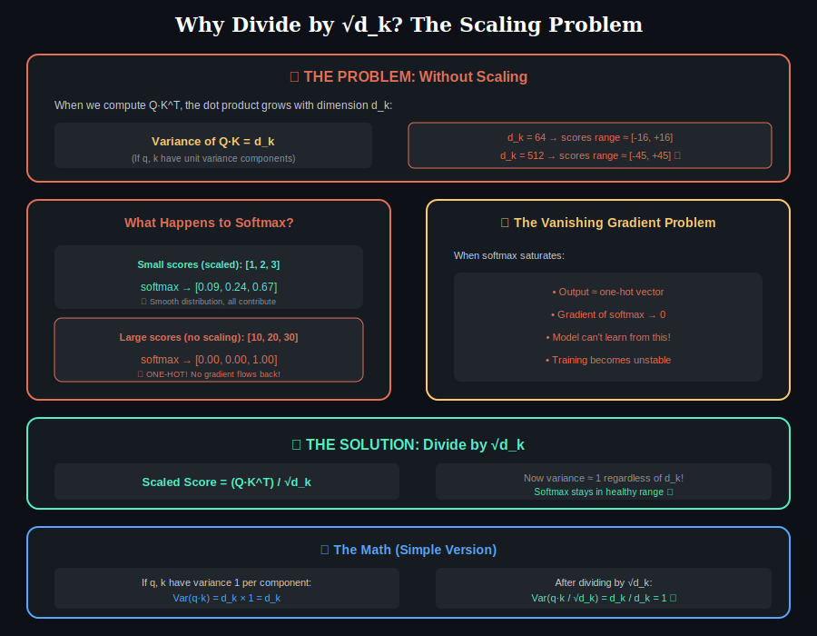
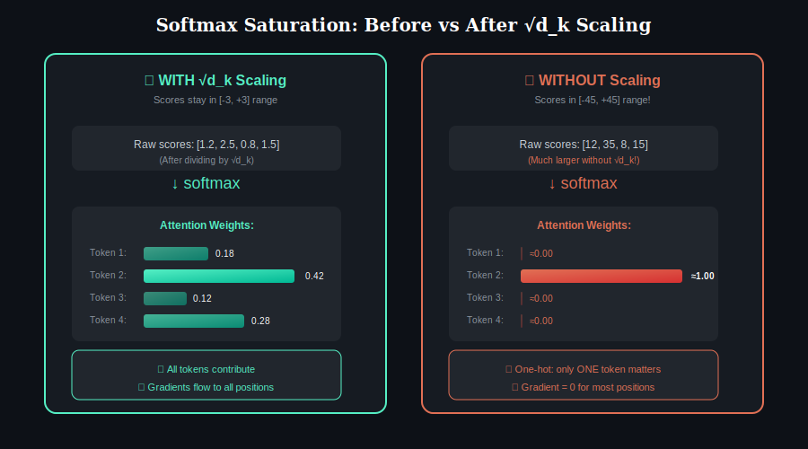
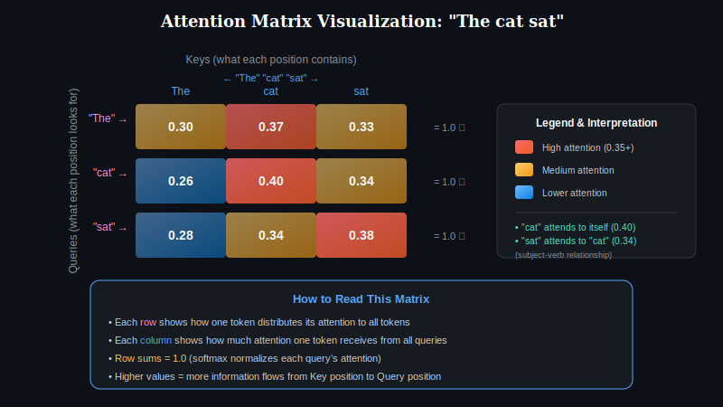
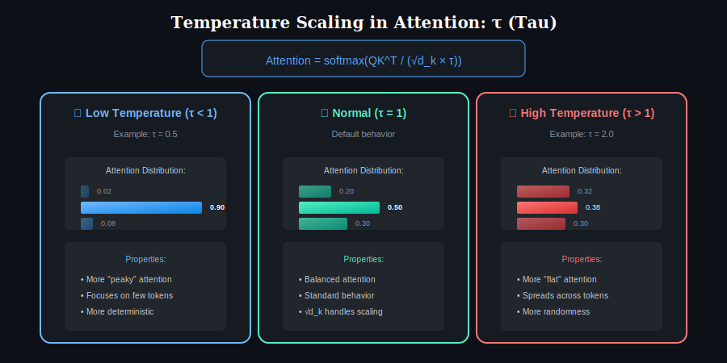

# 📖 Chapter 1: Self-Attention (Intra-Attention)

> **This is the foundation — master this before moving on!**

<p align="center">
  
</p>

## Overview

Self-attention, also known as **intra-attention**, is an attention mechanism where a sequence attends to itself. Unlike cross-attention where queries come from one sequence and keys/values from another, in self-attention, **queries, keys, and values all derive from the same input sequence**.

This mechanism allows every position in the sequence to directly interact with every other position, enabling the model to capture complex dependencies regardless of their distance in the sequence.

---

## Core Concept: Complete Overview

<p align="center">
  
</p>

### The Fundamental Idea

Imagine reading a sentence: *"The animal didn't cross the street because it was too tired."*

To understand what "it" refers to, you need to connect it back to "animal" — a word that appears much earlier. Self-attention enables this by allowing each word to "look at" all other words and determine which ones are relevant.

### Key Insight

The same input X produces all three components:
- **Query (Q):** What information am I looking for?
- **Key (K):** What information do I contain?
- **Value (V):** What information do I actually provide?

---

## Why Self-Attention? RNN vs Self-Attention

<p align="center">
  
</p>

### The Problem with RNNs

RNNs process sequences step-by-step, passing information through a chain:

| Problem | RNN Impact |
|---------|------------|
| **Sequential processing** | Cannot parallelize, slow training |
| **Vanishing gradients** | Information degrades over long distances |
| **Long path length** | Token 1 to Token 100 = 99 steps |
| **Information bottleneck** | All context compressed into fixed-size hidden state |

### How Self-Attention Solves This

| Aspect | RNN/LSTM | Self-Attention |
|--------|----------|----------------|
| **Information Flow** | Sequential (step-by-step) | Direct (all-to-all) |
| **Long Dependencies** | Difficult (vanishing gradients) | Easy (direct connections) |
| **Parallelization** | Limited (sequential nature) | Fully parallelizable |
| **Path Length** | O(n) for distant tokens | O(1) for any pair |

---

## Step-by-Step Computation

<p align="center">
  
</p>

### Step 1: Input Embeddings

We start with input tokens converted to embedding vectors.

**What happens:**
- Each word/token becomes a vector of numbers
- All embeddings have the same dimension (d_model)
- Example: "The cat sat" → 3 vectors, each of dimension 512

| Token | Embedding (example) |
|-------|---------------------|
| "The" | [0.2, 0.1, 0.5, 0.3, ...] (512 dims) |
| "cat" | [0.8, 0.4, 0.1, 0.7, ...] (512 dims) |
| "sat" | [0.3, 0.9, 0.2, 0.4, ...] (512 dims) |

**Input shape:** (n × d_model) where n = number of tokens

---

### Step 2: Create Q, K, V (Linear Projections)

Each input embedding is transformed into three different vectors through learned weight matrices:

**The formulas:**

$$Q = X \times W_Q \quad \text{(Query)}$$
$$K = X \times W_K \quad \text{(Key)}$$
$$V = X \times W_V \quad \text{(Value)}$$

**What each represents:**

| Component | Question It Answers | Purpose |
|-----------|---------------------|---------|
| **Query (Q)** | "What am I looking for?" | What information does this position need |
| **Key (K)** | "What do I contain?" | What information can this position provide |
| **Value (V)** | "What do I actually give?" | The actual content to be aggregated |

**Why three separate projections?**
- Different projections allow the model to learn different aspects
- Q: learned to "ask good questions"
- K: learned to "advertise" what's available  
- V: learned to provide the "answer"

**Shape after projection:** All three are (n × d_k)

### Deep Dive: Understanding Q, K, V Intuitively

<p align="center">
  
</p>

**The Library Analogy:**

| Component | Library Analogy | In NLP |
|-----------|-----------------|--------|
| **Query** | Your research question | "What context do I need?" |
| **Key** | Book index/catalog entries | "What information do I have to offer?" |
| **Value** | Actual book content | "Here's my semantic content" |
| **Attention** | Matching question to catalog | Finding relevant tokens |
| **Output** | Reading relevant paragraphs | Aggregating weighted information |

**Why NOT just use the same matrix for Q and K?**

Using different matrices allows:
- **Asymmetric relationships:** "The" can attend strongly to "cat" without "cat" attending equally to "The"
- **Different roles:** Questions vs. answers require different representations
- **Learned specialization:** Each matrix learns its optimal transformation

---

### Step 3: Compute Attention Scores

Calculate how relevant each position is to every other position:

$$\text{Scores} = \frac{QK^T}{\sqrt{d_k}}$$

**Step-by-step breakdown:**

| Sub-step | Operation | Result |
|----------|-----------|--------|
| 3a | Matrix multiply Q × K^T | n × n matrix |
| 3b | Divide by √d_k | Scaled scores |

**What this produces:**
- An **n × n matrix** where entry (i, j) = how relevant position j is to position i
- Each row represents one query's compatibility with all keys

---

## ⚠️ Critical Concept: Why Divide by √d_k?

<p align="center">
  
</p>

This is one of the most important details in attention — **without scaling, training fails!**

### The Problem: Variance Explosion

When we compute the dot product Q·K^T, something dangerous happens:

| Dimension (d_k) | Expected Score Range | Problem |
|-----------------|---------------------|---------|
| 64 | ≈ [-16, +16] | Starting to saturate |
| 256 | ≈ [-32, +32] | Worse |
| 512 | ≈ [-45, +45] | Severe saturation |

**Why does this happen?**

If each element of q and k has variance 1, then:
$$\text{Var}(q \cdot k) = \sum_{i=1}^{d_k} \text{Var}(q_i \times k_i) = d_k$$

The **variance grows linearly** with dimension!

### The Disaster: Softmax Saturation

<p align="center">
  
</p>

When softmax receives large values:

| Input Scores | Softmax Output | Gradient |
|-------------|----------------|----------|
| [1, 2, 3] | [0.09, 0.24, 0.67] | ✅ Healthy gradients |
| [10, 20, 30] | [0.00, 0.00, 1.00] | ❌ Near-zero gradients |

**What goes wrong:**
1. Softmax becomes **one-hot** (winner-takes-all)
2. Gradient of softmax ≈ 0 for all positions
3. Model **can't learn** — gradients don't flow back
4. Training becomes **unstable** or fails completely

### The Solution: Scale by √d_k

$$\text{Scaled Scores} = \frac{Q \cdot K^T}{\sqrt{d_k}}$$

**Why √d_k specifically?**

$$\text{Var}\left(\frac{q \cdot k}{\sqrt{d_k}}\right) = \frac{d_k}{d_k} = 1$$

Now the variance is **always 1**, regardless of dimension!

### Numerical Example

**Without scaling (d_k = 64):**
```
q = [0.1, -0.2, 0.3, ...] (64 values)
k = [0.2, 0.1, -0.3, ...] (64 values)
q·k = sum of 64 terms ≈ 12.8 (can be large!)
```

**With scaling:**
```
q·k / √64 = 12.8 / 8 = 1.6 (reasonable!)
```

### Visual Comparison

| Aspect | Without √d_k | With √d_k |
|--------|--------------|-----------|
| **Scores range** | [-45, +45] | [-3, +3] |
| **Softmax output** | One-hot (saturated) | Smooth distribution |
| **Gradient magnitude** | ≈ 0 (vanishing) | Healthy |
| **Training** | Unstable/fails | Stable |
| **All tokens contribute** | ❌ No | ✅ Yes |

---

### Step 4: Apply Softmax

Convert raw scores into probability distributions:

$$\text{Attention Weights} = \text{softmax}(\text{Scores})$$

**What softmax does:**

| Before Softmax | After Softmax |
|----------------|---------------|
| Any real numbers | All values ≥ 0 |
| Can be negative | Sum to 1.0 per row |
| Unbounded | Probability distribution |

**Properties:**
- Each row becomes a probability distribution over all positions
- Higher scores → higher probabilities
- Lower scores → near-zero probabilities
- Each position now has an "attention distribution" over all positions

---

### Step 5: Weighted Sum of Values

Compute the final output by aggregating values based on attention weights:

$$\text{Output} = \text{Attention Weights} \times V$$

**What this does:**
- For each position, take a weighted average of ALL value vectors
- Positions with higher attention weights contribute more
- Result: **Context-aware representation** for each position

**Example for position "sat":**
```
Output_sat = 0.22 × V_the + 0.35 × V_cat + 0.43 × V_sat
```
The output for "sat" now contains information weighted by relevance from all tokens!

---

## Visual Example: Attention Matrix

<p align="center">
  
</p>

### Attention Weights for "The cat sat"

| Query ↓ / Key → | The | cat | sat | Row Sum |
|-----------------|-----|-----|-----|---------|
| **"The"** | 0.30 | 0.37 | 0.33 | 1.0 |
| **"cat"** | 0.26 | **0.40** | 0.34 | 1.0 |
| **"sat"** | 0.28 | 0.34 | **0.38** | 1.0 |

### How to Interpret

- **"cat" attends most to itself (0.40):** Makes sense — it's a noun, needs to preserve its identity
- **"sat" attends to "cat" (0.34):** Captures subject-verb relationship
- **"The" spreads attention fairly evenly:** Articles are context-dependent

### Final Output Computation

| Token | Output Formula |
|-------|----------------|
| "The" | 0.30 × V_the + 0.37 × V_cat + 0.33 × V_sat |
| "cat" | 0.26 × V_the + 0.40 × V_cat + 0.34 × V_sat |
| "sat" | 0.28 × V_the + 0.34 × V_cat + 0.38 × V_sat |

Each output is now **context-aware** — it incorporates information from all positions!

---

## Complete Mathematical Formula

$$\text{SelfAttention}(X) = \text{softmax}\left(\frac{(XW_Q)(XW_K)^T}{\sqrt{d_k}}\right)(XW_V)$$

### Parameter Shapes

| Parameter | Shape | Description |
|-----------|-------|-------------|
| X | (n × d_model) | Input sequence |
| W_Q | (d_model × d_k) | Query projection |
| W_K | (d_model × d_k) | Key projection |
| W_V | (d_model × d_v) | Value projection |
| Output | (n × d_v) | Context-aware output |

---

## Why Self-Attention Works

### 1. Global Receptive Field

Every position can directly access information from every other position. Unlike CNNs (local) or RNNs (sequential), there's no information bottleneck.

### 2. Dynamic Attention Patterns

The attention weights are **input-dependent**. The same model will produce different attention patterns for different inputs, adapting to the specific content.

### 3. Permutation Equivariance

Self-attention is naturally **permutation equivariant** — if you shuffle the input positions, the outputs shuffle correspondingly. This is why positional embeddings are necessary.

### 4. Captures Multiple Relationship Types

Different attention heads (in multi-head attention) can learn to capture:
- Syntactic relationships (subject-verb agreement)
- Semantic similarity
- Coreference (pronoun resolution)
- Positional patterns

---

## Computational Complexity

| Metric | Complexity | Notes |
|--------|------------|-------|
| Time | O(n² × d) | Quadratic in sequence length |
| Space | O(n² + nd) | Attention matrix + embeddings |
| Parallelization | Fully parallel | Unlike RNNs |

### The Quadratic Bottleneck

| Sequence Length | Attention Matrix Size | Memory (FP16) |
|----------------|----------------------|---------------|
| 128 | 16,384 | 32 KB |
| 512 | 262,144 | 512 KB |
| 2,048 | 4,194,304 | 8 MB |
| 8,192 | 67,108,864 | 128 MB |
| 32,768 | 1,073,741,824 | 2 GB |

This is why long-sequence attention variants (sparse, linear) were developed.

---

## What Attention Heads Learn

Research has shown that different attention heads in trained models specialize in different patterns:

| Pattern Type | Description | Example |
|-------------|-------------|---------|
| **Positional** | Attend to adjacent positions | Previous/next token |
| **Syntactic** | Grammatical relationships | Subject → verb |
| **Semantic** | Meaning-based connections | Related concepts |
| **Delimiter** | Attention to special tokens | Focus on [SEP], [CLS] |
| **Rare token** | Attend to low-frequency words | Focus on unusual words |

---

## Variants of Self-Attention

### 1. Bidirectional Self-Attention
- Every position attends to all positions
- Used in: BERT, encoder models

### 2. Causal (Unidirectional) Self-Attention
- Each position only attends to previous positions
- Used in: GPT, decoder models
- [Learn more →](../04-causal-attention/)

### 3. Sparse Self-Attention
- Attend to subset of positions
- Used in: Longformer, BigBird
- [Learn more →](../05-sparse-attention/)

---

---

## 🌡️ Additional Concept: Temperature Scaling

<p align="center">
  
</p>

Sometimes we add a **temperature parameter** τ to control attention sharpness:

$$\text{Attention} = \text{softmax}\left(\frac{QK^T}{\sqrt{d_k} \times \tau}\right)V$$

### Effect of Temperature

| Temperature | Effect | Use Case |
|-------------|--------|----------|
| **τ < 1** (Low) | Sharper, more focused attention | When you want decisive attention |
| **τ = 1** (Normal) | Default behavior | Standard training |
| **τ > 1** (High) | Softer, more distributed attention | Exploration, diversity |

**Note:** In standard Transformers, τ = 1 (no additional temperature), and √d_k handles the necessary scaling.

---

## ❓ Frequently Asked Questions

### Q: Why not just use d_k instead of √d_k?

**A:** Dividing by d_k would over-correct and make attention too flat. √d_k is mathematically optimal because:
- Variance of dot product grows as d_k (not d_k²)
- Dividing by √d_k brings variance to 1

### Q: Why do we need separate W_Q, W_K, W_V? Can't we use the same matrix?

**A:** Different matrices allow:
- **Asymmetric attention:** Token A attends to B ≠ Token B attends to A
- **Different semantic spaces:** Query asks, Key advertises, Value provides
- **More expressive power:** 3x more parameters, 3x more flexibility

### Q: Why is self-attention O(n²)?

**A:** Because we compute attention between EVERY pair of tokens:
- n tokens × n tokens = n² attention scores
- Each score needs computation → O(n²) total

### Q: What's the relationship between √d_k and layer normalization?

**A:** Both help with scale:
- **√d_k:** Prevents softmax saturation by controlling variance
- **LayerNorm:** Normalizes activations to prevent exploding/vanishing values
- They work at different points in the computation

### Q: How do positional embeddings interact with self-attention?

**A:** Self-attention is **permutation equivariant** — it doesn't know position. Positional embeddings are added to input to provide position information before attention computation.

---

## Key Takeaways

| Concept | Key Point |
|---------|-----------|
| **Definition** | Sequence attends to itself; Q, K, V from same input |
| **Strength** | Global context, parallel computation, O(1) path length |
| **Weakness** | O(n²) complexity for long sequences |
| **Key Innovation** | Direct path between any two positions |
| **Usage** | Foundation of all Transformer models |
| **√d_k scaling** | Prevents softmax saturation, stabilizes training |
| **Q, K, V separation** | Allows asymmetric, specialized attention patterns |

---

## Further Reading

- [Multi-Head Attention](../03-multi-head-attention/) — Running multiple self-attention in parallel
- [Causal Attention](../04-causal-attention/) — Masked self-attention for generation
- [Sparse Attention](../05-sparse-attention/) — Efficient alternatives for long sequences

---

## ✅ Chapter Complete!

You've learned:
- How Q, K, V all come from the **same input**
- The **N×N attention matrix** (every token attends to every token)
- Why self-attention is **O(n²)** but **parallelizable**

**Next Chapter:**

<p align="center">
  <a href="../">← Back to Main</a> | <a href="../02-cross-attention/"><b>Chapter 2: Cross-Attention →</b></a>
</p>
