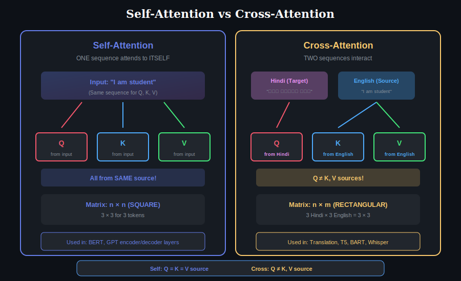
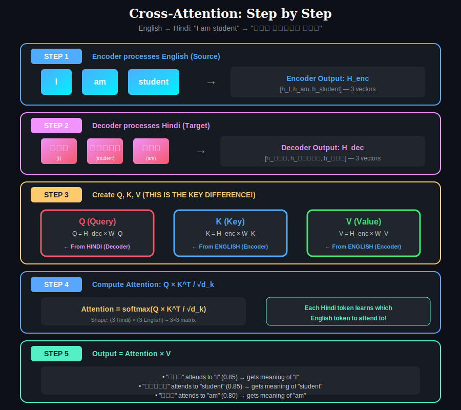
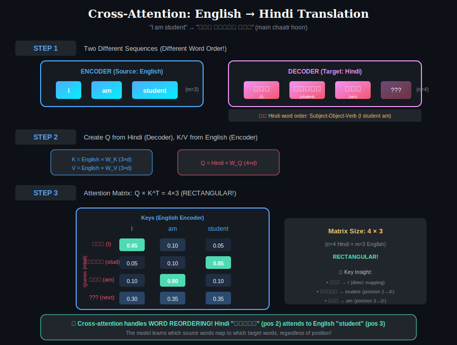
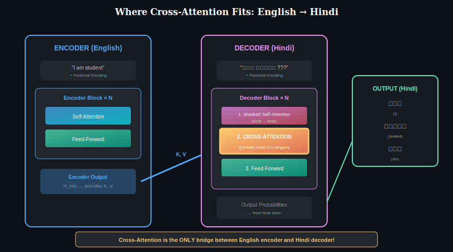

# 📖 Chapter 2: Cross-Attention

> **Pre-requisite:** Complete [Chapter 1: Self-Attention](../01-self-attention/) first!

  

## What is Cross-Attention?

Cross-attention connects **two different sequences**. Unlike self-attention where one sequence attends to itself:

| Component | Self-Attention | Cross-Attention |
|-----------|---------------|-----------------|
| **Query (Q)** | From sequence A | From **Target** (Hindi) |
| **Key (K)** | From sequence A | From **Source** (English) |
| **Value (V)** | From sequence A | From **Source** (English) |

**Key Insight:** In cross-attention, Q comes from one sequence, but K and V come from a DIFFERENT sequence!

---

## Example: English → Hindi Translation

Throughout this chapter, we'll use this example:

| English (Source) | Hindi (Target) |
|------------------|----------------|
| "I am student" | "मैं छात्र हूँ" (main chaatr hoon) |

**Notice:** Hindi word order is different!
- English: Subject-Verb-Object (I am student)
- Hindi: Subject-Object-Verb (I student am)

Cross-attention handles this reordering automatically!

---

## Overview: The Big Picture

  

### The Core Idea

| Role | What It Does | Example |
|------|--------------|---------|
| **Encoder (English)** | Provides K and V | "Here's what English contains" |
| **Decoder (Hindi)** | Provides Q | "What English word do I need?" |
| **Cross-Attention** | Matches Q to K, retrieves V | "हूँ needs info from 'am'" |

---

## Self-Attention vs Cross-Attention

  

### Key Differences

| Aspect | Self-Attention | Cross-Attention |
|--------|----------------|-----------------|
| **Number of sequences** | ONE | TWO |
| **Q, K, V source** | All from same | Q≠K,V |
| **Matrix shape** | n × n (square) | n × m (rectangular!) |
| **Purpose** | Understand single input | Connect two inputs |

---

## Step-by-Step Computation

  

### Step 1: Encoder Processes English

The encoder takes English and creates contextual representations:

| English Token | Encoder Output |
|---------------|----------------|
| "I" | h₁ = [0.8, 0.2, 0.5, ...] |
| "am" | h₂ = [0.3, 0.9, 0.4, ...] |
| "student" | h₃ = [0.1, 0.4, 0.8, ...] |

**Result:** H_enc of shape (3 × d_model)

---

### Step 2: Create K and V from Encoder (English)

From encoder output, create Keys and Values:

| Component | Formula | Source | Shape |
|-----------|---------|--------|-------|
| **K** | K = H_enc × W_K | English | (3 × d_k) |
| **V** | V = H_enc × W_V | English | (3 × d_v) |

**Important:** Both K and V come from the **English encoder**!

---

### Step 3: Decoder Creates Q from Hindi

The decoder processes Hindi and creates Queries:

| Component | Formula | Source | Shape |
|-----------|---------|--------|-------|
| **Q** | Q = H_dec × W_Q | Hindi | (3 × d_k) |

**Important:** Q comes from the **Hindi decoder** only!

---

### Step 4: Compute Cross-Attention

Now Q (Hindi) meets K, V (English):

$$\text{CrossAttention} = \text{softmax}\left(\frac{QK^T}{\sqrt{d_k}}\right) V$$

| Sub-step | Operation | Result Shape |
|----------|-----------|--------------|
| 4a | Q × K^T | (3 × 3) — Hindi × English |
| 4b | ÷ √d_k | Scaled scores |
| 4c | softmax | Attention weights |
| 4d | × V | (3 × d_v) — output |

---

## The Attention Matrix: N × M

  

### Understanding the Matrix

| Query (Hindi) ↓ | I | am | student |
|-----------------|---|----|---------| 
| **मैं** (I) | **0.85** | 0.10 | 0.05 |
| **छात्र** (student) | 0.05 | 0.10 | **0.85** |
| **हूँ** (am) | 0.10 | **0.80** | 0.10 |

### What This Shows

| Hindi Token | Attends Most To | Why |
|-------------|-----------------|-----|
| मैं (I) | "I" | Same meaning |
| छात्र (student) | "student" | Same meaning (different position!) |
| हूँ (am) | "am" | Same meaning (position 3→2!) |

**Key Insight:** Cross-attention handles word reordering! "हूँ" at position 3 in Hindi correctly attends to "am" at position 2 in English.

---

## Why Cross-Attention is Powerful

### 1. Handles Different Word Orders

| Language | Word Order | "I am student" |
|----------|------------|----------------|
| English | SVO | I am student |
| Hindi | SOV | मैं छात्र हूँ (I student am) |
| Japanese | SOV | 私は学生です (I student am) |

Cross-attention learns which source word maps to which target word, **regardless of position**!

### 2. Different Sequence Lengths

| Source | Target | Matrix Shape |
|--------|--------|--------------|
| "Hello" (1 word) | "नमस्ते" (1 word) | 1 × 1 |
| "I am student" (3 words) | "मैं छात्र हूँ" (3 words) | 3 × 3 |
| "Good morning" (2 words) | "शुभ प्रभात" (2 words) | 2 × 2 |

The matrix is **always n × m** where n = target length, m = source length.

---

## Where Cross-Attention Sits in Transformer

  

### In Each Decoder Block

| Layer | Type | What It Does |
|-------|------|--------------|
| 1 | Masked Self-Attention | Hindi attends to previous Hindi |
| 2 | **Cross-Attention** | Hindi attends to English ← THE BRIDGE! |
| 3 | Feed-Forward | Transform each position |

**Key:** Cross-attention is the ONLY connection between encoder and decoder!

---

## KV Caching for Efficiency

During generation, English is fixed. We can cache K and V:

| Step | Action | K, V |
|------|--------|------|
| 1 | Encode English | Compute K, V → **Cache** |
| 2 | Generate "मैं" | Use cached K, V |
| 3 | Generate "छात्र" | Use cached K, V |
| 4 | Generate "हूँ" | Use cached K, V |

**Benefit:** K and V computed only ONCE, reused for all Hindi tokens!

---

## Models Using Cross-Attention

| Model | Uses Cross-Attention? | Purpose |
|-------|----------------------|---------|
| **BERT** | ❌ No | Encoder-only |
| **GPT** | ❌ No | Decoder-only |
| **T5** | ✅ Yes | Text-to-text |
| **BART** | ✅ Yes | Seq2seq |
| **Whisper** | ✅ Yes | Speech → Text |
| **Stable Diffusion** | ✅ Yes | Text → Image |

---

## Key Takeaways

| Concept | Summary |
|---------|---------|
| **What** | Q from target, K/V from source |
| **Matrix Shape** | n × m (rectangular, NOT square!) |
| **Purpose** | Bridge between encoder and decoder |
| **Power** | Handles word reordering automatically |
| **Optimization** | KV caching during generation |

---

## Common Confusions Clarified

### ❓ "Why not use self-attention on both sequences concatenated?"

Cross-attention is more **efficient** and **focused**:
- Self-attention on concatenated: (n+m)² computations
- Cross-attention: n × m computations
- Plus, cross-attention explicitly models the "query-answer" relationship

### ❓ "What if source and target have same length?"

The matrix is still **conceptually different** from self-attention:
- Self-attention: Token i attends to token i in same sequence
- Cross-attention: Target token i attends to all source tokens

### ❓ "Does position matter in cross-attention?"

**No!** That's the power. Cross-attention is **position-independent**. "हूँ" at position 3 can freely attend to "am" at position 2.

---

## ✅ Chapter Complete!

You've learned:
- Q from **decoder (target)**, K/V from **encoder (source)**
- Matrix is **N×M (rectangular)**, not N×N
- Cross-attention handles **word reordering** automatically
- It's the **bridge** between encoder and decoder

**Next Chapter:**

  <a href="../01-self-attention/">← Chapter 1</a> | <a href="../">Main</a> | <a href="../03-multi-head-attention/"><b>Chapter 3: Multi-Head Attention →</b></a>

