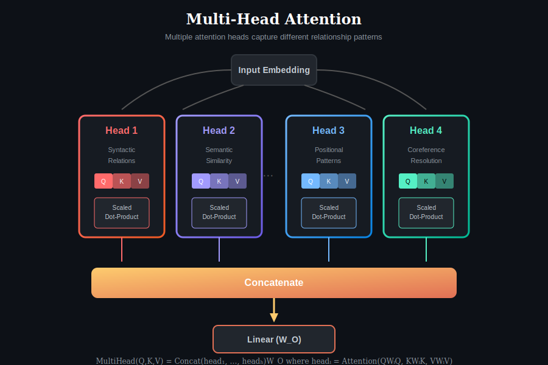
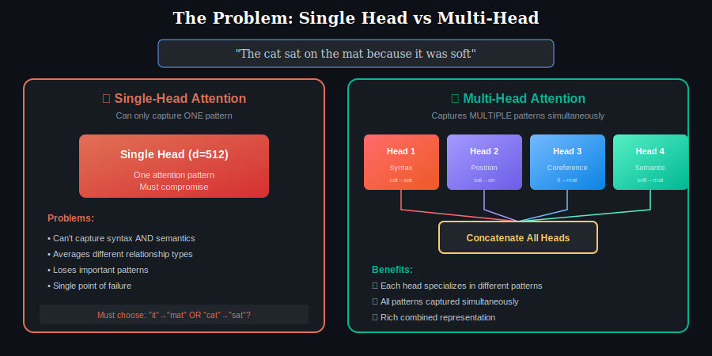
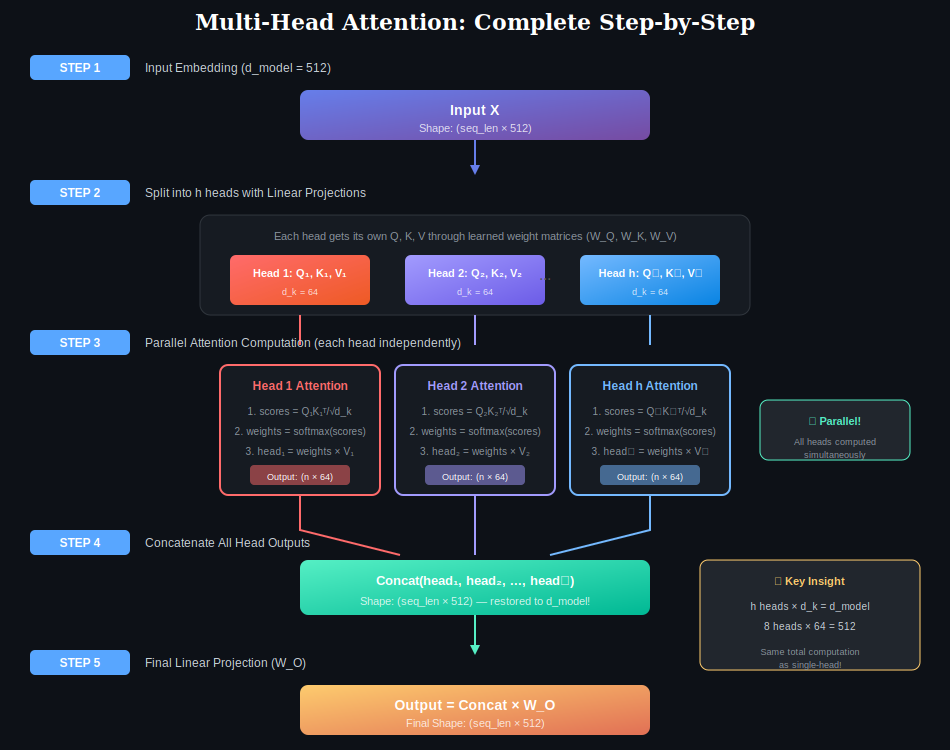
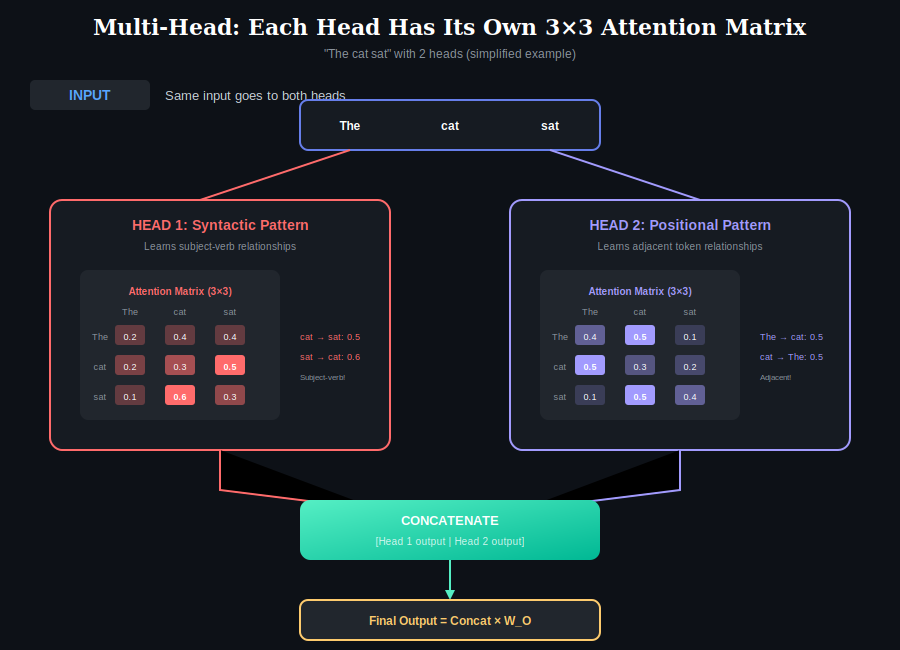
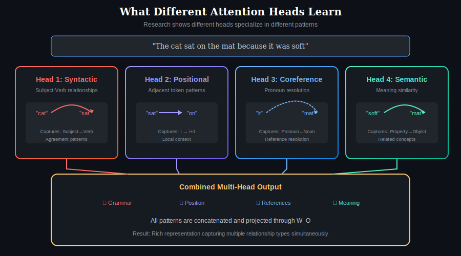
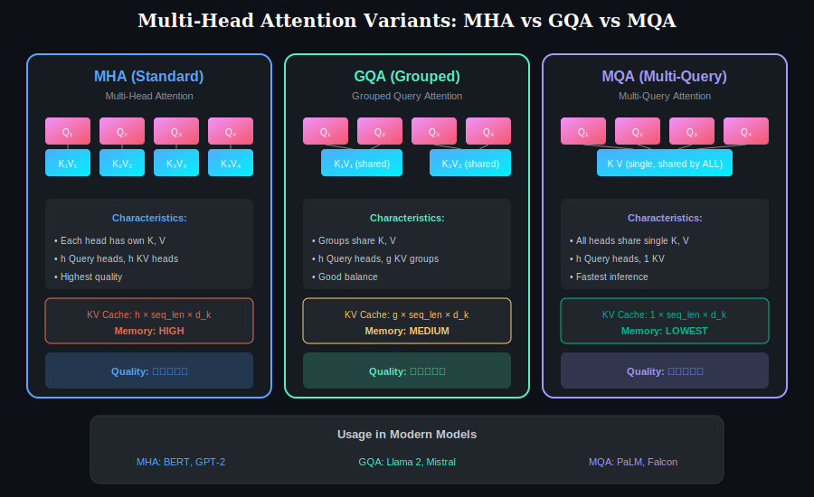

# 📖 Chapter 3: Multi-Head Attention

> **Pre-requisite:** Complete [Chapter 1](../01-self-attention/) and [Chapter 2](../02-cross-attention/) first!

  

## Overview

Multi-Head Attention (MHA) is an extension of the basic attention mechanism that runs **multiple attention operations in parallel**, each with different learned projections. Instead of performing a single attention function, MHA allows the model to jointly attend to information from **different representation subspaces** at different positions.

This is one of the key innovations of the Transformer architecture, enabling it to capture diverse types of relationships simultaneously.

---

## The Problem: Why Single-Head Isn't Enough

  

### Single-Head Limitation

A single attention head can only learn **one type of attention pattern**. But language has multiple simultaneous relationships:

| Relationship Type | Example | What It Captures |
|------------------|---------|------------------|
| **Syntactic** | "cat" → "sat" | Subject-verb agreement |
| **Positional** | "sat" → "on" | Adjacent word patterns |
| **Coreference** | "it" → "mat" | Pronoun resolution |
| **Semantic** | "soft" → "mat" | Property-object relations |

**The Problem:** A single head must compromise and average across these different pattern types, losing important information.

### Multi-Head Solution

Instead of one large attention with dimension d_model, use **h smaller attention heads**, each with dimension d_k = d_model/h:

| Aspect | Single-Head | Multi-Head |
|--------|-------------|------------|
| **Attention patterns** | 1 | h (typically 8-16) |
| **Dimension per pattern** | d_model | d_k = d_model/h |
| **Total computation** | Same | Same |
| **Expressiveness** | Limited | Rich & diverse |

---

## Step-by-Step Computation

  

### Step 1: Input

We start with input embeddings of shape **(seq_len × d_model)**.

**Example:** For d_model = 512, a sequence of 10 tokens has shape (10 × 512).

---

### Step 2: Split into h Heads via Linear Projections

Each head gets its own **Q, K, V** through learned weight matrices:

**For each head i (where i = 1 to h):**

| Projection | Formula | Shape |
|------------|---------|-------|
| Query | Q_i = X × W_i^Q | (seq_len × d_k) |
| Key | K_i = X × W_i^K | (seq_len × d_k) |
| Value | V_i = X × W_i^V | (seq_len × d_v) |

**Weight matrices:**
- W_i^Q ∈ ℝ^(d_model × d_k)
- W_i^K ∈ ℝ^(d_model × d_k)
- W_i^V ∈ ℝ^(d_model × d_v)

**Example with 8 heads:**
- d_model = 512
- h = 8 heads
- d_k = 512 / 8 = 64 per head

Each head operates in a **64-dimensional subspace**.

---

### Step 3: Parallel Attention Computation

**Each head computes attention independently:**

#### Head i Computation:

**Step 3a: Compute Attention Scores**
$$\text{scores}_i = \frac{Q_i \times K_i^T}{\sqrt{d_k}}$$

**Step 3b: Apply Softmax**
$$\text{weights}_i = \text{softmax}(\text{scores}_i)$$

**Step 3c: Weighted Sum of Values**
$$\text{head}_i = \text{weights}_i \times V_i$$

**Output shape per head:** (seq_len × d_k)

#### Why This Works in Parallel

All heads are computed **simultaneously** because:
- Each head has independent weight matrices
- No dependencies between heads during computation
- Modern GPUs can batch all h heads together

---

### Step 4: Concatenate All Head Outputs

After all heads complete their attention:

$$\text{Concat} = [\text{head}_1; \text{head}_2; ...; \text{head}_h]$$

**Shape transformation:**
- Each head: (seq_len × d_k)
- After concat: (seq_len × h × d_k) = (seq_len × d_model)

**Example:**
- 8 heads × 64 dimensions = 512 dimensions (restored to d_model!)

---

### Step 5: Final Output Projection

The concatenated output passes through a final linear layer:

$$\text{Output} = \text{Concat} \times W^O$$

Where W^O ∈ ℝ^(d_model × d_model)

**Purpose of W^O:**
- Mixes information across heads
- Allows model to learn how to combine head outputs
- Final transformation back to d_model space

**Final output shape:** (seq_len × d_model)

---

## Complete Mathematical Formula

$$\text{MultiHead}(Q, K, V) = \text{Concat}(\text{head}_1, ..., \text{head}_h) \times W^O$$

Where each head is:

$$\text{head}_i = \text{Attention}(QW_i^Q, KW_i^K, VW_i^V)$$

And Attention is:

$$\text{Attention}(Q, K, V) = \text{softmax}\left(\frac{QK^T}{\sqrt{d_k}}\right) V$$

---

## What Different Heads Learn: Each Head Has Its Own N×N Matrix

  

Each head independently computes its own attention matrix with different patterns!

  

Research analyzing trained Transformers reveals that different heads **specialize** in different patterns:

### Head Specializations

| Head Type | What It Learns | Example |
|-----------|----------------|---------|
| **Syntactic Heads** | Grammar structure | Subject → Verb agreement |
| **Positional Heads** | Local patterns | Word → Next word (i → i+1) |
| **Coreference Heads** | Reference resolution | Pronoun → Antecedent |
| **Semantic Heads** | Meaning similarity | Property → Object |
| **Delimiter Heads** | Special tokens | All → [CLS] or [SEP] |
| **Rare Token Heads** | Unusual words | Focus on low-frequency tokens |

### Why Specialization Happens

- Different projection matrices (W^Q, W^K, W^V) create different **subspaces**
- During training, heads naturally diverge to capture complementary patterns
- The final W^O learns to combine these patterns effectively

---

## Attention Variants: MHA vs GQA vs MQA

  

### 1. Multi-Head Attention (MHA) - Standard

**Structure:**
- h Query heads
- h Key-Value pairs (one per head)

**Pros:** Highest quality, most expressive
**Cons:** Largest KV cache memory

### 2. Grouped Query Attention (GQA)

**Structure:**
- h Query heads
- g Key-Value groups (g < h)
- Multiple Q heads share each KV group

**Example:**
- 8 query heads, 2 KV groups
- Heads 1-4 share KV₁, Heads 5-8 share KV₂

**Pros:** Good balance of quality and efficiency
**Cons:** Slightly lower quality than MHA

**Used in:** Llama 2 (70B), Mistral

### 3. Multi-Query Attention (MQA)

**Structure:**
- h Query heads
- 1 Key-Value pair (shared by ALL heads)

**Pros:** Smallest KV cache, fastest inference
**Cons:** Lower quality

**Used in:** PaLM, Falcon

### Comparison Table

| Variant | KV Heads | Memory | Quality | Speed |
|---------|----------|--------|---------|-------|
| **MHA** | h | Highest | ★★★★★ | Baseline |
| **GQA** | g (< h) | Medium | ★★★★☆ | Faster |
| **MQA** | 1 | Lowest | ★★★☆☆ | Fastest |

---

## Computational Analysis

### Complexity

| Operation | Single-Head | Multi-Head |
|-----------|-------------|------------|
| Attention per head | O(n² × d) | O(n² × d_k) |
| Total attention | O(n² × d) | O(h × n² × d_k) = O(n² × d) |
| Parameters | 3d² + d² | 3d² + d² |

**Key insight:** Total computation is the **same**! We're just organizing it differently for better expressiveness.

### Why Same Computation?

- Single head: One (n × n) attention matrix with d dimensions
- Multi-head: h attention matrices, each (n × n) with d/h dimensions
- Total: h × d/h = d — same as single head!

---

## Common Model Configurations

| Model | d_model | Heads (h) | d_k | Variant |
|-------|---------|-----------|-----|---------|
| BERT-base | 768 | 12 | 64 | MHA |
| BERT-large | 1024 | 16 | 64 | MHA |
| GPT-2 | 768 | 12 | 64 | MHA |
| GPT-3 (175B) | 12288 | 96 | 128 | MHA |
| Llama 2 (70B) | 8192 | 64 | 128 | GQA |
| Mistral (7B) | 4096 | 32 | 128 | GQA |

**Pattern:** d_k is typically kept at **64-128** regardless of model size.

---

## Practical Guidelines

### Choosing Number of Heads

| Model Size | Recommended Heads |
|------------|-------------------|
| Small (< 100M params) | 4-8 |
| Medium (100M-1B) | 8-16 |
| Large (> 1B params) | 16-96 |

### When to Use Each Variant

| Scenario | Recommendation |
|----------|----------------|
| Training from scratch | MHA (best quality) |
| Long-context inference | GQA (memory efficient) |
| Extreme memory constraints | MQA (smallest KV cache) |
| Production with quality focus | GQA (balanced) |

---

## Key Takeaways

| Concept | Key Point |
|---------|-----------|
| **Purpose** | Capture multiple relationship types simultaneously |
| **Structure** | h parallel heads, each with d_k = d_model/h |
| **Computation** | Same total FLOPs as single-head |
| **Benefits** | Diverse patterns, parallel computation, robustness |
| **Variants** | MHA (full), GQA (grouped), MQA (shared) |
| **Head Specialization** | Different heads learn different patterns |

---

## Further Reading

- [Self-Attention](../01-self-attention/) — Foundation of each head
- [Cross-Attention](../02-cross-attention/) — Multi-head applies to cross-attention too
- [Causal Attention](../04-causal-attention/) — Multi-head with masking

---

## ✅ Chapter Complete!

You've learned:
- Each head has its own **N×N attention matrix**
- Different heads learn **different patterns** (syntactic, positional, etc.)
- Heads are **concatenated** and projected back to d_model

**Next Chapter:**

  <a href="../02-cross-attention/">← Chapter 2</a> | <a href="../">Main</a> | <a href="../04-causal-attention/"><b>Chapter 4: Causal Attention →</b></a>

