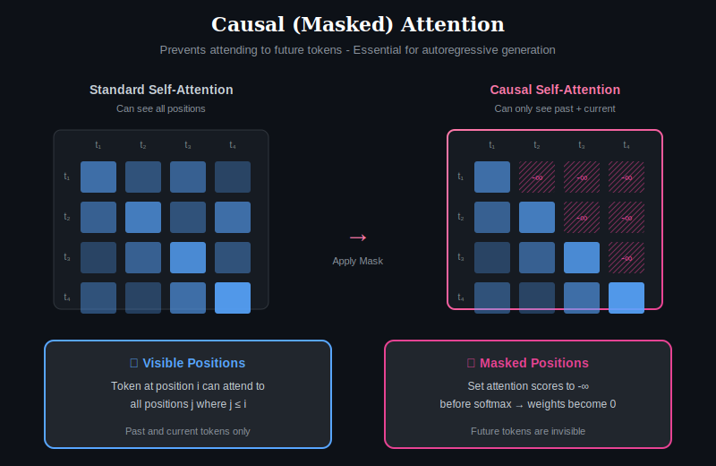
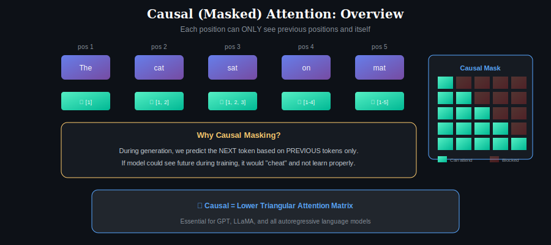
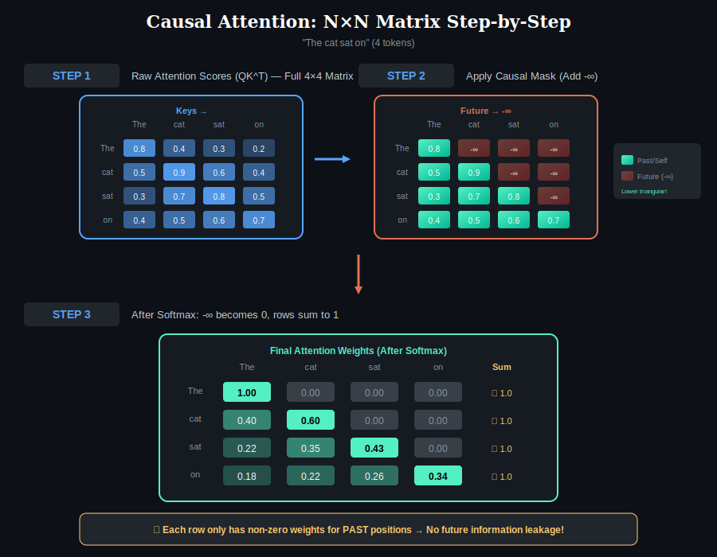
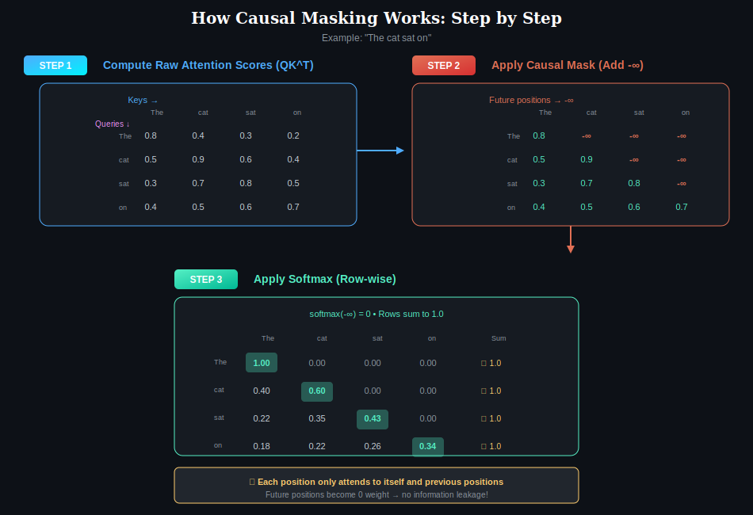

# 📖 Chapter 4: Causal (Masked) Attention

> **Pre-requisite:** Complete [Chapter 1](../01-self-attention/) to [Chapter 3](../03-multi-head-attention/) first!

  

## Overview

Causal attention (also called **masked attention**, **autoregressive attention**, or **unidirectional attention**) is a variant of self-attention where each position can only attend to **previous positions and itself**, never to future positions. This is essential for **autoregressive generation** tasks where the model generates tokens one at a time, left to right.

The "causal" name comes from the concept of causality — future events cannot influence past predictions.

---

## Core Concept: Visual Overview

  

### What Each Position Can See

| Position | Token | Can See | Cannot See |
|----------|-------|---------|------------|
| 1 | "The" | [1] | [2, 3, 4, 5] |
| 2 | "cat" | [1, 2] | [3, 4, 5] |
| 3 | "sat" | [1, 2, 3] | [4, 5] |
| 4 | "on" | [1, 2, 3, 4] | [5] |
| 5 | "mat" | [1, 2, 3, 4, 5] | None |

This creates a **lower triangular** attention pattern.

---

## The Problem Causal Attention Solves

### Why Can't We See the Future?

In autoregressive language modeling, we predict the next token based only on previous tokens:

$$P(x_t | x_1, x_2, ..., x_{t-1})$$

**The Problem:**
- If the model could "see" future tokens during training
- The task becomes trivially easy (just copy!)
- But the model wouldn't learn to actually predict
- At inference time, future tokens don't exist!

**The Solution:** Mask (block) attention to future positions.

---

## Bidirectional vs Causal Attention

  

### Key Differences

| Aspect | Bidirectional (BERT) | Causal (GPT) |
|--------|---------------------|--------------|
| **Attention Pattern** | Full n×n matrix | Lower triangular |
| **Token 3 sees** | [1, 2, 3, 4, 5] | [1, 2, 3] only |
| **Information Flow** | ← Both directions → | Left to right → only |
| **Use Case** | Understanding | Generation |
| **Models** | BERT, RoBERTa | GPT, LLaMA, Mistral |

---

## Mathematical Formulation

### Standard Attention (Bidirectional)

$$\text{Attention} = \text{softmax}\left(\frac{QK^T}{\sqrt{d_k}}\right) V$$

All positions can attend to all other positions.

### Causal Attention (Unidirectional)

$$\text{CausalAttention} = \text{softmax}\left(\frac{QK^T}{\sqrt{d_k}} + M\right) V$$

Where M is the **causal mask**:

$$M_{ij} = \begin{cases} 0 & \text{if } j \leq i \text{ (allowed)} \\ -\infty & \text{if } j > i \text{ (blocked)} \end{cases}$$

### Why -∞ Works

After softmax:
- softmax(-∞) = 0
- The model **literally cannot** attend to future positions
- Zero attention weight = zero information flow

---

## Step-by-Step: How Causal Masking Works on the N×N Matrix

  

The full 4×4 attention matrix transformed by causal masking:

  

### Step 1: Compute Raw Attention Scores (QK^T)

Every position computes compatibility with every other position (same as regular attention).

**Raw Scores for "The cat sat on":**

| Query ↓ / Key → | The | cat | sat | on |
|-----------------|-----|-----|-----|-----|
| **The** | 0.8 | 0.4 | 0.3 | 0.2 |
| **cat** | 0.5 | 0.9 | 0.6 | 0.4 |
| **sat** | 0.3 | 0.7 | 0.8 | 0.5 |
| **on** | 0.4 | 0.5 | 0.6 | 0.7 |

---

### Step 2: Apply Causal Mask (Add -∞)

Add -∞ to positions where j > i (future positions):

| Query ↓ / Key → | The | cat | sat | on |
|-----------------|-----|-----|-----|-----|
| **The** | 0.8 | **-∞** | **-∞** | **-∞** |
| **cat** | 0.5 | 0.9 | **-∞** | **-∞** |
| **sat** | 0.3 | 0.7 | 0.8 | **-∞** |
| **on** | 0.4 | 0.5 | 0.6 | 0.7 |

**Key insight:** Upper triangle (future) becomes -∞!

---

### Step 3: Apply Softmax (Row-wise)

After softmax, -∞ becomes 0:

| Query ↓ / Key → | The | cat | sat | on | Sum |
|-----------------|-----|-----|-----|-----|-----|
| **The** | **1.00** | 0.00 | 0.00 | 0.00 | 1.0 ✓ |
| **cat** | 0.40 | **0.60** | 0.00 | 0.00 | 1.0 ✓ |
| **sat** | 0.22 | 0.35 | **0.43** | 0.00 | 1.0 ✓ |
| **on** | 0.18 | 0.22 | 0.26 | **0.34** | 1.0 ✓ |

**What happened:**
- Row 1 ("The"): Only sees itself → 100% attention on self
- Row 2 ("cat"): Sees [The, cat] → attention split between them
- Each row still sums to 1.0 (valid probability distribution)

---

### Step 4: Weighted Sum of Values

Each output is a weighted combination of **only visible** values:

| Position | Output Computation |
|----------|-------------------|
| **"The"** | 1.00 × V_the |
| **"cat"** | 0.40 × V_the + 0.60 × V_cat |
| **"sat"** | 0.22 × V_the + 0.35 × V_cat + 0.43 × V_sat |
| **"on"** | 0.18 × V_the + 0.22 × V_cat + 0.26 × V_sat + 0.34 × V_on |

Each position only aggregates information from past + self!

---

## Why Causal Masking is Essential

### 1. Training Efficiency (Teacher Forcing)

With causal masking, **one forward pass trains on the entire sequence**:

| Position | Input Context | Predicts |
|----------|--------------|----------|
| 1 | [START] | "The" |
| 2 | [START, The] | "cat" |
| 3 | [START, The, cat] | "sat" |
| 4 | [START, The, cat, sat] | "on" |

**One forward pass = multiple training examples!**

### 2. No Information Leakage

| Scenario | What Model Sees | Problem |
|----------|----------------|---------|
| **Without mask** | Full sequence including future | Cheating! Too easy |
| **With mask** | Only past tokens | Must actually predict |

### 3. Consistent Train-Test Behavior

- **Training:** Model sees masked attention (past only)
- **Inference:** Tokens generated one at a time (future doesn't exist)
- **Result:** Same constraint in both phases!

---

## Causal Attention in Different Contexts

### Decoder-Only Models (GPT-style)

| Component | Attention Type |
|-----------|---------------|
| Self-Attention | **Causal (masked)** |
| Feed-Forward | Position-wise |
| Repeat × N layers | |

**Models:** GPT-2, GPT-3, GPT-4, LLaMA, Mistral, Claude

### Encoder-Decoder Models (T5-style)

| Component | Attention Type |
|-----------|---------------|
| **Encoder** | Bidirectional (no mask) |
| **Decoder Self-Attention** | **Causal (masked)** |
| **Decoder Cross-Attention** | Full (attends to all encoder) |

**Models:** T5, BART, mT5

### Prefix-LM (Hybrid)

| Part | Attention Type |
|------|---------------|
| Prefix tokens | Bidirectional (see each other) |
| Generation tokens | Causal (see prefix + past generation) |

**Models:** UniLM, some instruction-tuned models

---

## Implementation: Creating the Causal Mask

The mask is a **lower triangular matrix**:

| Position | Mask Values |
|----------|-------------|
| Lower triangle (j ≤ i) | 0 (allowed) |
| Upper triangle (j > i) | -∞ (blocked) |

**Example 4×4 causal mask:**

| | 1 | 2 | 3 | 4 |
|---|---|---|---|---|
| **1** | 0 | -∞ | -∞ | -∞ |
| **2** | 0 | 0 | -∞ | -∞ |
| **3** | 0 | 0 | 0 | -∞ |
| **4** | 0 | 0 | 0 | 0 |

---

## KV Caching for Efficient Generation

During autoregressive generation, we cache K and V to avoid recomputation:

### How KV Caching Works

| Step | Action | K, V Cache |
|------|--------|------------|
| 1 | Process "The" | Cache K₁, V₁ |
| 2 | Process "cat" | Use [K₁], add K₂, V₂ |
| 3 | Process "sat" | Use [K₁, K₂], add K₃, V₃ |
| ... | ... | Growing cache |

**Key insight:** Only compute new Q, K, V for the new token; reuse cached K, V for past tokens.

**Benefit:** O(1) computation per new token instead of O(n) recomputation!

---

## When to Use Each Type

| Task | Recommended Attention |
|------|----------------------|
| Text generation | Causal |
| Translation (target side) | Causal |
| Text classification | Bidirectional |
| Named entity recognition | Bidirectional |
| Question answering | Bidirectional or Hybrid |
| Summarization | Encoder (bi) + Decoder (causal) |

---

## Variants and Extensions

### 1. Sliding Window + Causal

Combine causal masking with local attention (window size w):
- Each position sees last w positions only
- Still maintains causal constraint

**Used in:** Mistral, Longformer

### 2. Block-Causal

Causal at block level, full attention within blocks:
- Block 2 can see Block 1 (not Block 3)
- Within each block: bidirectional attention

### 3. Causal with Global Tokens (Sink Tokens)

Certain tokens attend globally:
- Global token sees everything
- All tokens see the global token
- Useful for aggregating information

---

## Key Takeaways

| Concept | Key Point |
|---------|-----------|
| **Purpose** | Prevent information leakage from future tokens |
| **Mechanism** | Add -∞ to attention scores for future positions |
| **Result** | Lower triangular attention matrix |
| **Essential For** | Autoregressive generation (GPT, LLaMA, etc.) |
| **Efficiency** | Enables KV caching during inference |

---

## Further Reading

- [Self-Attention](../01-self-attention/) — The bidirectional counterpart
- [Sparse Attention](../05-sparse-attention/) — Combining causal with sparsity
- [Multi-Head Attention](../03-multi-head-attention/) — Causal applies per head

---

## ✅ Chapter Complete!

You've learned:
- The N×N matrix becomes **lower triangular** (future blocked)
- **-∞ masking** makes softmax output 0 for future positions
- Essential for **autoregressive generation** (GPT, LLaMA)

**Next Chapter:**

  <a href="../03-multi-head-attention/">← Chapter 3</a> | <a href="../">Main</a> | <a href="../05-sparse-attention/"><b>Chapter 5: Sparse Attention →</b></a>

