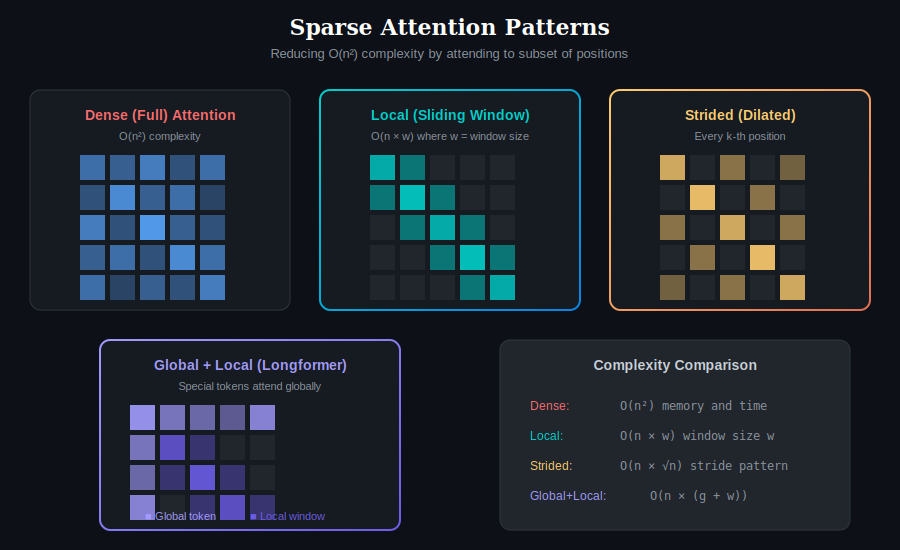
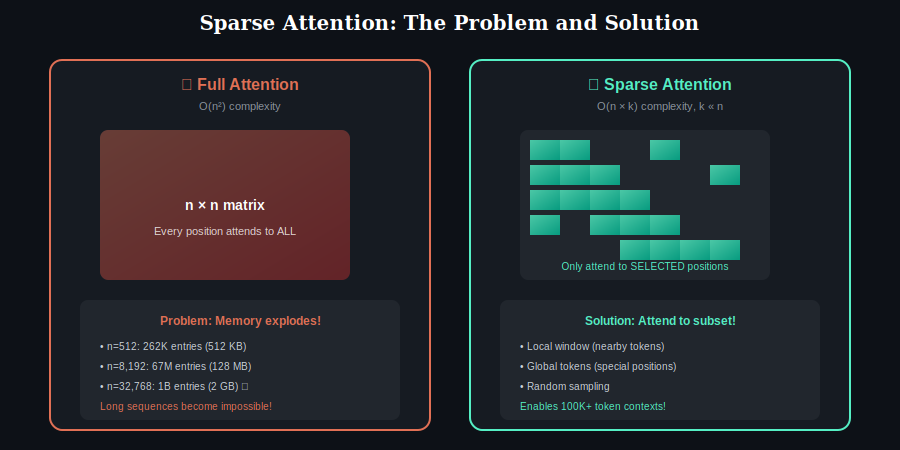
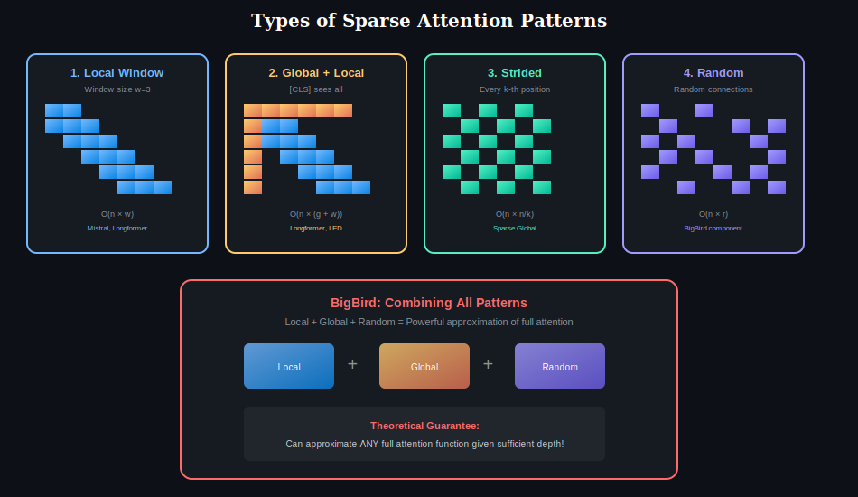

# 📖 Chapter 5: Sparse Attention

> **Pre-requisite:** Complete Chapters 1-4 first!

  

## Overview

Sparse attention is a family of attention mechanisms that reduce the computational complexity from **O(n²) to sub-quadratic** by attending to only a **subset of positions** rather than all positions. This is essential for processing long sequences where full attention becomes prohibitively expensive.

The key insight: not all attention connections are equally important. By strategically selecting which positions to attend to, we can maintain model quality while dramatically reducing computation.

---

## The Problem: Quadratic Complexity

  

### Full Attention Cost

For sequence length n:
- **Time Complexity:** O(n²) — compute all pairwise scores
- **Memory Complexity:** O(n²) — store attention matrix

### The Problem in Numbers

| Sequence Length | Attention Matrix Size | Memory (FP16) |
|----------------|----------------------|---------------|
| 512 | 262,144 | 512 KB |
| 2,048 | 4,194,304 | 8 MB |
| 8,192 | 67,108,864 | 128 MB |
| 32,768 | 1,073,741,824 | 2 GB |
| 131,072 | 17,179,869,184 | 32 GB |

For context lengths like 100K+ tokens, full attention is simply **not feasible**.

### The Key Observation

Research shows that attention weights are often **sparse in practice**:
- Most weights are near zero
- Only a few positions receive significant attention
- Many full-attention connections are "wasted computation"

---

## Types of Sparse Attention Patterns

  

### 1. Local (Sliding Window) Attention

Each position attends only to a **fixed-size window** of nearby positions.

**Pattern Visualization:**
| Position | Attends To |
|----------|-----------|
| 1 | [1, 2] |
| 2 | [1, 2, 3] |
| 3 | [1, 2, 3, 4] (window fills) |
| 4 | [2, 3, 4, 5] (window slides) |
| ... | ... |

**Properties:**

| Aspect | Value |
|--------|-------|
| **Complexity** | O(n × w) where w = window size |
| **Context** | Local only (w tokens) |
| **Effective receptive field** | w × L layers (grows with depth) |
| **Best for** | Tasks with local dependencies |

**Models Using Local Attention:**
- Longformer (local + global)
- BigBird (local + global + random)
- **Mistral** (sliding window)
- LongT5

---

### 2. Global + Local (Hybrid) Attention

Designate certain tokens as **"global tokens"** that attend to (and are attended by) all positions.

**How It Works:**
- Global tokens (e.g., [CLS]): See ALL positions
- Regular tokens: See global tokens + local window

**Properties:**

| Aspect | Value |
|--------|-------|
| **Complexity** | O(n × (g + w)) where g = global tokens |
| **Context** | Local + indirect global via global tokens |
| **Global tokens** | [CLS], task tokens, or learned |
| **Best for** | Document understanding, long-form QA |

**Models Using Global + Local:**
- **Longformer**: Configurable global positions
- **BigBird**: Global + Local + Random
- **LED** (Longformer-Encoder-Decoder)

---

### 3. Strided (Dilated) Attention

Attend to every k-th position, creating a **sparse but global** pattern.

**Pattern:**
| Position | Attends To (k=2) |
|----------|-----------------|
| 1 | [1, 3, 5, 7, ...] |
| 2 | [2, 4, 6, 8, ...] |
| ... | ... |

**Properties:**

| Aspect | Value |
|--------|-------|
| **Complexity** | O(n × n/k) = O(n²/k) |
| **Context** | Sparse global |
| **Pattern** | Regular intervals |
| **Best for** | Capturing periodic patterns |

---

### 4. Random Attention

Randomly sample positions to attend to.

**Properties:**

| Aspect | Value |
|--------|-------|
| **Complexity** | O(n × r) where r = random samples |
| **Context** | Random global |
| **Theory** | Based on random graph connectivity |
| **Best for** | Combined with other patterns |

**Why Random Works:**
Graph theory shows that adding random edges to a graph dramatically reduces the average path length (small-world phenomenon). Information can flow between any two positions in O(log n) hops.

---

### 5. Block-Sparse Attention

Divide sequence into blocks; attend within blocks and to selected other blocks.

**Properties:**

| Aspect | Value |
|--------|-------|
| **Complexity** | O(n × b + n × selected_blocks) |
| **Hardware** | Very efficient (block operations) |
| **Flexibility** | Block patterns can be learned |

---

## Complexity Comparison

| Pattern | Time | Space | Global Context |
|---------|------|-------|----------------|
| **Full (Dense)** | O(n²) | O(n²) | ✅ Complete |
| **Local Window** | O(n × w) | O(n × w) | ❌ Window only |
| **Strided** | O(n × n/k) | O(n × n/k) | ⚠️ Sparse |
| **Global + Local** | O(n × (g+w)) | O(n × (g+w)) | ⚠️ Via globals |
| **Random** | O(n × r) | O(n × r) | ⚠️ Probabilistic |
| **Block-Sparse** | O(n × b + blocks) | O(blocks × b²) | ⚠️ Selected |

---

## Deep Dive: Longformer Pattern

Longformer combines multiple patterns:

**Components:**
1. **Sliding Window**: Every token attends to w neighbors
2. **Global Attention**: Selected tokens attend everywhere
3. **Dilated Sliding Window**: Larger windows in higher layers

**How It Works:**

| Token Type | What It Sees | What Sees It |
|------------|--------------|--------------|
| Global ([CLS]) | ALL tokens | ALL tokens |
| Regular | Local window + globals | Local window + globals |

---

## Deep Dive: BigBird Pattern

BigBird combines three patterns for theoretical guarantees:

**Formula:** BigBird = Local + Global + Random

| Component | Purpose |
|-----------|---------|
| **Local** | Captures nearby context |
| **Global** | Aggregates information |
| **Random** | Provides connectivity |

**Theoretical Guarantee:**
BigBird proves that this combination is a **universal approximator** — it can approximate any full attention function, given sufficient depth.

---

## Combining Sparse Attention with Causal Masking

For autoregressive models, combine sparsity with causal constraint:

**Causal Sliding Window:**

| Position | Can Attend To |
|----------|--------------|
| 1 | [1] |
| 2 | [1, 2] |
| 3 | [1, 2, 3] |
| 4 | [2, 3, 4] (window + causal) |
| 5 | [3, 4, 5] |
| ... | ... |

**Models:** Mistral uses sliding window causal attention.

---

## When to Use Each Pattern

| Scenario | Recommended Pattern |
|----------|-------------------|
| Document classification | Global + Local |
| Long-form QA | Global + Local + Random |
| Language modeling | Sliding Window (causal) |
| Structured data (tables) | Block-Sparse |
| General long context | BigBird or Longformer |
| Maximum efficiency | Local only |

---

## Trade-offs

### Quality vs Efficiency

| Approach | Quality | Efficiency |
|----------|---------|------------|
| Full Attention | ★★★★★ | ★☆☆☆☆ |
| BigBird | ★★★★☆ | ★★★★☆ |
| Longformer | ★★★★☆ | ★★★★☆ |
| Local Only | ★★★☆☆ | ★★★★★ |

---

## Key Takeaways

| Concept | Key Point |
|---------|-----------|
| **Motivation** | O(n²) is too expensive for long sequences |
| **Core Idea** | Attend to subset of positions |
| **Local** | Nearby tokens only, O(n × w) |
| **Global** | Special tokens see everything |
| **Random** | Probabilistic coverage |
| **Hybrid** | Combine patterns for best results |

---

## Further Reading

- [Self-Attention](../01-self-attention/) — The dense baseline
- [Causal Attention](../04-causal-attention/) — Masking for generation
- [Score Functions](../06-score-functions/) — Computing the attention scores

---

## ✅ Chapter Complete!

You've learned:
- Full attention is **O(n²)** — too expensive for long sequences
- Sparse patterns: **Local, Global, Strided, Random**
- BigBird = Local + Global + Random (universal approximator!)

**Next Chapter:**

  <a href="../04-causal-attention/">← Chapter 4</a> | <a href="../">Main</a> | <a href="../06-score-functions/"><b>Chapter 6: Score Functions →</b></a>

