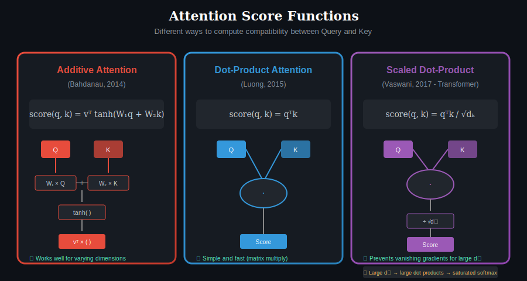
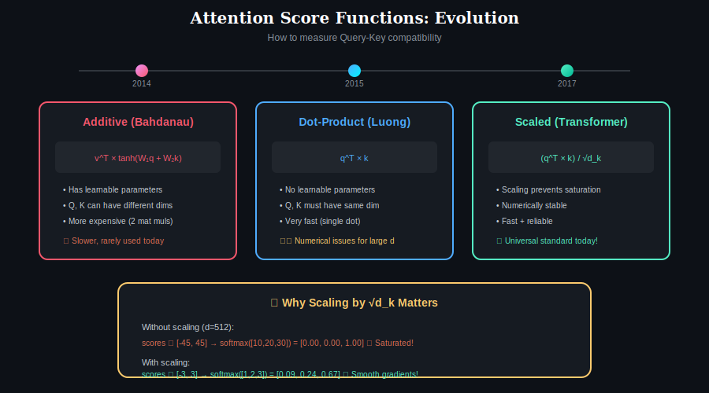

# 📖 Chapter 6: Attention Score Functions

> **Pre-requisite:** Complete Chapters 1-5 first!

  

## Overview

The attention score function determines **how compatibility between queries and keys is computed**. This is the core "matching" operation that decides which values to attend to. Different score functions have different properties, computational costs, and behaviors.

---

## The Evolution of Score Functions

  

### Timeline

| Year | Method | Author | Innovation |
|------|--------|--------|------------|
| 2014 | Additive | Bahdanau | First neural attention |
| 2015 | Dot-Product | Luong | Simpler, faster |
| 2017 | Scaled Dot-Product | Vaswani | Fixed numerical issues |

---

## The Three Main Score Functions

### 1. Additive Attention (Bahdanau, 2014)

$$\text{score}(q, k) = v^T \tanh(W_1 q + W_2 k)$$

**How It Works:**

| Step | Operation |
|------|-----------|
| 1 | Transform q with W₁ |
| 2 | Transform k with W₂ |
| 3 | Add the results |
| 4 | Apply tanh activation |
| 5 | Project with v to get scalar |

**Properties:**

| Property | Value |
|----------|-------|
| **Learnable Parameters** | W₁, W₂ (matrices), v (vector) |
| **Flexibility** | Q and K can have different dimensions |
| **Non-linearity** | tanh activation |
| **Computation** | More expensive (two matrix mults + activation) |

**When to Use:**
- When query and key have **different dimensions**
- When you want **learned compatibility** patterns
- Historical architectures (pre-Transformer)

---

### 2. Dot-Product Attention (Luong, 2015)

$$\text{score}(q, k) = q^T k$$

Simply compute the inner product between q and k.

**Properties:**

| Property | Value |
|----------|-------|
| **Learnable Parameters** | None in score function itself |
| **Flexibility** | Q and K must have same dimension |
| **Non-linearity** | None |
| **Computation** | Very fast (single dot product) |

**When to Use:**
- When you need **speed**
- When Q and K have **same dimensions**
- When projections handle learned compatibility

**Problem:** Numerical instability for large dimensions!

---

### 3. Scaled Dot-Product Attention (Transformer, 2017)

$$\text{score}(q, k) = \frac{q^T k}{\sqrt{d_k}}$$

**Properties:**

| Property | Value |
|----------|-------|
| **Learnable Parameters** | None (scaling is fixed) |
| **Flexibility** | Q and K must have same dimension |
| **Numerical Stability** | Much better than unscaled |
| **Computation** | Fast (dot product + scalar division) |

**This is the universal standard today!**

---

## Why Scaling Matters: Deep Dive

### The Softmax Saturation Problem

Consider what happens to softmax with different input magnitudes:

**Small inputs (good):**

| Input | Softmax Output |
|-------|----------------|
| [1, 2, 3] | [0.09, 0.24, **0.67**] |

Smooth distribution, meaningful gradients ✓

**Large inputs (bad):**

| Input | Softmax Output |
|-------|----------------|
| [10, 20, 30] | [0.00, 0.00, **1.00**] |

Saturated! No gradient for training ✗

### Why Does This Happen?

For vectors q, k ∈ ℝ^d with independent components:
- E[q·k] = 0 (if mean-centered)
- **Var[q·k] = d** (variance grows with dimension!)

| Dimension | Typical Score Range | Problem |
|-----------|-------------------|---------|
| d = 64 | [-16, 16] | Softmax works OK |
| d = 512 | [-45, 45] | Softmax saturates! |

### The Solution: Scale by √d

After scaling by √d_k:
- **Var[q·k/√d] = 1** (constant variance)
- Softmax operates in a good range
- Stable gradients during training

---

## Mathematical Comparison

### Side-by-Side Formulas

| Method | Formula | Parameters |
|--------|---------|------------|
| **Additive** | v^T tanh(W₁q + W₂k) | W₁, W₂, v |
| **Dot-Product** | q^T k | None |
| **Scaled Dot-Product** | (q^T k) / √d_k | None |

### Computational Complexity

For a single query-key pair:

| Method | FLOPs | Memory |
|--------|-------|--------|
| **Additive** | O(d²) | O(d²) parameters |
| **Dot-Product** | O(d) | O(1) |
| **Scaled** | O(d) | O(1) |

---

## Other Score Functions

### General Attention (Learned Similarity)

$$\text{score}(q, k) = q^T W k$$

Introduces a learnable interaction matrix W.

### Cosine Similarity

$$\text{score}(q, k) = \frac{q^T k}{\|q\| \|k\|}$$

Normalized dot product (bounded [-1, 1]).

### Concatenation-based

$$\text{score}(q, k) = \text{MLP}([q; k])$$

Concatenate q and k, pass through MLP.

---

## Practical Recommendations

### Which Score Function to Use?

| Scenario | Recommendation |
|----------|----------------|
| **New Transformer model** | Scaled Dot-Product |
| **Different Q/K dimensions** | Additive or project first |
| **Maximum efficiency** | Scaled Dot-Product |
| **Need interpretability** | Cosine (bounded scores) |
| **Legacy system** | Match existing architecture |

### Modern Best Practice

Almost all modern models use **Scaled Dot-Product** because:
1. Efficient (matrix multiplication)
2. Hardware-optimized
3. Numerically stable
4. Well-understood

The learnable compatibility is handled by the **Q, K projection matrices** (W_Q, W_K), not the score function itself.

---

## Key Takeaways

| Concept | Key Point |
|---------|-----------|
| **Purpose** | Measure query-key compatibility |
| **Additive** | Flexible, learnable, slower |
| **Dot-Product** | Fast but unstable for large d |
| **Scaled Dot-Product** | Fast AND stable (standard choice) |
| **Scaling** | Prevents softmax saturation |

---

## ✅ Chapter Complete!

You've learned:
- **Additive**: Flexible but slow (v^T tanh(W₁q + W₂k))
- **Dot-Product**: Fast but unstable (q^T k)
- **Scaled Dot-Product**: Fast AND stable (q^T k / √d_k) — **the standard!**

**Next Chapter:**

  <a href="../05-sparse-attention/">← Chapter 5</a> | <a href="../">Main</a> | <a href="../07-soft-hard-attention/"><b>Chapter 7: Soft vs Hard Attention →</b></a>

