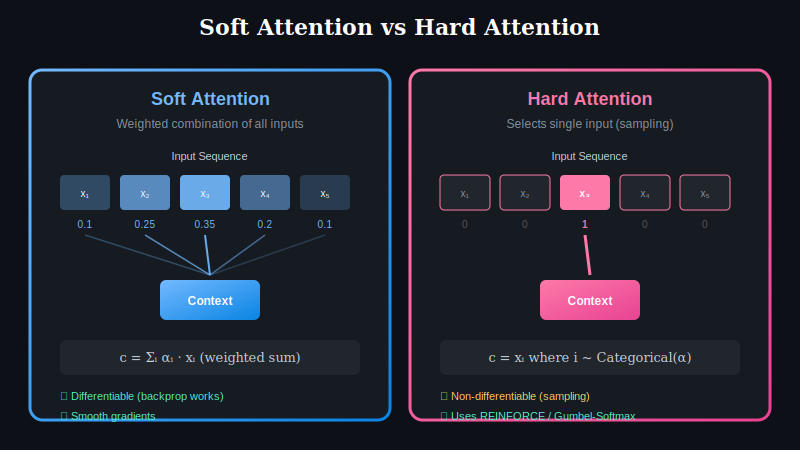
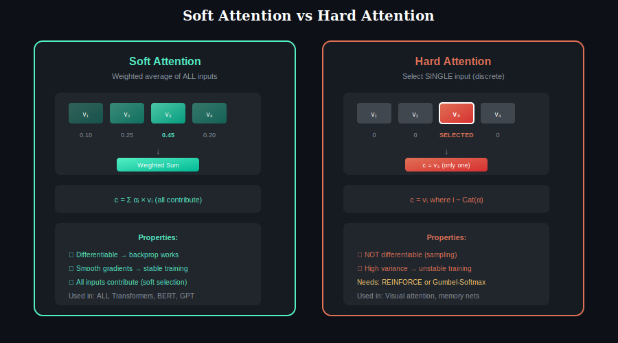

# 📖 Chapter 7: Soft Attention vs Hard Attention

> **Pre-requisite:** Complete Chapters 1-6 first!

  

## Overview

The distinction between **soft** and **hard** attention represents a fundamental choice in how attention mechanisms select and aggregate information:

- **Soft Attention:** Computes a weighted average of all inputs
- **Hard Attention:** Selects a single input (or discrete subset)

This choice has major implications for training, expressiveness, and application.

---

## Visual Comparison

  

---

## Soft Attention

### Definition

Soft attention computes a **continuous weighted combination** of all input values:

$$c = \sum_{i=1}^{n} \alpha_i \cdot v_i$$

Where:
- α_i are attention weights (sum to 1)
- v_i are value vectors
- c is the context/output vector

### How It Works

| Step | Operation |
|------|-----------|
| 1 | Compute scores for each position |
| 2 | Apply softmax → get weights α |
| 3 | Take weighted sum of all values |
| 4 | **ALL** inputs contribute to output |

### Properties

| Property | Soft Attention |
|----------|----------------|
| **Output** | Weighted average of all inputs |
| **Differentiable** | ✅ Yes (gradients flow through) |
| **Training** | Standard backpropagation |
| **Gradient** | Smooth, well-behaved |
| **Selection** | "Soft" selection (all contribute) |

### Mathematical Form

$$\alpha = \text{softmax}(\text{scores})$$
$$c = \sum_i \alpha_i v_i = \alpha^T V$$

The softmax ensures:
- α_i ≥ 0 (non-negative weights)
- Σ α_i = 1 (normalized to probability)

---

## Hard Attention

### Definition

Hard attention **selects a single position** (or discrete subset) to attend to:

$$c = v_i \quad \text{where} \quad i \sim \text{Categorical}(\alpha)$$

The index i is **sampled** from the attention distribution.

### How It Works

| Step | Operation |
|------|-----------|
| 1 | Compute scores for each position |
| 2 | Apply softmax → get probabilities α |
| 3 | **Sample** one position from α |
| 4 | Output = only the selected value |

### Properties

| Property | Hard Attention |
|----------|----------------|
| **Output** | Single selected input |
| **Differentiable** | ❌ No (sampling is discrete) |
| **Training** | Requires RL (REINFORCE) or tricks |
| **Gradient** | High variance |
| **Selection** | "Hard" selection (winner-take-all) |

### The Differentiability Problem

The sampling operation i ~ Categorical(α) is **non-differentiable**:

| Pass | What Happens |
|------|--------------|
| **Forward** | α → sample → i → v_i → output |
| **Backward** | Cannot compute ∂output/∂α directly! |

---

## Comparison Table

| Aspect | Soft Attention | Hard Attention |
|--------|----------------|----------------|
| **Output** | Weighted sum | Single selection |
| **Formula** | Σ α_i v_i | v_i where i ~ Cat(α) |
| **Differentiable** | ✅ Yes | ❌ No |
| **Training** | Backprop | REINFORCE / Gumbel |
| **Gradient Variance** | Low | High |
| **Computation** | Attends to all | Attends to one |
| **Interpretability** | Weights show distribution | Clear single choice |

---

## Training Hard Attention

Since hard attention is non-differentiable, special techniques are needed:

### 1. REINFORCE (Policy Gradient)

Treat attention as a policy, use RL to train:

$$\nabla_\theta J = \mathbb{E}[(R - b) \nabla_\theta \log p_\theta(i)]$$

Where:
- R = reward (e.g., task accuracy)
- b = baseline (variance reduction)
- p_θ(i) = α_i = selection probability

| Pros | Cons |
|------|------|
| Correct gradients in expectation | High variance |
| Works with any discrete choice | Slow convergence |

### 2. Gumbel-Softmax (Relaxation)

Approximate discrete sampling with continuous relaxation:

$$y_i = \frac{\exp((\log \alpha_i + g_i) / \tau)}{\sum_j \exp((\log \alpha_j + g_j) / \tau)}$$

Where:
- g_i = Gumbel noise
- τ = temperature (→ 0 becomes hard)

| Pros | Cons |
|------|------|
| Differentiable | Approximation |
| Works with backprop | Temperature scheduling |

### 3. Straight-Through Estimator

| Pass | Operation |
|------|-----------|
| **Forward** | Use hard (argmax) selection |
| **Backward** | Pretend it was soft attention |

| Pros | Cons |
|------|------|
| Simple | Biased gradients |

---

## When to Use Each

### Use Soft Attention When:

| Scenario | Reason |
|----------|--------|
| **Default choice** | Simpler, more stable training |
| **Need smooth gradients** | Critical for optimization |
| **All inputs may contribute** | Information from multiple sources |
| **Standard Transformers** | Industry standard |

### Use Hard Attention When:

| Scenario | Reason |
|----------|--------|
| **Discrete decision needed** | Select exactly one option |
| **Memory efficiency** | Only attend to one item |
| **Interpretability** | Clear, discrete choices |
| **RL-based systems** | Already using RL training |

---

## Hybrid Approaches

### Top-k Attention

Select top-k positions instead of all or one:

| Approach | What It Does |
|----------|--------------|
| Compute α | Get attention weights |
| Select top-k | Keep k highest weights |
| Renormalize | Make weights sum to 1 |
| Weighted sum | Over k positions only |

### Sparse Attention

Learned or fixed sparsity patterns — a form of "planned" hard attention:
- Local window (hard: only nearby)
- Global tokens (hard: only special positions)

---

## Applications

### Soft Attention Use Cases

| Application | Why Soft |
|------------|----------|
| Machine Translation | All source words may contribute |
| Text Summarization | Multiple sentences relevant |
| Question Answering | Context has distributed evidence |
| Image Captioning | Multiple regions informative |

### Hard Attention Use Cases

| Application | Why Hard |
|------------|----------|
| Visual Attention | Mimic eye fixations |
| Memory Networks | Discrete memory slot selection |
| Program Synthesis | Select exact operation |
| Pointer Networks | Point to single position |

---

## Key Takeaways

| Concept | Key Point |
|---------|-----------|
| **Soft Attention** | Weighted sum, differentiable, standard choice |
| **Hard Attention** | Discrete selection, needs RL or tricks |
| **Trade-off** | Ease of training vs. interpretability |
| **Modern Practice** | Soft attention dominates (Transformers) |
| **Hybrid** | Top-k, sparse patterns combine benefits |

---

## 🎉 Congratulations!

You've completed all 7 chapters! You now understand:

| Chapter | Key Concept |
|---------|-------------|
| 1 | Self-Attention: N×N matrix, Q=K=V from same input |
| 2 | Cross-Attention: N×M matrix, Q from decoder, K/V from encoder |
| 3 | Multi-Head: h parallel attention heads, each learns different patterns |
| 4 | Causal: Lower triangular mask for autoregressive models |
| 5 | Sparse: Efficient patterns for long sequences |
| 6 | Score Functions: Scaled dot-product is the standard |
| 7 | Soft vs Hard: Soft (differentiable) dominates |

  <a href="../06-score-functions/">← Chapter 6</a> | <a href="../"><b>Back to Main →</b></a>

