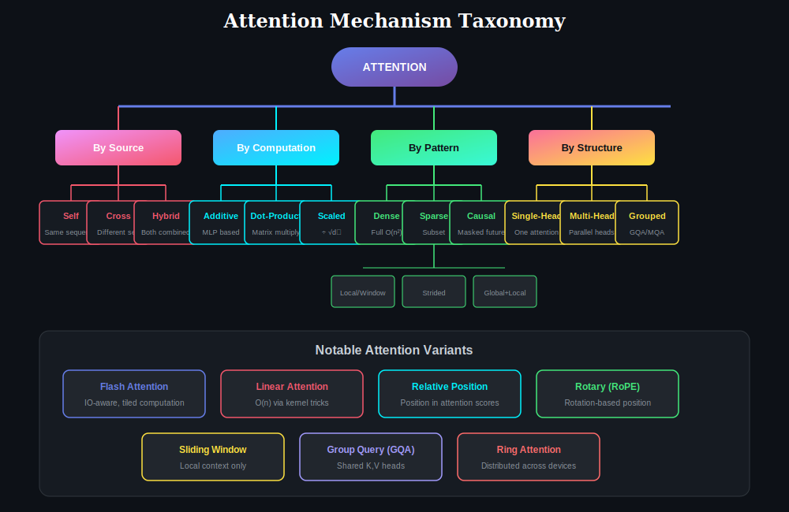

# 📖 Attention Mechanisms: A Visual Guide

> *"Attention is All You Need"* — The paper that revolutionized deep learning

<p align="center">
  
</p>

---

## 🎯 How to Read This Guide

**Read like a book — start from Chapter 0 and progress sequentially:**

```
Chapter 0 (Concepts) → 1 → 2 → 3 → 4 → 5 → 6 → 7
```

Each chapter builds on the previous one. Don't skip!

---

## 📚 Chapters

### **Chapter 0: Prerequisites (Must Read!)**

| Ch | Topic | What You'll Learn |
|----|-------|-------------------|
| **0** | [Important Concepts](./00-important-concepts/) | **Why √d_k?** d_model vs d_k, Q/K/V intuition, temperature |

> ⚠️ **Many learners skip these details and get confused later. Start here!**

### **Part I: Core Concepts**

| Ch | Topic | What You'll Learn |
|----|-------|-------------------|
| **1** | [Self-Attention](./01-self-attention/) | Foundation — how Q, K, V work, N×N attention matrix |
| **2** | [Cross-Attention](./02-cross-attention/) | How encoder-decoder attention works (N×M matrix!) |
| **3** | [Multi-Head Attention](./03-multi-head-attention/) | Why multiple heads, what each head learns |

### **Part II: Special Patterns**

| Ch | Topic | What You'll Learn |
|----|-------|-------------------|
| **4** | [Causal Attention](./04-causal-attention/) | Masking for GPT-style generation (lower triangular) |
| **5** | [Sparse Attention](./05-sparse-attention/) | Efficient patterns for long sequences |

### **Part III: Deep Dive**

| Ch | Topic | What You'll Learn |
|----|-------|-------------------|
| **6** | [Score Functions](./06-score-functions/) | Additive vs Dot-Product vs Scaled |
| **7** | [Soft vs Hard Attention](./07-soft-hard-attention/) | Weighted average vs discrete selection |

---

## 🔑 The Core Intuition

Think of attention as a **soft database lookup**:

| Component | Question | Role |
|-----------|----------|------|
| **Query (Q)** | "What am I looking for?" | The question you ask |
| **Key (K)** | "What do I contain?" | The index/label of each item |
| **Value (V)** | "What I actually provide" | The actual data content |

---

## 📐 The Universal Formula

$$\text{Attention}(Q, K, V) = \text{softmax}\left(\frac{QK^T}{\sqrt{d_k}}\right) V$$

### Step-by-Step:

| Step | Operation | Result | Purpose |
|------|-----------|--------|---------|
| **1** | QK^T | (n × m) matrix | Compute all pairwise scores |
| **2** | ÷ √d_k | scaled scores | **Prevent softmax saturation** |
| **3** | softmax | attention weights | Normalize to probabilities |
| **4** | × V | output | Weighted combination of values |

### ⚠️ Why √d_k? (Critical!)

| Without √d_k | With √d_k |
|--------------|-----------|
| Variance grows with d_k | Variance = 1 (constant) |
| Scores: [-45, +45] for d_k=512 | Scores: [-3, +3] |
| Softmax saturates → one-hot | Softmax works normally |
| **Gradients vanish, training fails!** | **Stable training** |

👉 [Learn more in Chapter 0](./00-important-concepts/#why-divide-by-√dk)

---

## 🗂️ Quick Reference: Attention Types

<p align="center">
  
</p>

| Type | Q Source | K,V Source | Matrix Shape | Example Use |
|------|----------|------------|--------------|-------------|
| **Self** | Same | Same | N × N | BERT, GPT |
| **Cross** | Target | Source | N × M | Translation |
| **Causal** | Same | Same (masked) | N × N (triangular) | GPT |
| **Multi-Head** | Same | Same | h × (N × N) | All Transformers |

---

## 📊 Complexity at a Glance

| Pattern | Time | Space | Use Case |
|---------|------|-------|----------|
| Dense (Full) | O(n²) | O(n²) | Short sequences |
| Sparse | O(n·w) | O(n·w) | Long documents |
| Linear | O(n) | O(n) | Very long sequences |

---

## 🚀 Start Reading!

**Begin with Chapter 0 (Important Concepts):**

👉 **[Chapter 0: Important Concepts](./00-important-concepts/)** — Why √d_k? What is d_model? Don't skip!

Then continue to Chapter 1:

👉 **[Chapter 1: Self-Attention](./01-self-attention/)** — The foundation of everything!

---

## 📁 Structure

```
atten/
├── README.md                    ← You are here
├── images/
│
├── 00-important-concepts/       ← START HERE (Prerequisites!)
│   ├── README.md                  Why √d_k? d_model vs d_k? Q/K/V?
│   └── images/
│
├── 01-self-attention/           ← Then continue here
│   ├── README.md
│   └── images/
│       └── *.svg (N×N matrix diagrams)
│
├── 02-cross-attention/
├── 03-multi-head-attention/
├── 04-causal-attention/
├── 05-sparse-attention/
├── 06-score-functions/
└── 07-soft-hard-attention/
```

---

## 📈 Evolution Timeline

| Year | Innovation | Impact |
|------|------------|--------|
| 2014 | Bahdanau Attention | First seq2seq attention |
| 2015 | Luong Attention | Simpler dot-product |
| 2017 | Transformer | Self-attention revolution |
| 2020 | Longformer | Sparse for long docs |
| 2022 | Flash Attention | Memory-efficient |

---

<p align="center">
  <b>👉 <a href="./00-important-concepts/">Start Chapter 0: Important Concepts →</a></b>
  <br/>
  <a href="./00-important-concepts/">Then Chapter 0: 00-important-concepts →</a>
</p>

---

<p align="center">
  <i>Created with 💜 for the AI community</i>
</p>
